```{r setup, include=FALSE}
knitr::opts_chunk$set(
  message = FALSE,
  warning = FALSE
)
```

```{r include=FALSE}
library(forecast)
library(ggplot2)
library(dplyr)
library(tidyr)
library(kableExtra)
library(lubridate)
library(zoo)
library(fGarch, quietly = TRUE)
library(vars)
library(tseries)
library(tictoc)
library(tidyverse)
library(pomp)
library(foreach)
library(future)
library(doFuture)
library(iterators)
library(tictoc)
library(DT)
```

# Introduction

The main goal of this project is to explore and model the temporal
dynamics of the pandemic in Kerala using time series models. We apply
ARIMA, VAR and POMP models to better understand the trends, patterns,
and potential structure underlying the spread of COVID-19.

The original data were reported on a **daily** basis, spanning from
January 31, 2020 to May 22, 2022. To enhance model interpretability and
reduce daily reporting volatility, all models are trained on the
**weekly-aggregated dataset**. Weekly data provide a smoother
representation of the underlying trends, helping to reduce the impact of
daily fluctuations and reporting delays, which are common in
epidemiological data.

## About the Datasets

This project uses dataset collected from the [Kerala Government COVID-19
Dashboard](https://dashboard.kerala.gov.in) [1].

### COVID-19 Case Data

-   **Time range:** Feburary 2, 2020 – May 15, 2022 (Week 1 - Week 119)
-   **Number of observations:** 119 weekly records
-   **Variables:**
    -   `Date`: The first date of the week
    -   `Confirmed`: Number of newly confirmed COVID-19 cases reported
        within the week
    -   `Recovered`: Number of individuals who recovered from COVID-19
        within the week
    -   `Deceased`: Number of reported deaths due to COVID-19 within the
        week

# Exploratory Data Analysis

```{r, echo=FALSE}
library(forecast)
library(ggplot2)
library(dplyr)
library(tidyr)
library(kableExtra)
library(lubridate)
library(zoo)
library(fGarch, quietly = TRUE)
library(vars)
library(tseries)

cases <- read.csv("data/covid_data_kerala.csv", header = TRUE)
#vaccine <- read.csv("/Users/cathy/Desktop/daily-vaccination-in-kerala.csv", header = FALSE)
#colnames(vaccine) <- c("Date", "Count")
#vaccine$Date <- as.Date(vaccine$Date, format = "%m/%d/%y")
cases$Date <- as.Date(cases$Date)
cases[is.na(cases)] <- 0
#head(cases)
#summary(cases)
#head(vaccine)
#summary(vaccine)
```

### Weekly Trends for Confirmed, Recovered, Deceased COVID-19 Cases and Vaccination Counts

```{r, echo=FALSE}
df_trimmed <- cases %>%
  slice(4:(n() - 5))

weekly_df <- df_trimmed %>%
  mutate(Week = floor_date(Date, unit = "week", week_start = 1)) %>%
  group_by(Week) %>%
  summarise(across(c(Confirmed, Recovered, Deceased), sum, na.rm = TRUE))

weekly_long <- weekly_df %>%
  pivot_longer(cols = c(Confirmed, Recovered, Deceased),
               names_to = "Status", values_to = "Count")

cut_date1 <- as.Date("2021-03-22")
cut_date2 <- as.Date("2022-01-02")
subset_1 <- subset(weekly_df, Week <= cut_date1)
subset_2 <- subset(weekly_df, Week <= cut_date2 & Week > cut_date1)
subset_3 <- subset(weekly_df, Week > cut_date2)

```

```{r fig1, fig.cap="Figure 1: Weekly COVID-19 case trends (Confirmed, Recovered, Deceased) in Kerala from January 2020 to March 2023", echo=FALSE}
fig1 = "**Figure 1.** *Weekly COVID-19 case trends (Confirmed, Recovered, Deceased) in Kerela from January 2020 to March 2023*"
ggplot(weekly_long, aes(x = Week, y = Count, color = Status)) +
  geom_line() +
  theme_bw() +
  labs(title = "Weekly COVID-19 Trends",
       x = "Week",
       y = "Weekly Case Count",
       color = "Status")+
  geom_vline(xintercept = as.numeric(cut_date1), linetype = "dashed", color = "black") +
  geom_vline(xintercept = as.numeric(cut_date2), linetype = "dashed", color = "black") 
```

Figure 1 shows weekly trends in **confirmed**, **recovered**, and
**deceased** COVID-19 cases in Kerala from January 2020 to May 2022. We
can observe several key surges in confirmed and recovered cases.

The two vertical dashed lines in the figure represent key public health
milestones:

-   The **first line** (March 22, 2021, last day of week 60) corresponds
    to the **initial rollout of COVID-19 vaccines** and **spread of
    delta variant** in the region.

-   The **second line** (January 2, 2022, last day of Week 100) marks
    the **emergence and rapid spread of the Omicron variant**.

These two events dramatically changed the trajectory and severity of the
pandemic. Therefore, we divide the full timeline into **three distinct
stages**.

### ACF and PACF of Weekly Confirmed, Recovered, Deceased COVID-19 Cases

```{r fig2, fig.cap="Figure 2: ACF and PACF of Weekly Confirmed, Recovered, Deceased COVID-19 Cases in Kerala, India", echo=FALSE}
fig2 = "**Figure 2.** *ACF and PACF of Weekly Confirmed, Recovered, Deceased COVID-19 Cases in Kerala, India*"
par(mfrow = c(2, 4))
confirmed.ts <- ts(data = weekly_df$Confirmed, start = c(2020, 1), frequency = 7)
acf(confirmed.ts, lag.max = 48, main = "ACF and PACF Plot")
pacf(confirmed.ts, lag.max = 48, main = "- (Confirmed Cases)")

recovered.ts <- ts(data = weekly_df$Recovered, start = c(2020, 1), frequency = 7)
acf(recovered.ts, lag.max = 48, main = "ACF and PACF Plot")
pacf(recovered.ts, lag.max = 48, main = "- (Recovered Cases)")

deceased.ts <- ts(data = weekly_df$Deceased, start = c(2020, 1), frequency = 7)
acf(deceased.ts, lag.max = 48, main = "ACF and PACF Plot")
pacf(deceased.ts, lag.max = 48, main = "- (Deceased Cases)")

#vaccine.ts <- ts(data = weekly_vaccine$Count, start = c(2020, 1), frequency = 7)
#acf(vaccine.ts, lag.max = 48, main = "ACF and PACF Plot")
#pacf(vaccine.ts, lag.max = 48, main = "- (Vaccine Counts)")
```

Figure 2 shows the ACF and PACF of weekly confirmed, recovered, deceased
COVID-19 cases and vaccination administered in Kerala, India. The ACF
and PACF plots for confirmed, recovered, and deceased cases show strong
autocorrelation and slow decay, indicating **non-stationarity** and
**the need for differencing**.

### Smoothed periodogram of Weekly Confirmed, Recovered, Deceased COVID-19 Cases

```{r fig3, fig.cap="Figure 3: Smoothed periodogram of Weekly Confirmed, Recovered, Deceased COVID-19 Cases ", echo=FALSE}
fig4 = "**Figure 3.** *Smoothed periodogram of Weekly Confirmed, Recovered, Deceased COVID-19 Cases*"

confirmed.ts <- ts(weekly_df$Confirmed, start = c(2020, 1), frequency = 7)
recovered.ts <- ts(weekly_df$Recovered, start = c(2020, 1), frequency = 7)
deceased.ts  <- ts(weekly_df$Deceased, start = c(2020, 1), frequency = 7)
#vaccine.ts   <- ts(weekly_vaccine$Count, start = c(2021, 1), frequency = 7)

par(mfrow = c(2, 2))
spectrum(confirmed.ts, spans = c(4, 6, 4), main = "Smoothed Periodogram - Confirmed Cases")
spectrum(recovered.ts, spans = c(4, 6, 4), main = "Smoothed Periodogram - Recovered Cases")
spectrum(deceased.ts, spans = c(4, 6, 4), main = "Smoothed Periodogram - Deceased Cases")
#spectrum(vaccine.ts, spans = c(4, 6, 4), main = "Smoothed Periodogram - Vaccine Count")

```

Figure 3 is the smoothed periodogram of weekly confirmed, recovered,
deceased COVID-19 cases and vaccination administered. The smoothed
periodograms show **no strong seasonal peaks for any series**,
suggesting that trend, rather than seasonality, is the dominant feature
across confirmed, recovered, and deceased cases.

# Model 1: ARIMA

The first model we fit was an ARIMA model using the confirmed cases time
series. This model focuses solely on the confirmed cases, and helps
establish a baseline understanding of the pandemic progression before
incorporating additional variables or building more complex models.

### AIC- Based Model Selection

Firstly, we selected the best ARIMA model based on AIC values
[[2](chrome-extension://efaidnbmnnnibpcajpcglclefindmkaj/https://ionides.github.io/531w25/05/slides.pdf),
[3](https://ionides.github.io/531w24/final_project/project12/blinded.html)].

```{r, echo=FALSE}
ts_confirmed <- ts(weekly_df$Confirmed, frequency = 7, start = c(2020, 31))

p_values <- 0:5
d_value <- 1
q_values <- 0:5

aic_matrix <- matrix(NA, nrow = length(p_values), ncol = length(q_values),
                     dimnames = list(paste0("AR", p_values), paste0("MA", q_values)))

for (p in p_values) {
  for (q in q_values) {
    try({
      model <- Arima(ts_confirmed, order = c(p, d_value, q), method = "ML")
      aic_matrix[p + 1, q + 1] <- model$aic
    }, silent = TRUE)
  }
}

knitr::kable(aic_matrix, caption = "AIC Table for ARIMA(p,1,q) Models")

```

The AIC table shows the model fit quality for different combinations of
ARIMA(p,1,q) models (where differencing order d = 1 is fixed according
to the ACF/PACF in EDA).

-   The model with the **lowest AIC value is ARIMA(5,1,5)** (AIC ≈
    2675.033), followed closely by several other models like
    ARIMA(3,1,3) and ARIMA(5,1,2).

-   In general, lower AIC indicates a better model fit, balancing
    goodness of fit and model complexity.

-   **Conclusion:** Based on the AIC values, ARIMA(5,1,5) would be a
    strong candidate for modeling confirmed cases, although slightly
    simpler models (like ARIMA(3,1,3)) could also be considered if
    parsimony is preferred.

### ARIMA(5,1,5) Model Specification

Let $Y_t$ represent the original time series (weekly confirmed cases).

Since $d = 1$, the series is differenced once:

$$
\nabla Y_t = Y_t - Y_{t-1}
$$

The ARIMA(5,1,5) model for the differenced series is specified as:

$$
\nabla Y_t = \phi_1 \nabla Y_{t-1} + \phi_2 \nabla Y_{t-2} + \phi_3 \nabla Y_{t-3} + \phi_4 \nabla Y_{t-4} + \phi_5 \nabla Y_{t-5} + \epsilon_t + \theta_1 \epsilon_{t-1} + \theta_2 \epsilon_{t-2} + \theta_3 \epsilon_{t-3} + \theta_4 \epsilon_{t-4} + \theta_5 \epsilon_{t-5}
$$

where:

-   $\phi_1, \phi_2, \phi_3, \phi_4, \phi_5$ are the autoregressive (AR)
    coefficients,

-   $\theta_1, \theta_2, \theta_3, \theta_4, \theta_5$ are the moving
    average (MA) coefficients,

-   $\epsilon_t$ is white noise (i.i.d. with mean 0 and constant
    variance).

### Model Fitting

```{r, echo=FALSE}
best_model <- Arima(ts_confirmed, order = c(5, 1, 5), method = "ML")
summary(best_model)
```

The fitted ARIMA(5,1,5) model achieved a log-likelihood of **-1326.52**,
indicating the overall goodness of fit. In general, a higher
log-likelihood suggests a better model fit to the data.

```{r fig4, fig.cap= "Figure 4: ARIMA(5,1,5) Fitted vs. Actual plot", echo=FALSE}
fig4 = "**Figure 4.** *ARIMA(5,1,5) Fitted vs. Actual plot*"
autoplot(ts_confirmed, series = "Actual") +
  autolayer(fitted(best_model), series = "Fitted") +
  labs(
    title = "ARIMA(5,1,5) Fit to Confirmed Cases",
    y = "Confirmed Cases", x = "Time", color = "Legend"
  ) +
  scale_color_manual(values = c("Actual" = "blue", "Fitted" = "red")) +
  theme_minimal()

```

The time series plot (Figure 5) comparing the actual confirmed cases
(blue) and the ARIMA(5,1,5) fitted values (red) shows that the model
tracks the major peaks and overall trends quite closely. Although there
are some deviations at sharp turning points — especially during rapid
spikes and declines — the model generally captures the overall behavior
of the pandemic progression well.

### Model Diagnostics

```{r fig5, fig.cap= "Figure 5: Model Diagnostics for ARIMA(5,1,5)",echo=FALSE}
res <- residuals(best_model)
fig5 = "**Figure 5.** *Model Diagnostics for ARIMA(5,1,5)*"

par(mfrow = c(2, 2))

plot(res, main = "Residuals", ylab = "Residuals", xlab = "Time", type = "l")
acf(res, main = "ACF of Residuals")
qqnorm(res, main = "Normal Q-Q Plot")
qqline(res, col = "red")
Box.test(res, lag = 20, type = "Ljung-Box")

```

#### Residual Diagnostics

-   The residual time series appears centered around zero with no clear
    patterns, although some variance increases during peaks.

-   The ACF of residuals shows no significant autocorrelation,
    supporting the model adequacy
    [[2](https://ionides.github.io/531w25/06/slides.pdf),
    [3](https://ionides.github.io/531w24/final_project/project12/blinded.html)].

#### Normality Check

-   The Q-Q plot shows slight deviations from normality at the tails,
    but residuals are generally close to the theoretical normal line,
    which is acceptable for ARIMA models
    [[2](https://ionides.github.io/531w25/06/slides.pdf),
    [3](https://ionides.github.io/531w24/final_project/project12/blinded.html)].

#### Box-Ljung Test

-   The Box-Ljung test yields a p-value of **0.9991**, suggesting no
    significant autocorrelation remaining in the residuals (fail to
    reject the null hypothesis of independence)
    [[2](https://ionides.github.io/531w25/06/slides.pdf),
    [3](https://ionides.github.io/531w24/final_project/project12/blinded.html)].

```{r fig6, fig.cap="Figure 6: Inverse Roots of Both AR and MA Polynomials", echo=FALSE}
fig6 = "**Figure 6.** *Inverse Roots of Both AR and MA Polynomials*"
autoplot(best_model)

```

#### Stability Check

-   The AR inverse roots are all located within the unit circle,
    indicating that the model satisfies the stationarity condition. The
    MA inverse roots lie mostly within the unit circle, satisfying the
    invertibility condition. However, a few roots are located near or on
    the boundary, indicating that the model is close to
    non-invertibility. As a result, shocks may decay more slowly over
    time, although the process remains invertible.
    [[4](https://ionides.github.io/531w25/05/slides.pdf)].

Overall, the ARIMA(5,1,5) model provides a reasonable fit to the
confirmed cases data. The residuals show no significant autocorrelation,
the model passes the Box-Ljung test, and the roots confirm stationarity
and invertibility. While slight deviations from normality are observed,
the model effectively captures the main trend and fluctuations, making
it a suitable baseline for further analysis.

# Model 2: VAR

The second model we aim to build is a Vector Autoregression (VAR) model,
which incorporates confirmed, recovered, and deceased cases
simultaneously. Unlike the ARIMA model that focuses on a single series,
the VAR model allows us to capture the dynamic relationships between
multiple time series. This modeling approach is inspired by the work
presented in [this
study](https://www.sciencedirect.com/science/article/pii/S0960077920305853),
where the authors successfully used VAR models to analyze the
interactions among COVID-19 variables over time
[[5]](https://www.sciencedirect.com/science/article/pii/S0960077920305853).

### Model Selection

#### Select the VAR Model Using Optimal Lag

```{r message=FALSE, warning=FALSE, include=FALSE}
data_var <- weekly_df[, c("Confirmed", "Recovered", "Deceased")]
VARselect(data_var, lag.max = 20, type = "const")
model_var <- VAR(data_var, p = 9, type = "const")
summary(model_var)

```

To build the VAR model, we included the confirmed, recovered, and
deceased cases as jointly modeled time series. The optimal lag length
was selected using information criteria (AIC, HQ, SC, and FPE). Based on
the VARSelect output, most criteria suggested a higher lag order (around
20), but to balance model complexity and overfitting risk, we chose **p
= 9** for the final VAR model. This setup allows the model to capture
dependencies across multiple past weeks while maintaining reasonable
parsimony.

### Model Specification

The VAR model captures the joint dynamics of confirmed ($y_1$),
recovered ($y_2$), and deceased ($y_3$) cases.\
The general form of a VAR($p$) model is:

$$
\mathbf{Y}_t = \mathbf{B}_0 + \mathbf{B}_1 \mathbf{Y}_{t-1} + \mathbf{B}_2 \mathbf{Y}_{t-2} + \cdots + \mathbf{B}_p \mathbf{Y}_{t-p} + \boldsymbol{\epsilon}_t
$$

where:

-   $\mathbf{Y}_t$ is a $3 \times 1$ vector of the three time series at
    time $t$,

-   $\mathbf{B}_0$ is a $3 \times 1$ vector of intercepts,

-   $\mathbf{B}_1, \mathbf{B}_2, \ldots, \mathbf{B}_p$ are $3 \times 3$
    coefficient matrices, - $\boldsymbol{\epsilon}_t$ is a $3 \times 1$
    vector of error terms.

For example, a VAR(1) model (for illustration) would be written as:

$$
\begin{pmatrix}
y_1(t) \\
y_2(t) \\
y_3(t)
\end{pmatrix}
=
\begin{pmatrix}
b_{10} \\
b_{20} \\
b_{30}
\end{pmatrix}
+
\begin{pmatrix}
b_{11} & b_{12} & b_{13} \\
b_{21} & b_{22} & b_{23} \\
b_{31} & b_{32} & b_{33}
\end{pmatrix}
\begin{pmatrix}
y_1(t-1) \\
y_2(t-1) \\
y_3(t-1)
\end{pmatrix}
+
\begin{pmatrix}
\epsilon_1(t) \\
\epsilon_2(t) \\
\epsilon_3(t)
\end{pmatrix}
$$

In our case, $p = 9$, so the model includes lags up to nine weeks back
for each series
[[5]](https://www.sciencedirect.com/science/article/pii/S0960077920305853).

### Model Fitting

```{r, echo=FALSE}
n_obs <- nrow(residuals(model_var))
k <- ncol(residuals(model_var))
Sigma_u <- summary(model_var)$covres
log_likelihood_manual <- - (n_obs * k / 2) * log(2 * pi) - (n_obs / 2) * log(det(Sigma_u)) - (n_obs * k / 2)
log_likelihood_manual

```

The log-likelihood for the VAR(9) model was manually computed as
**-3229.10** due to the inclusion of a constant term, which prevented
direct extraction from the model output. Given the relatively large
sample size and the complexity of the data (confirmed, recovered, and
deceased cases), this log-likelihood value suggests that the VAR(9)
model provides a reasonable fit to the data, capturing the main dynamics
without overfitting.

```{r fig7, fig.cap="Figure 7: VAR(9) Model Fit to Confirmed, Recovered, and Deceased Cases", echo=FALSE}
p <- 9  
aligned_actual <- weekly_df[(p + 1):nrow(weekly_df), ]
fitted_values <- fitted(model_var)
combined_df <- data.frame(
  Time = 1:nrow(fitted_values), 
  Actual_Confirmed = aligned_actual$Confirmed,
  Fitted_Confirmed = fitted_values[, "Confirmed"],
  Actual_Recovered = aligned_actual$Recovered,
  Fitted_Recovered = fitted_values[, "Recovered"],
  Actual_Deceased = aligned_actual$Deceased,
  Fitted_Deceased = fitted_values[, "Deceased"]
)

combined_long <- combined_df %>%
  dplyr::select(Time,
         Actual_Confirmed, Fitted_Confirmed,
         Actual_Recovered, Fitted_Recovered,
         Actual_Deceased, Fitted_Deceased) %>%
  pivot_longer(
    cols = -Time,
    names_to = c("Type", "Variable"),
    names_sep = "_",
    values_to = "Value"
  ) %>%
  pivot_wider(
    names_from = Type,
    values_from = Value
  )

combined_long <- combined_long %>%
  mutate(
    Variable = case_when(
      Variable == "Confirmed" ~ "Confirmed Cases",
      Variable == "Recovered" ~ "Recovered Cases",
      Variable == "Deceased"  ~ "Deceased Cases"
    )
  )
fig7 = "**Figure 7.** *VAR(9) Model Fit to Confirmed, Recovered, and Deceased Cases*"

ggplot(combined_long, aes(x = Time)) +
  geom_line(aes(y = Actual, color = "Actual")) +
  geom_line(aes(y = Fitted, color = "Fitted")) +
  facet_wrap(~ Variable, scales = "free_y") +
  labs(
    title = "VAR(9) Model Fit to Confirmed, Recovered, and Deceased Cases",
    y = "Counts",
    x = "Time",
    color = "Legend"
  ) +
  scale_color_manual(values = c("Actual" = "blue", "Fitted" = "red")) +
  theme_minimal()
```

Figure 7 shows the VAR(9) model fit to the confirmed, recovered, and
deceased cases over time. Across all three series, the fitted values
(red) closely follow the actual observed data (blue), capturing the
overall trends, peaks, and shifts quite well. Minor discrepancies appear
around sharp transitions, particularly for deceased cases, where the
fitted values slightly overshoot or lag behind the actual counts.
Nevertheless, the model effectively tracks the general behavior of each
time series, suggesting that the VAR(9) model provides a good
approximation of the underlying dynamics.

### Model Diagnostics

#### ACF

```{r fig8, fig.cap= "Figure 8: ACF of VAR(9) Model: Confirmed, Recovered, and Deceased Cases", echo=FALSE}
fig8 = "**Figure 8.** *ACF of VAR(9) Model: Confirmed, Recovered, and Deceased Cases*"

par(mfrow = c(2, 2))

acf(residuals(model_var)[,1], main = "ACF: Confirmed") 
acf(residuals(model_var)[,2], main = "ACF: Recovered") 
acf(residuals(model_var)[,3], main = "ACF: Deceased")
```

The residual ACF plots for confirmed, recovered, and deceased cases show
no significant autocorrelation, suggesting that the VAR(9) model
adequately captured the dynamics of the series.

#### QQ Plot

```{r fig9, fig.cap="Figure 9: Q-Q Plot of VAR(9) Model: Confirmed, Recovered, and Deceased Cases", echo=FALSE}
fig9 = "**Figure 9.** *Q-Q Plot of VAR(9) Model: Confirmed, Recovered, and Deceased Cases*"

par(mfrow = c(2, 2))

qqnorm(residuals(model_var)[,1], main = "Q-Q Plot: Confirmed")
qqline(residuals(model_var)[,1])
qqnorm(residuals(model_var)[,2], main = "Q-Q Plot: Recovered")
qqline(residuals(model_var)[,2])
qqnorm(residuals(model_var)[,3], main = "Q-Q Plot: Deceased")
qqline(residuals(model_var)[,3])
```

Q-Q plots indicate that residuals are approximately normally
distributed, with slight deviations at the tails, which is acceptable
for practical purposes.

#### Box- Ljung Test

```{r, echo=FALSE}
residuals_var <- residuals(model_var)
Box.test(residuals_var[, "Confirmed"], lag = 10, type = "Ljung-Box")
Box.test(residuals_var[, "Recovered"], lag = 10, type = "Ljung-Box")
Box.test(residuals_var[, "Deceased"], lag = 10, type = "Ljung-Box")

```

The Box-Ljung tests for all three series yield high p-values (all \>
0.79), meaning we fail to reject the null hypothesis of no
autocorrelation, supporting model adequacy.

#### Stability Check

The OLS-CUSUM test checks the stability of a VAR model by examining
whether the cumulative sum of residuals stays within confidence bounds.
If the plot crosses the bounds, it indicates possible structural breaks,
meaning the VAR model may need to be re-specified
[[6]](https://www.researchgate.net/publication/324153796_Meteorological_multivariable_approximation_and_prediction_with_classical_VAR-DCC_approach).

```{r fig10, fig.cap="Figure 10: OLS-CUSUM plots of VAR(9) Model: Confirmed, Recovered, and Deceased Cases", echo=FALSE}
fig10 = "**Figure 10.** *OLS-CUSUM plots of VAR(9) Model: Confirmed, Recovered, and Deceased Cases*"

stability_check <- stability(model_var)
plot(stability_check)
```

OLS-CUSUM plots for each equation show that the empirical fluctuation
processes remain well within the boundaries, indicating model stability
over time.

Overall, the VAR(9) model provides a good fit to the confirmed,
recovered, and deceased case series. Model diagnostics indicate that the
residuals are uncorrelated, approximately normally distributed, and
stable over time. The fitted values closely capture the major trends and
variations in the data, supporting the use of the VAR model for
analyzing the dynamic relationships between these pandemic variables.

# Model 3: SEIRS Model1

## Introduction

### Model Specification

We propose a SEIRS (Susceptible - Exposed - Infectious - Recovered -
Susceptible) Model (Class notes 11-18 in [STATS531 Modeling and Analysis
of Time Series Data](https://ionides.github.io/531w25/)(2025) [7] and
COVID_19 final project [COVID-19 in Kent County,
MI](https://ionides.github.io/531w24/final_project/project12/blinded.html)
(2024) [3]), which is a compartmental epidemiological model that extends
the classical SEIR model by including the transition from state $R$ to
$S$, thus allowing re-infections.

```{r, echo=FALSE,fig.align="center", out.width = "60%", fig.cap = "SEIRS Diagram"}
knitr::include_graphics("./diagram.png")
```

The model can be characterized by the following system of differential
equations,

\begin{align*}
    \frac{\mathrm{d}S}{\mathrm{d}t} &= -\mu_{SE} S(t) + \mu_{RS} R(t) \\
    \frac{\mathrm{d}E}{\mathrm{d}t} &= \mu_{SE} S(t) - \mu_{EI} E(t) \\
    \frac{\mathrm{d}I}{\mathrm{d}t} &= \mu_{EI} E(t) - \mu_{IR} I(t) \\
    \frac{\mathrm{d}R}{\mathrm{d}t} &= \mu_{IR} I(t) - \mu_{RS} R(t) \\
\end{align*}

where

-   $\mu_{SE} = \beta(t)$ is the transition rate from state $S$ to state
    $E$, also known as the *transmission rate*;
-   $\mu_{EI}$ is the transition rate from state $E$ to state $I$;
-   $\mu_{IR}$ is the transition rate from state $I$ to state $R$;
-   $\mu_{RS}$ is the transition rate from state $R$ to state $S$;
-   $N(t) = S(t) + E(t) + I(t) + R(t)$ is the population size, which is
    assumed to be constant throughout the epidemic.

In order to discretize the model, we assume that each transition between
compartments is a *binomial* random variable, *i.e.* \begin{align*}
\Delta N_{SE} &= Binomial(S, 1 - e^{-\beta(t) \frac{I \Delta t}{N}}) \\
\Delta N_{EI} &= Binomial(E, 1 - e^{-\mu_{EI} \Delta t}) \\
\Delta N_{IR} &= Binomial(I, 1 - e^{-\mu_{IR} \Delta t}) \\
\Delta N_{RS} &= Binomial(R, 1 - e^{-\mu_{RS} \Delta t}) \\
\end{align*}

As demonstrated in earlier sections, the sample period can be segmented
into three distinct phases. Accordingly, we allow the transmission rate,
$\beta(t)$, the dispersion coefficient, $k$,and the reporting rate
$\rho$, to vary across these phases to reflect changes in underlying
epidemic dynamics. Specifically, let $\beta(t), k(t), \rho(t)$ be
piecewise functions *s.t.* \begin{equation*} \beta(t) = \left\{
\begin{matrix}
b_1, & t \in [1, 61] \\
b_2, & t \in [62, 96] \\
b_3, & t \in [63, 119]
\end{matrix}
\right.\end{equation*} \begin{equation*} k(t) = \left\{
    \begin{matrix}
    k_1, & t \in [1, 61] \\
    k_2, & t \in [62, 96] \\
    k_3, & t \in [63, 119]
    \end{matrix}
\right.\end{equation*}

\begin{equation*} \rho(t) = \left\{
    \begin{matrix}
    \rho_1, & t \in [1, 61] \\
    \rho_2, & t \in [62, 96] \\
    \rho_3, & t \in [63, 119]
\end{matrix}\right.\end{equation*}

Note that $k$ and $\rho$ controls the negative binomial distribution for
the number of reported cases $Y(t)$, *i.e.*
$$ Y(t) \sim NegBinom(\rho * H, \rho * H + \frac{(\rho H)^2}{k(t)}) $$

### Why not SEIR

We do not start with the SEIR model since it assumes that recovered
individuals gain *permanent* immunity. Consequently, the SEIR model
would trap all individuals in $R$ forever with enough time, leading to
depletion of susceptibles and underestimation of future waves when
multiple outbreaks are observed, which is our case.

Alternatively, we consider adding the $R \rightarrow S$ route in order
to allow recovered individuals to lose immunity over time and return to
the susceptible state, thus enabling re-infections.

### Why Time-varying $k$ and $\rho$

**The problematic models mentioned in this section can be found in the
Appendix.**

At the very beginning, we began our analysis with a SEIRS model
featuring time-varying transmission rates, while initially holding the
dispersion parameter $(k)$ and the reporting rate $(\rho)$ fixed. This
setup was meant for simplicity. This model fails to account for any
shifts in amplitudes after the first outbreak, and instead exhibits
dynamics similar to a stationary process. Besides, some parameters
including $b_2, b_3$, $\mu_{IR}$ are either unstable or unrealistic.

Our next step was to allow the dispersion parameter $k$ in the negative
binomial distribution to vary over time, in order to capture changes in
the level of noise in reported case counts across different epidemic
phases. Such variations may arise from factors like evolving testing
policies, reporting delays, or improvements in data infrastructure.

When using a relatively narrow range for the global search, the
parameter estimates remain stable, yet some values are still
nonsensical, and the simulation exhibits an unexpected spike during the
initial outbreak. Expanding the search to a wider range leads to
increased parameter instability, and the profile likelihood plots for
$\eta$ and $\rho$ become problematic. The plot for $\eta$ shows no
significant pattern or structure, indicating weak identifiability, while
the other plot contains a gap between $\rho = 0.4$ and $\rho=0.45$,
which is typically a red flag suggesting either numerical instability or
convergence failure.

Finally, varying only $k(t)$ allows the model to adjust the
**dispersion** around the expected number of reported cases, but it
alone does not affect the **mean** of the observation distribution. As a
result, it cannot account for changes in the actual **level of under
reporting or detection bias** over time.This is why we decided to
introduce a time-varying reporting rate $\rho(t)$, and hence derived our
final model.

```{r message=FALSE, warning=FALSE, include=FALSE}
KERALA_POP = 34530000

NP = 5000; NMIF = 200; NUM_GUESSES = 400
# NP = 200; NMIF = 10; NUM_GUESSES = 40 # debug line

interval = c(61, 35, 23) # DO NOT change the first entry. It's the time when the vaccination program started.

# The code for the SEIR model is developed from https://kingaa.github.io/sbied/pfilter/model.R

covid_data = read.csv("data/weekly_df.csv")

seir_step <- Csnippet("

  double Beta;
  if (interval == 1) Beta = b1;
  else if (interval == 2) Beta = b2;
  else Beta = b3;

  double dN_SE = rbinom(S,1-exp(-Beta*I/N*dt));
  double dN_EI = rbinom(E,1-exp(-mu_EI*dt));
  double dN_IR = rbinom(I,1-exp(-mu_IR*dt));
  double dN_RS = rbinom(R, 1 - exp(-mu_RS*dt));

  S -= dN_SE - dN_RS;
  E += dN_SE - dN_EI;
  I += dN_EI - dN_IR;
  R += dN_IR;
  H += dN_IR;
")

seir_init <- Csnippet("
  S = nearbyint(eta*N);
  E = 0;
  I = 1000;
  R = nearbyint((1-eta)*N);
  H = 0;
")

dmeas <- Csnippet("
  double rho;
  if (interval == 1) rho = rho1;
  else if (interval == 2) rho = rho2;
  else rho = rho3;
  
  double k;
  if (interval == 1) k = k1;
  else if (interval == 2) k = k2;
  else k = k3;

  double mean_reports = fmax(rho * H, 1e-5);
  lik = dnbinom_mu(reports, k, mean_reports, give_log);
")

rmeas <- Csnippet("
  double rho;
  if (interval == 1) rho = rho1;
  else if (interval == 2) rho = rho2;
  else rho = rho3;
  
  double k;
  if (interval == 1) k = k1;
  else if (interval == 2) k = k2;
  else k = k3;

  reports = rnbinom_mu(k,rho*H);"
)

emeas <- Csnippet("
  double rho;
  if (interval == 1) rho = rho1;
  else if (interval == 2) rho = rho2;
  else rho = rho3;
  
  E_reports = rho*H;"
)

time_indicators = covariate_table(
  t = covid_data$Week_Number,
  interval = c(rep(1, interval[1]), rep(2, interval[2]), rep(3, interval[3])), 
  times = "t")

## MODEL INIT

init_params = c(b1=3, b2=50, b3=20, rho1=.12, rho2 =.4, rho3=.5, mu_EI=1/0.6, mu_IR=1/2.5, mu_RS = .005, 
                k1=2.5, k2=4, k3=0.5, eta=.1,N=KERALA_POP) 

# assumptions: 4-4.5 days of incubation period; 2 weeks of recovery period; 26 weeks of immunity

covid_data |>
  dplyr::select(Week_Number,reports=Confirmed) |>
  filter(Week_Number<=119) |>
  pomp(
    times="Week_Number",t0=1,
    rprocess=euler(seir_step,delta.t=1/7),
    rinit=seir_init,
    rmeasure=rmeas,
    dmeasure=dmeas,
    emeasure=emeas,
    accumvars="H",
    statenames=c("S", "E","I","R","H"),
    paramnames=c("b1","b2","b3","mu_EI","mu_IR", "mu_RS", "eta","rho1","rho2", "rho3", "k1", "k2", "k3", "N"),
    params=init_params,
    covar = time_indicators
  ) -> COVID_SEIR
```

## Initial Guesses

We begin with a population size of $N = 34,530,000$, which is estimated
based on the population size of 33,406,061 from the most previous Cencus
of India
[[8](https://spb.kerala.gov.in/sites/default/files/2021-01/English-Vol-1_0.pdfLinks%20to%20an%20external%20site.)].
For simplicity, $N$ is assumed to be constant throughout the sample time
period. The initial guess for the parameters are as follows.
\begin{equation*}\left\{\begin{matrix}
  b_1 = 3, b_2 = 50, b_3 = 20, \\
  \mu_{EI} = 1.67, \mu_{IR} = 0.4, \mu_{RS} = 0.005, \\
  \rho_1 = 0.12, \rho_2 =0.4, \rho_3 = 0.5 \\
  k_1 = 2.5, k_2 = 4, k_3 = 0.5 \\
  \eta = 0.1 \\
\end{matrix}\right.\end{equation*}

We expect $b_2$ to be greater than $b_1$ since the second outbreak
features a larger magnitude, which suggest rising transmissibility.
$b_3$ is assumed to be moderately less than $b_2$ to compensate for the
heavy infections already caused by the 2nd outbreak, so that the third
wave doesn't unrealistically overshoot due to a reduced susceptible
population.

Additionally, the median incubation period is roughly 4.5-5.8 days
[[9](https://doi.org/10.7326/M20-0504)]. The infectious period is
usually believed to be 1-2 days before and 8-10 days after symptoms
begin
[[10](https://wwwnc.cdc.gov/travel/yellowbook/2024/infections-diseases/covid-19)]
. To include a buffer for late recovery or reporting delays, we assume
this period to be 2.5 weeks. Hence, we set $\mu_{EI} = 1.67$, and
$\mu_{IR} = 0.5$. $\mu_{RS}$ is set to 0.005 for numerical stability, as
we examine significant divergence results and worse local search and
global search results when we try to increase $\mu_{RS}$.

Moreover, $\eta$ is set to $0.1$ considering the large population size
in Kerala. Large $N$ implies high absolute infection counts in spite of
small proportions, which would possibly sufficient for the early seeding
of the outbreaks.

Before starting the local search, it still remains to check the particle
filters and plot the simulations based the guess.

```{r echo=FALSE, fig.show="hold",out.width="49%", fig.cap="ESS Check and Simulations, Initial Guess"}
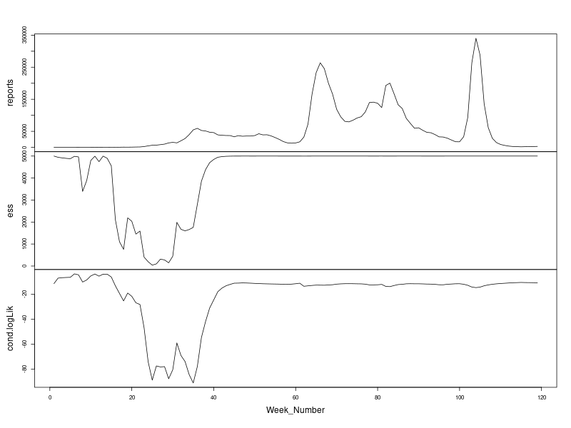
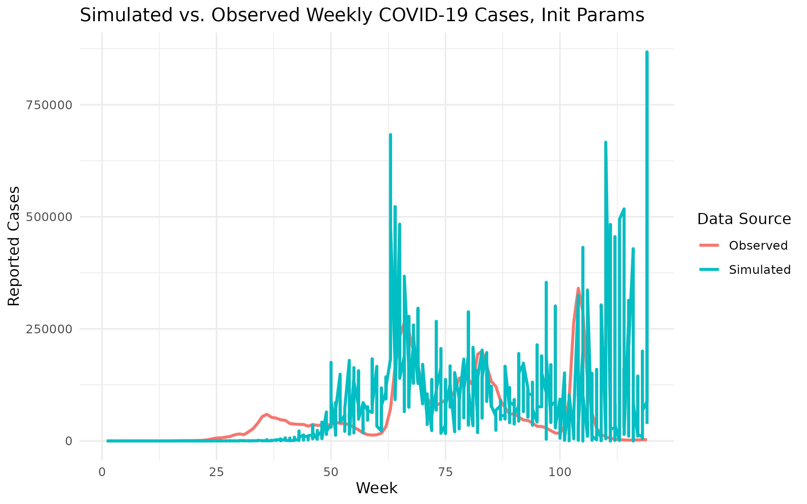
```

With the initial parameters, the model can closely capture the timing
and structure of the second and the third major outbreak. However, it
overestimates the sharpness of the third peak. The first outbreak has
been significantly underestimated in terms of magnitude. Besides, the
effective sample size drops sharply during the first outbreak (week
10-30), indicating poor particle diversity and possibly degeneracy in
the particle filter. Admittedly, the initial guesses are far from
perfect, but we will see significantly improved model fit after the
local search and global search.

## Local Search

We conducted the local search using 5,000 particle filters, 200
iterations. The diagnostics plot is as follows.

```{r, echo=FALSE,fig.align="center", out.width="75%", fig.cap="Local Search Diagnostics"}
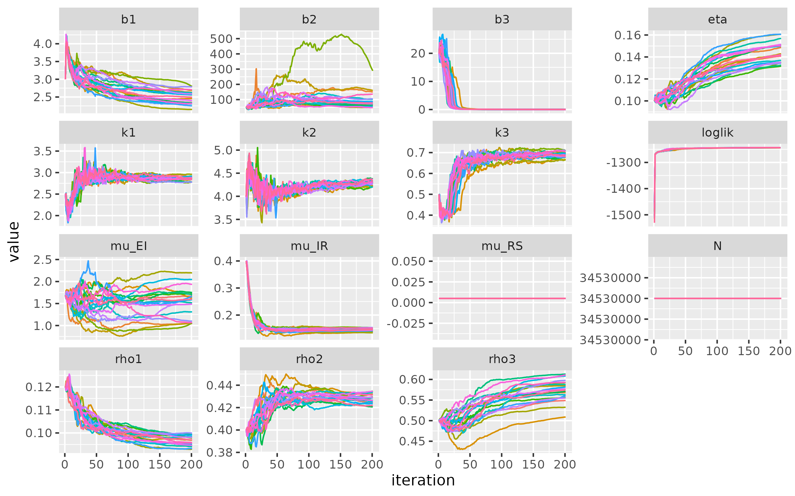
```

Though we don't include the effective sample size check here, but the
ess close to 0 in the middle part issue of our initial guess is actually
fixed after performing the global search. The log-likelihood
trajectories here show rapid convergence towards roughly -1,250 and
stabilization, indicating that the local search successfully identified
a high-likelihood region even in the expanded parameter space with
time-varying $k$ and $\rho$.

Parameter-wise, some estimates demonstrate stable convergence, including
the time-varying dispersion terms $k_1, k_2, k_3$, reporting rates
$\rho_1, \rho_2$, and the recover rate $\mu_{IR}$, while others may
suffer poor convergence and weak identifiability, especially $b_2$,
$\mu_{EI}$, and $\rho_3$.

In addition, unlike results from simpler models(they can be found in the
appendix) where $\eta$ decreased steadily, here it **increases over
iterations**, which may better reflect a realistic susceptible
population size.

Finally, $b_3$ may still be problematic since it rapidly declines and
converges toward zero, which could be the the model attempting to
compensate for prior infection dynamics by downweighting $b_3$, despite
the visible spike in observed cases.\
Overall, despite the rich parameterization, the model remains
well-behaved and converges stably.

The locally optimal parameters and the simulation based on them are as
follows.

```{r, echo=FALSE, fig.align="center",out.width="70%", fig.cap = "Simulations, Local Search"}
results_local = readRDS("./results/seirs_varying_k_rho/lik_local.rds")
results_local_maxll = results_local |> arrange(desc(loglik)) |> slice(1)
best_params_local = results_local_maxll |> as.list() |> unlist()
as.data.frame(t(best_params_local))
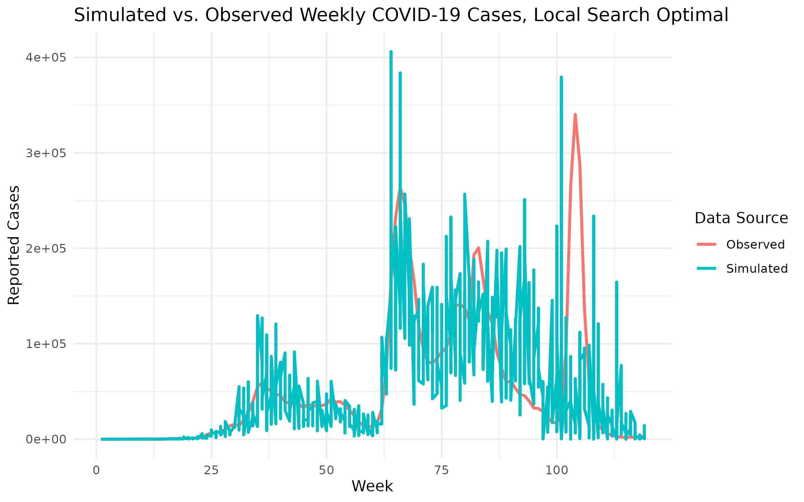
```

This simulation aligns closely with the observed data in terms of
overall wave timing and peak locations, especially during the first two
outbreak periods. Overall, the fit demonstrates strong agreement with
the empirical trend while allowing for stochastic variation.

## Global Search

Based on our local search convergence range, we give a wider global
searching range with 800 random starting points as follows:

$$
b_1 \in(1, 5) \quad b_2 \in (5, 50) \quad b_3 \in (10, 50) \\
\rho_1 \in(0.05, 0.3) \quad \rho_2 \in (0.3, 0.6) \quad \rho_3 \in (0.4, 0.8)\\
k_1 \in(1, 5) \quad k_2\in(1, 5) \quad k_3\in(1, 5) \\
\mu_{EI} \in (1, 5) \quad  \mu_{IR} \in (0.1, 0.5) \quad \eta \in(0, 1)\\
$$

```{r echo=FALSE, message=FALSE, warning=FALSE}
global_result = read_csv("results/seirs_varying_k_rho/Global_rho_800.csv")
ordered_result = arrange(global_result, desc(loglik))
top10 = head(ordered_result, 10)
datatable(top10, options = list(pageLength = 10, scrollX = TRUE))
```

Global search leads to slightly larger (around 3 log units)
log-likelihood than local search with small Monte Carlo standard error.
The sets of parameters corresponding to the top 10 log-likelihood stay
relatively consistent. Therefore, we can just extract the model with the
largest log-likelihood as our best model during current global search,
and use the existing results in the literature to access the rationality
of our best parameters.

```{r echo=FALSE}
global_best_params1 = ordered_result[1, ]
datatable(global_best_params1, options = list(pageLength = 1, scrollX = TRUE))
```

We first focus on the non-multi-stage parameters, to be specific
$\eta, \mu_{EI}, \mu_{IR}$:

At the onset of the COVID-19 pandemic in early 2020, the global
population was considered to be **entirely** susceptible to SARS-CoV-2,
as it was a novel virus with no prior immunity in humans (World Health
Organization [WHO], 2020)
[[11](https://www.who.int/publications/i/item/report-of-the-who-china-joint-mission-on-coronavirus-disease-2019-(covid-19))],
which suggests a very large initial fraction $\eta$ values 0.9 or even
near 1.0. As the pandemic progressed, population-level immunity began to
build through natural infections and widespread vaccination campaigns.
By late 2021, seroprevalence data from the U.S. Centers for Disease
Control and Prevention (CDC) indicated that over 90% of the U.S.
population had detectable antibodies due to either infection or
vaccination (Clarke et al., 2022)
[[12](https://doi.org/10.15585/mmwr.mm7117e3)]. However, susceptibility
to reinfection remained due to factors such as **waning immunity** and
the emergence of **immune-evasive variants** like Omicron. Recent
studies estimate that even with high levels of seroprevalence,
approximately 30–50% of individuals may be susceptible to reinfection at
any given time during the Omicron period, depending on prior exposure,
vaccine status, and the circulating variant (Pulliam et al., 2022)
[[13](https://doi.org/10.1126/science.abn4947)]. Based on our data (from
2020 to 2022), in Kerala, the vaccination record started in 2021 (can be
check in our data folder) and Omicron (the third peak) occurred in late
2021 and early 2022**,** so our best parameter initial fraction
$\eta \approx 0.71$ is reasonable in the general setting, and our added
$R \rightarrow S$ route can compensate our initial fraction $\eta$ by
returning people from state $R$ to state $S$, which means over the
entire time period, the proportion of people who once become susceptible
or enter state $S$ is larger than initial fraction $\eta \approx 0.71$,
may reach 0.9 or even near 1.0, but we fail to track the exact number in
our model.

According to Lauer, S. A., et al. (2020)
[[14](https://www.acpjournals.org/doi/10.7326/M20-0504)], in general,
the **median incubation period** for COVID-19 is approximately **5
days**, our best parameter $\mu_{EI} = 2.38$ corresponds to approximate
3 days incubation period, which is shorter than the 5 days, but is still
a reasonable value considering the possible region difference (for
example, health condition......) in Kerala, India.

According to World Health Organization (WHO) (2020) [15]**,** people
with mild infectious generally need 2 weeks to recover, and more severe
cases may take 3-6 weeks or even more, our best parameter $\mu_{IR}$
falls around 0.15, corresponds to 7 weeks recovery time, we admit that 7
weeks is still longer than the actual COVID-19 recover time, but at
least it becomes much better than our previous model results (**See
Appendix**) where $\mu_{IR}$ actually converges towards 0.01 which
corresponds to 100 weeks recovery time and probably it is the best our
model can get during current global search.

Then we want to focus on our multi-stage parameters, to be specific
$\rho_1, \rho_2, \rho_3, b_3$:

**Early Phase (2020–early 2021)** $\rho_1$**:** The first reporting
rate, $\rho_1 \approx 0.05$, reflects the early months of the pandemic
when both the public and governments were still coming to grips with the
outbreak. Testing capacity was extremely limited, awareness was low, and
many infections likely went undetected — particularly mild or
asymptomatic cases. Studies suggest that early under-ascertainment was
substantial, with some estimates indicating that fewer than 10% of
infections were reported in early 2020 (Wu et al., 2020; Nishiura et
al., 2020) [[16](https://doi.org/10.1038/s41467-020-18272-4)]
[[17](https://doi.org/10.1016/j.ijid.2020.03.020)].

**Middle Phase (mid-2021)** $\rho_2$**:** The increase to
$\rho_2 \approx 0.4$ coincides with expanded testing infrastructure,
public health campaigns, and improved surveillance. During this period,
rapid antigen tests and PCR testing became widely available in many
regions, increasing the likelihood that symptomatic and even some
asymptomatic cases were reported (Hellewell et al., 2021)
[[18](https://doi.org/10.1186/s12916-021-01982-x)].

**Late Phase (2022 onward)** $\rho_3, b_3$**:** The final reporting
rate, $\rho_3 \approx 0.85$, reflects a period in which detection
capacity was fully developed, testing became routine in many settings
(e.g., workplaces, schools), and public awareness was high.
Additionally, mandatory reporting systems and contact tracing efforts
were more refined. While some under reporting likely persisted
(especially for mild or asymptomatic cases), this value suggests a
near-complete reporting of symptomatic infections during peak testing
periods.

The final transmission rate $b_3 \approx 0.0024$ during Omicron outbreak
is actually very small, this may can be explained by our model
mechanism, but as the underlying model mechanism involves too many
states and transmissions, we fail to track the number of people in each
state at each time point in our model and conjecture reasonable
explanations.

After analyzing the rationality of our best model's parameters, we try
use them to generate 5 simple random simulations.

```{r echo=FALSE, message=FALSE, warning=FALSE}
set.seed(021031)
global_best_model1 = pomp(COVID_SEIR, params = global_best_params1[1:15])
sim_df <- simulate(global_best_model1, nsim = 5, format = "data.frame") |>
  dplyr::select(Week_Number, .id, reports) |>
  mutate(source = "Simulated")

real_df <- covid_data |>
  dplyr::select(Week_Number, Confirmed) |>
  rename(reports = Confirmed) |>
  mutate(source = "Observed")

(
  bind_rows(sim_df, real_df) |>
  ggplot(aes(x = Week_Number, y = reports, color = source)) +
  geom_line(linewidth = 1) +
  labs(
    title = "Simulated vs. Observed Weekly COVID-19 Cases, Global Best1",
    x = "Week",
    y = "Reported Cases",
    color = "Data Source"
  ) +
  theme_minimal()
  )
```

Despite slight overestimation issue in the first outbreak and a bit
early appearance of the third outbreak, our best global search model's
simulations suggest that our model fitting is pretty good and much
better than previous models **(See Appendix)**. It well captures three
different outbreaks within three different time intervals and their
relative magnitude from smallest (first outbreak) to largest(third
outbreaks), which can be viewed as a good candidate for explaining our
COVID_19 data in Kerala, India.

Then we want to dive deeper into the interpretation of the global search
best parameter by looking into their profile likelihood results,
especially $\rho, \eta,\mu_{IR}$.

## Profile Likelihood

```{r echo=FALSE, message=FALSE, warning=FALSE}
library(tidyverse)
library(patchwork)

# Rho1
rho_pro = read.csv("results/seirs_varying_k_rho/Rho1_profile_800.csv")
rho_pro |>
  filter(is.finite(loglik)) -> profile_results
p1 <- profile_results |>
  filter(loglik > max(loglik) - 10, loglik.se < 1) |>
  group_by(round(rho1, 2)) |>
  filter(rank(-loglik) < 3) |>
  ungroup() |>
  ggplot(aes(x = rho1, y = loglik)) +
  geom_point() +
  geom_hline(color = "red", yintercept = max(profile_results$loglik) - 0.5 * qchisq(df = 1, p = 0.95)) +
  ggtitle("Profile Likelihood for rho1")

profile_results |>
  filter(loglik > max(loglik) - 0.5 * qchisq(df = 1, p = 0.95)) |>
  summarize(min = min(rho1), max = max(rho1)) -> rho1_ci

# Rho2
rho_pro = read.csv("results/seirs_varying_k_rho/Rho2_profile_800.csv")
rho_pro = arrange(rho_pro, desc(loglik))[-1, ]
rho_pro |>
  filter(is.finite(loglik)) -> profile_results
p2 <- profile_results |>
  filter(loglik > max(loglik) - 10, loglik.se < 1) |>
  group_by(round(rho2, 2)) |>
  filter(rank(-loglik) < 3) |>
  ungroup() |>
  ggplot(aes(x = rho2, y = loglik)) +
  geom_point() +
  geom_hline(color = "red", yintercept = max(profile_results$loglik) - 0.5 * qchisq(df = 1, p = 0.95)) +
  ggtitle("Profile Likelihood for rho2")

profile_results |>
  filter(loglik > max(loglik) - 0.5 * qchisq(df = 1, p = 0.95)) |>
  summarize(min = min(rho2), max = max(rho2)) -> rho2_ci

# Rho3
rho_pro = read.csv("results/seirs_varying_k_rho/Rho3_profile_800.csv")
rho_pro |>
  filter(is.finite(loglik)) -> profile_results
p3 <- profile_results |>
  filter(loglik > max(loglik) - 10, loglik.se < 1) |>
  group_by(round(rho3, 2)) |>
  filter(rank(-loglik) < 3) |>
  ungroup() |>
  ggplot(aes(x = rho3, y = loglik)) +
  geom_point() +
  geom_hline(color = "red", yintercept = max(profile_results$loglik) - 0.5 * qchisq(df = 1, p = 0.95)) +
  ggtitle("Profile Likelihood for rho3")

profile_results |>
  filter(loglik > max(loglik) - 0.5 * qchisq(df = 1, p = 0.95)) |>
  summarize(min = min(rho3), max = max(rho3)) -> rho3_ci

# Combine plots in 1x3 layout
p1 + p2 + p3 + plot_layout(ncol = 3)

rho_ci_table = rbind(rho1_ci, rho2_ci, rho3_ci)
rownames(rho_ci_table) = c("Rho1", "Rho2", "Rho3")
colnames(rho_ci_table) = c("Lower", "Upper")
print(rho_ci_table)
```

All three profile plots are consistent in the largest log-likelihood,
which is between -1240 and -1239. The profile plots of $\rho_1$ and
$\rho_3$ all have clear pattern and produce nice confidence interval
without varying too much from our best global search model parameters;
but the profile plot of $\rho_2$ looks much more messy, a possible
reason is that the log-likelihood is very hard to calculate for some
points and lead to potential maximization errors, despite that, the
profile plot of $\rho_2$ has a very nice quadratic form in the top-left
corner.

```{r echo=FALSE}
eta_pro <- read.csv("results/seirs_varying_k_rho/Eta_profile_800.csv")
eta_pro <- arrange(eta_pro, desc(loglik))[-1, ]  # NOTE: Fixed variable name from rho_pro
eta_pro |>
  filter(is.finite(loglik)) -> profile_eta

eta_plot <- profile_eta |>
  filter(loglik > max(loglik) - 10, loglik.se < 1) |>
  group_by(round(eta, 2)) |>
  filter(rank(-loglik) < 3) |>
  ungroup() |>
  ggplot(aes(x = eta, y = loglik)) +
  geom_point() +
  geom_hline(
    color = "red",
    yintercept = max(profile_eta$loglik) - 0.5 * qchisq(df = 1, p = 0.95)
  ) +
  ggtitle("Profile Likelihood for Eta")

# Confidence interval for eta
profile_eta |>
  filter(loglik > max(loglik) - 0.5 * qchisq(df = 1, p = 0.95)) |>
  summarize(min = min(eta), max = max(eta)) -> eta_ci

# --- mu_IR profile ---
muir_pro <- read.csv("results/seirs_varying_k_rho/muir_profile_800.csv")
muir_pro |>
  filter(is.finite(loglik)) -> profile_muir

muir_plot <- profile_muir |>
  filter(loglik > max(loglik) - 10, loglik.se < 1) |>
  group_by(round(mu_IR, 2)) |>
  filter(rank(-loglik) < 3) |>
  ungroup() |>
  ggplot(aes(x = mu_IR, y = loglik)) +
  geom_point() +
  geom_hline(
    color = "red",
    yintercept = max(profile_muir$loglik) - 0.5 * qchisq(df = 1, p = 0.95)
  ) +
  ggtitle("Profile Likelihood for mu_IR")

# Confidence interval for mu_IR
profile_muir |>
  filter(loglik > max(loglik) - 0.5 * qchisq(df = 1, p = 0.95)) |>
  summarize(min = min(mu_IR), max = max(mu_IR)) -> muir_ci

# --- Combine Plots ---
eta_plot + muir_plot + plot_layout(ncol = 2)

ci_table = rbind(eta_ci, muir_ci)
rownames(ci_table) = c("Eta", "mu_IR")
colnames(ci_table) = c("Lower", "Upper")
print(ci_table)
```

The profile of $\eta$ has clear pattern despite several possible points
where log-likelihood is hard to compute and lead to maximization errors,
it produces a wide confidence interval on $\eta$ which may coincide with
our previous statement that added $R \rightarrow S$ route can compensate
our initial fraction $\eta$ and makes initial fraction $\eta$ not very
sensitive. The profile of $\mu_{IR}$ has a good quadratic from on the
left side where $\mu_{IR}$ is between 0 and 0.25, but contains several
isolated points with large log-likelihood on the right side where
$\mu_{IR}$ is between 1.0 and 1.5 (one week recovery time), and 1.0 to
1.5 is a range we probably fail to incorporate during our previous
global search, which further indicates another possible global optimum
search range and another global optimum model that may improve our
current global search best model by directly improving $\mu_{IR}$.

# Model 4: SEIRS Model2

As discussed above, the profile likelihood plots reveal a data point
with a remarkably high log-likelihood, corresponding to a set of stable
and plausible parameters. We therefore decided to proceed with a
follow-up investigation. Specifically, we have replace the initial
parameters for the local search with those from the data point, while
keeping all other configurations:

\begin{equation*}\left\{\begin{matrix}
  b_1 = 2.33, b_2 = 3.68, b_3 = 11.40, \\
  \mu_{EI} = 1.67, \mu_{IR} = 0.4, \mu_{RS} = 0.005, \\
  \rho_1 = 0.07, \rho_2 =0.51, \rho_3 = 0.11 \\
  k_1 = 1.26, k_2 = 6, k_3 = 2.8 \\
  \eta = 0.62 \\
\end{matrix}\right.\end{equation*}

## Local Search 2

Let's revisit the diagnostics. The log-likelihood reaches -1,240 after
200 iterations and still exibits an upward trend. Most parameter show
strong signs of convergence except for $\eta$ and $\rho_1$. More
importantly, the estimated parameters now have better intepretability,
particularly $\mu_{IR}$, which is now centered around 1.0
$\mathrm{week}^{-1}$ rather than 0.15$\mathrm{week}^{-1}$.

```{r, echo=FALSE,fig.align="center", out.width="75%", fig.cap="Local Search Diagnostics"}
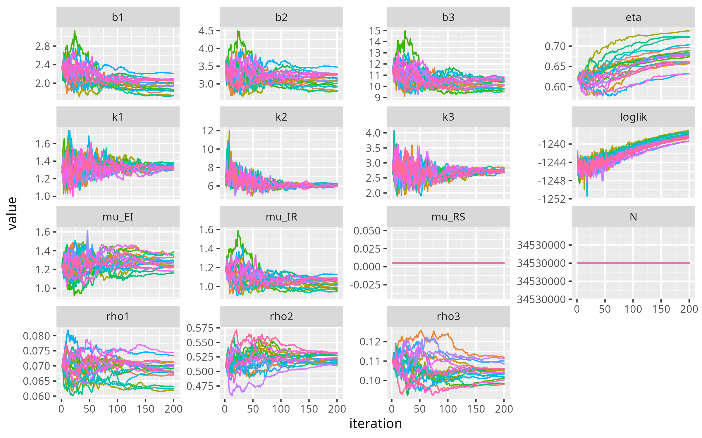
```

The simulations looks similar to the previous model, although there is
still spike at the first outbreak which is not supposed to exist.

```{r, echo=FALSE, fig.align="center",out.width="70%", fig.cap = "Simulations, Local Search"}
results_local = readRDS("./results/seirs_global2/lik_local.rds")
results_local_maxll = results_local |> arrange(desc(loglik)) |> slice(1)
best_params_local = results_local_maxll |> as.list() |> unlist()
as.data.frame(t(best_params_local))
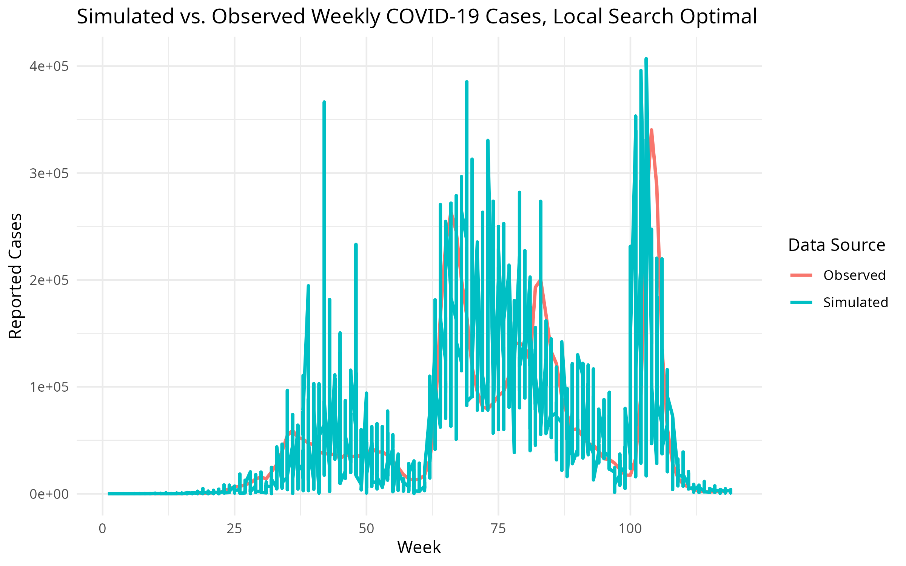
```

## Global Search 2

```{r echo=FALSE, message=FALSE, warning=FALSE}
global_result = read_csv("results/seirs_global2/Global_rho_jump.csv")
ordered_result = arrange(global_result, desc(loglik))
top10 = head(ordered_result, 10)
datatable(top10, options = list(pageLength = 10, scrollX = TRUE))
```

Global search leads to slightly larger log-likelihood (2 log units) than
local search with small Monte Carlo standard error. The sets of
parameters corresponding to the top 10 log-likelihood stay relatively
consistent. Therefore, we can just extract the model with the largest
log-likelihood as our best model during current global search, and the
best parameters is as follows,

```{r echo=FALSE}
global_best_params2 = ordered_result[1, ]
datatable(global_best_params2, options = list(pageLength = 1, scrollX = TRUE))
```

We focus on the changes related to the previous global search, the
log-likelihood becomes 6 log units larger and converges around -1233
with small Monte Carlo standard error. In terms of parameters
interpretation, some of the parameters become better in this model, but
new problems also appear.

For non-multi-stage parameters, to be specific
$\eta, \mu_{EI}, \mu_{IR}$:

$\eta$ increase to 0.998, which is almost 1, coincides with our previous
statement that global population was considered to be **entirely**
susceptible to SARS-CoV-2, and indicates that the added
$R \rightarrow S$ in this model mostly indicates second/third or even
multiple times infectious situation.

$\mu_{EI} \approx1.1$, which corresponds to 6 days incubation period,
which is pretty much close to our previous statement 5 days.

$\mu_{IR}\approx 0.84$ is significantly improved from 0.15 in the
previous global search, and corresponds to 8.3 days recovery time on
average. We admit 8.3 days is slight shorter than 2 weeks recovery time
suggested in the literature, but it is more reasonable than 7 weeks on
average in the previous global search.

For multi-stage parameters, to be more specific
$\rho_1, \rho_2, \rho_3, b_3$ :

$\rho_1, \rho_2$ stay roughly the same as previous global search
candidate, but a new problematic parameter is $\rho_3 \approx 0.09$
during the third(Omicron) outbreak, which is too small and beyond our
expectation, we fail to explain what our best model suggests for
$\rho_3$.

$b_3 \approx 9.14$, it is a coincident that $b_3$ is solved by this
model, which maintains a reasonable transmission rate order, smallest
transmission rate $b_1$ at the beginning of pandemic outbreak, slightly
larger $b_2$ in the second(Delta) outbreak, and significantly larger
$b_3$ during the third(Omicron) outbreak which coincides with the
statement "Omicron has a basic reproduction number estimated to be **2–3
times higher** than Delta, which itself was **more transmissible** than
earlier variants" (Liu, Y., Rocklöv, J. , 2022)
[[19](https://doi.org/10.1093/jtm/taac037)].

Similarly, we provide 5 simple random simulations based on our second
global search candidate's parameters.

```{r echo=FALSE}
set.seed(021031)
global_best_model2 = pomp(COVID_SEIR, params = global_best_params2[1:15])
sim_df <- simulate(global_best_model2, nsim = 5, format = "data.frame") |>
  dplyr::select(Week_Number, .id, reports) |>
  mutate(source = "Simulated")

real_df <- covid_data |>
  dplyr::select(Week_Number, Confirmed) |>
  rename(reports = Confirmed) |>
  mutate(source = "Observed")

(
  bind_rows(sim_df, real_df) |>
  ggplot(aes(x = Week_Number, y = reports, color = source)) +
  geom_line(linewidth = 1) +
  labs(
    title = "Simulated vs. Observed Weekly COVID-19 Cases, Global Best2",
    x = "Week",
    y = "Reported Cases",
    color = "Data Source"
  ) +
  theme_minimal()
  )
```

The simulation results are slightly better than previous global search
best model candidate, with the first and second outbreaks well captured
as previous global search candidate, while solving the early appearance
issue so that the third(Omicron) outbreak is roughly better captured.
Then the best model in current global search 2 can be viewed as the
second global search candidate

As the profile plot of $\mu_{IR}$ shows some interesting results in the
previous global search candidate, we want to dive deeper to check the
profile plot of $\mu_{IR}$ of our second global search candidate and try
to combine two profile results to get a closer and nicer look of the
full-range profile likelihood of $\mu_{IR}$.

## Profile Likelihood on $\mu_{IR}$

```{r echo=FALSE}
library(patchwork)
# --- mu_IR profile ---
muir_pro2 <- read.csv("results/seirs_global2/muir_profile.csv")
muir_pro2 |>
  filter(is.finite(loglik)) -> profile_muir2

muir_plot2 <- profile_muir2 |>
  filter(loglik > max(loglik) - 10, loglik.se < 1) |>
  group_by(round(mu_IR, 2)) |>
  filter(rank(-loglik) < 3) |>
  ungroup() |>
  ggplot(aes(x = mu_IR, y = loglik)) +
  geom_point() +
  geom_hline(
    color = "red",
    yintercept = max(profile_muir$loglik) - 0.5 * qchisq(df = 1, p = 0.95)
  ) +
  ggtitle("Profile Likelihood")

profile_muir_combined = rbind(profile_muir, profile_muir2)
muir_plot_combine <- profile_muir_combined |>
  filter(loglik > max(loglik) - 10, loglik.se < 1) |>
  group_by(round(mu_IR, 2)) |>
  filter(rank(-loglik) < 3) |>
  ungroup() |>
  ggplot(aes(x = mu_IR, y = loglik)) +
  geom_point() +
  geom_hline(
    color = "red",
    yintercept = max(profile_muir_combined$loglik) - 0.5 * qchisq(df = 1, p = 0.95)
  ) +
  ggtitle("Combined Profile Likelihood")
muir_plot2 + muir_plot_combine + plot_layout(ncol = 2)

profile_muir_combined |>
  filter(loglik > max(loglik) - 0.5 * qchisq(df = 1, p = 0.95)) |>
  summarize(min = min(mu_IR), max = max(mu_IR)) -> muir_ci
cat("Combining two profile dataset, the 95% confidence interval of mu_IR is", muir_ci[[1]], muir_ci[[2]])
```

The profile plot (on the left) coincides with our previous guess that
there is another global optimum range where $\mu_{IR}$ falls between
0.75 to 1.25 that we fail to explore during the first global search.
After combining two profile datasets and make a profile plot (on the
right), we have a very clear pattern which shows two quadratic-shape
peaks with the first peak corresponds to our first global search and
second peak corresponds to our second global search.

# Conclusion & Limitations

Then we extract the log-likelihood for our benchmark $ARIMA(5, 1, 5)$
and our two $SEIRS$ global search candidates, though we believe compare
log-likelihood is sufficient, we also provide $AIC$ values comparison
[[2](https://ionides.github.io/531w25/05/slides.pdf)].

```{r echo=FALSE, message=FALSE, warning=FALSE}
arima_best_model = best_model
arima_best_model_loglik = arima_best_model$loglik
arima_best_model_aic = arima_best_model$aic
arima_best_model_res = c(arima_best_model_loglik, arima_best_model_aic)

seirs_best_model1_loglik = global_best_params1$loglik
seirs_best_model2_loglik = global_best_params2$loglik
seirs_best_model_num = 12
seirs_best_model1_aic = 2*seirs_best_model_num-2*seirs_best_model1_loglik
seirs_best_model2_aic = 2*seirs_best_model_num-2*seirs_best_model2_loglik
seirs_best_model1_res = c(seirs_best_model1_loglik, seirs_best_model1_aic)
seirs_best_model2_res = c(seirs_best_model2_loglik, seirs_best_model2_aic)

compare_table = rbind(arima_best_model_res,
                      seirs_best_model1_res,
                      seirs_best_model2_res)
rownames(compare_table) = c("ARIMA(5, 1, 5)", "SEIRS_Candidate1", "SEIRS_Candidate2")
colnames(compare_table) = c("Log-Likelihood", "AIC")
compare_table
```

Compared with our benchmark ARIMA(5, 1, 5), we can see that both our
SEIRS global search candidates (12 free parameters) have significantly
larger log-likelihood and smaller AIC values. This means that the SEIRS
global search candidates are actually better fit in terms of both
log-likelihood (AIC) and potential mechanism interpretation values.
However, between two SEIRS global search candidates, though the first
candidate has smaller log-likelihood and larger AIC, consider the
different parameter values and their interpretation values, we prefer to
leave all of they here as our best SEIRS model in this project, which
can be further explored in the future.

Also, we provide another option VAR model using the confirmed, recovery
and deceased data at the same time, which is also an advantage of our
well recorded dataset. Compared to ARIMA, the VAR model has the
advantage of handling multiple interrelated time series simultaneously,
allowing it to capture cross-variable dynamics that ARIMA cannot.
Compared to POMP models, VAR models are simpler and more transparent,
requiring fewer assumptions about the underlying latent processes. This
makes VAR easier to estimate and interpret. But as the log-likelihood
and AIC for VAR model is based on all confirmed, recovered and deceased
data, while ARIMA and SEIRS only incorporate confirmed data, we can not
directly compared with ARIMA and SEIRS model, which can be further
discuss in the future.

One of the main limitation of our project is the fixed setting on
$\mu_{RS} = 0.005$ for SEIRS model, corresponds to 200 weeks immunity
and is generally too large. But as we examined significant divergence
results and worse local search and global search results when we try to
increase $\mu_{RS}$, so we give up on that and leave for future
exploration. Another possible limitation is that due to the complexity
of our SEIRS model, we may not have a very nice-looking global
log-likelihood surface and due to our limited time and searching setting
on Greatlakes (NP = 5000, NMIF = 200, Guesses = 400/800), it is really
tricky and hard to find the actual global optimum. Even though we add an
extra round of global search after we examine some interesting points
occur in the $\mu_{IR}$ profile plot and our parameter and simulation
results look nice, we may still get stuck into some local optimum, and
fail to really touch the global optimum. We believe this a very common
problem in carrying out maximization algorithm in complex models, which
also is left for future explorations.

# Appendix

## SEIRS, with Constant $k$ and $\rho$

### Initial Guesses

\begin{equation*} \left\{
\begin{matrix}
  b_1 = 5, b_2 = 10, b_3 = 20, \\
  \mu_{EI} = 1.67, \mu_{IR} = 0.5, \mu_{RS} = 0.005, \\
  \rho = 0.4, \\
  k = 10, \\
  \eta = 0.1 \\
\end{matrix}
\right.\end{equation*}

```{r echo=FALSE, fig.show="hold",out.width="80%"}
knitr::include_graphics("./results/seirs_const/pic/sim_init.png")
```

With the initial guess, the model manages to capture the timeline for
most outbreaks, but fails to estimate the magnitudes.

```{r include=FALSE}
KERALA_POP = 34530000

NP = 5000; NMIF = 200; NUM_GUESSES = 400
# NP = 200; NMIF = 10; NUM_GUESSES = 40 # debug line

interval = c(61, 35, 23) # DO NOT change the first entry. It's the time when the vaccination program started.

# The code for the SEIR model is developed from https://kingaa.github.io/sbied/pfilter/model.R

covid_data = read.csv("./data/weekly_df.csv")


seir_step <- Csnippet("

  double Beta;
  if (interval == 1) Beta = b1;
  else if (interval == 2) Beta = b2;
  else Beta = b3;

  double dN_SE = rbinom(S,1-exp(-Beta*I/N*dt));
  double dN_EI = rbinom(E,1-exp(-mu_EI*dt));
  double dN_IR = rbinom(I,1-exp(-mu_IR*dt));

  double dN_RS = rbinom(R, 1 - exp(-mu_RS*dt));

  S -= dN_SE - dN_RS;

  E += dN_SE - dN_EI;
  I += dN_EI - dN_IR;
  R += dN_IR;
  H += dN_IR;
")
 
seir_init <- Csnippet("
  S = nearbyint(eta*N);
  E = 0;
  I = 1000;
  R = nearbyint((1-eta)*N);
  H = 0;
")

dmeas <- Csnippet("
  double mean_reports = fmax(rho * H, 1e-5);
  lik = dnbinom_mu(reports, k, mean_reports, give_log);
")

rmeas <- Csnippet("
  reports = rnbinom_mu(k,rho*H);"
)

emeas <- Csnippet("
  E_reports = rho*H;"
)

time_indicators = covariate_table(
    t = covid_data$Week_Number,
    interval = c(rep(1, interval[1]), rep(2, interval[2]), rep(3, interval[3])), 
    times = "t")

## MODEL INIT

init_params = c(b1=5,b2=10,b3=20,rho=.4, mu_EI=1/0.6, mu_IR=1/2.5, mu_RS = .005, k=10, eta=.1,N=KERALA_POP) 

# assumptions: 4-4.5 days of incubation period; 2 weeks of recovery period; 26 weeks of immunity

cat("[INFO] Initial model parameters:\n")
setNames(sprintf("%.3f", init_params), names(init_params))

covid_data |>
  dplyr::select(Week_Number,reports=Confirmed) |>
  filter(Week_Number<=119) |>
  pomp(
    times="Week_Number",t0=1,
    rprocess=euler(seir_step,delta.t=1/7),
    rinit=seir_init,
    rmeasure=rmeas,
    dmeasure=dmeas,
    emeasure=emeas,
    accumvars="H",
    statenames=c("S", "E","I","R","H"),
    paramnames=c("b1","b2","b3","mu_EI","mu_IR", "mu_RS", "eta","rho","k","N"),
    params=init_params,
    covar = time_indicators
  ) -> COVID_SEIR
```

### Local Search

The diagnostics plot is as follows. The log-likelihood shows rapid
improvement in the early iterations, followed by clear stabilization
around iteration 100, indicating good convergence of the local search.
However, it eventually stays at roughly -1,800, which is lower than that
of the benchmark by almost 500 units.

Most parameter trajectories exhibit some variability. Fixed parameters
($k$, $\mu_{RS}$, $N$) remain constant as expected.

```{r, echo=FALSE,fig.align="center", out.width="75%"}
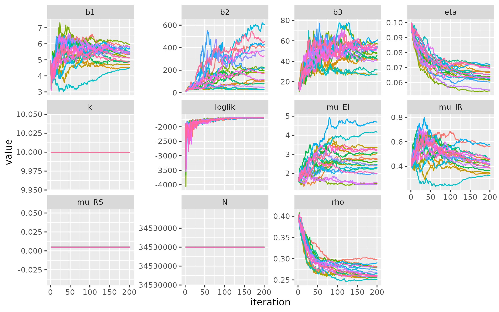
```

The locally optimal parameters and the simulation based on them are as
follows.

```{r, echo=FALSE, fig.align="center",out.width="70%"}
results_local = readRDS("./results/seirs_const/lik_local.rds")
results_local_maxll = results_local |> arrange(desc(loglik)) |> slice(1)
best_params_local = results_local_maxll |> as.list() |> unlist()
as.data.frame(t(best_params_local))
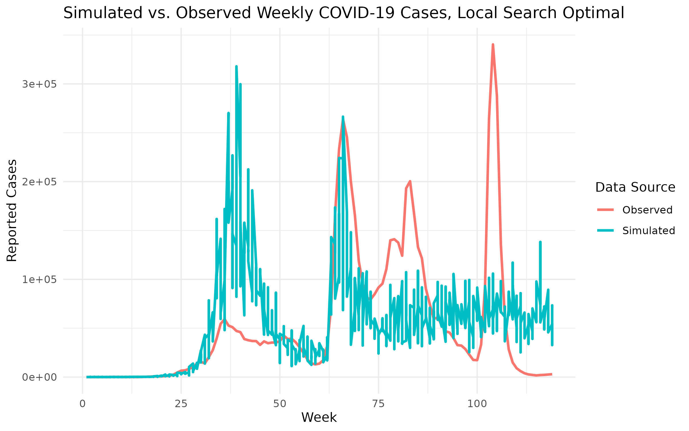
```

The model can closely capture the timing of the first outbreak, but it
overestimates the amplitude. The second peak looks great. Unfortunately
though, the model dies down and fails to capture any volatilities after
that. Changes in model structure will be necessary if the global search
cannot lead to significant improvements in model performance.

### Global Search

```{r echo=FALSE, message=FALSE, warning=FALSE}
global_result = read_csv("results/seirs_const/Global.csv")
ordered_result = arrange(global_result, desc(loglik))
top10 = head(ordered_result, 10)
datatable(top10, options = list(pageLength = 10, scrollX = TRUE))
```

```{r echo=FALSE, message=FALSE, warning=FALSE}
set.seed(021031)
global_best_params = ordered_result[1, ]
global_best_model = pomp(COVID_SEIR, params = global_best_params[1:11])
sim_df <- simulate(global_best_model, nsim = 5, format = "data.frame") |>
  dplyr::select(Week_Number, .id, reports) |>
  mutate(source = "Simulated")

real_df <- covid_data |>
  dplyr::select(Week_Number, Confirmed) |>
  rename(reports = Confirmed) |>
  mutate(source = "Observed")

(
  bind_rows(sim_df, real_df) |>
  ggplot(aes(x = Week_Number, y = reports, color = source)) +
  geom_line(linewidth = 1) +
  labs(
    title = "Simulated vs. Observed Weekly COVID-19 Cases, Global Best",
    x = "Week",
    y = "Reported Cases",
    color = "Data Source"
  ) +
  theme_minimal()
  )
```

## SEIRS, with constant $\rho$ and Time-varying $k$

### Initial Guesses

\begin{equation*} \left\{
\begin{matrix}
  b_1 = 5, b_2 = 10, b_3 = 20, \\
  \mu_{EI} = 1.67, \mu_{IR} = 0.5, \mu_{RS} = 0.005, \\
  \rho = 0.4, \\
  k_1 = 8, k_2 = 5, k_3 = 2 \\
  \eta = 0.1 \\
\end{matrix}
\right.\end{equation*}

```{r echo=FALSE, fig.show="hold",out.width="80%"}
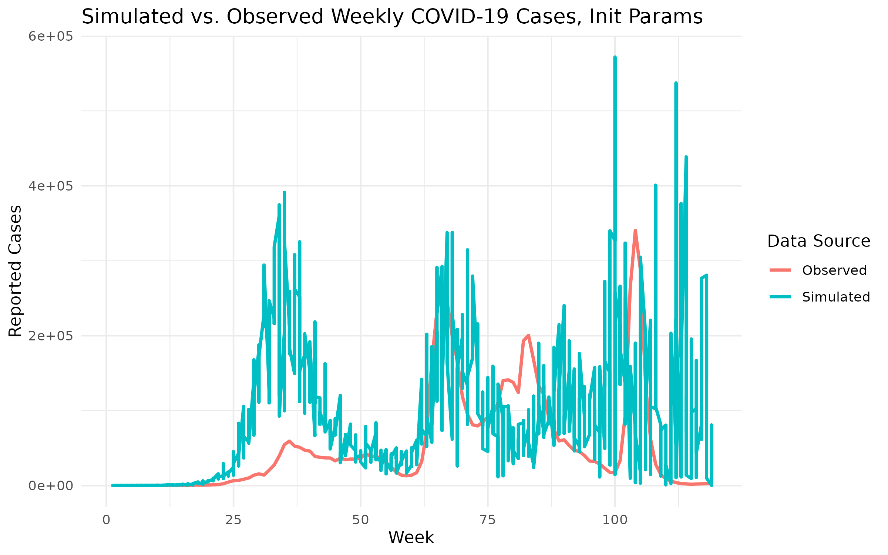
```

The timeframes of all three outbreaks are captured more accurately,
while the magnitudes are still problematic.

```{r include=FALSE}
KERALA_POP = 34530000

NP = 5000; NMIF = 200; NUM_GUESSES = 400
# NP = 200; NMIF = 10; NUM_GUESSES = 40 # debug line

cat("[INFO] Iteration parameters: Np =", NP, " | Nmif =", NMIF, "\n")

interval = c(61, 35, 23) # DO NOT change the first entry. It's the time when the vaccination program started.

cat(sprintf("[INFO] Time interval (in weeks): [1 - %d], [%d - %d], [%d - %d]\n", interval[1], interval[1] + 1, interval[1] + interval[2], 
    interval[1] + interval[2] + 1, sum(interval)))


# The code for the SEIR model is developed from https://kingaa.github.io/sbied/pfilter/model.R

covid_data = read.csv("./data/weekly_df.csv")


seir_step <- Csnippet("

  double Beta;
  if (interval == 1) Beta = b1;
  else if (interval == 2) Beta = b2;
  else Beta = b3;

  double dN_SE = rbinom(S,1-exp(-Beta*I/N*dt));
  double dN_EI = rbinom(E,1-exp(-mu_EI*dt));
  double dN_IR = rbinom(I,1-exp(-mu_IR*dt));

  double dN_RS = rbinom(R, 1 - exp(-mu_RS*dt));

  S -= dN_SE - dN_RS;

  E += dN_SE - dN_EI;
  I += dN_EI - dN_IR;
  R += dN_IR;
  H += dN_IR;
")
 
seir_init <- Csnippet("
  S = nearbyint(eta*N);
  E = 0;
  I = 1000;
  R = nearbyint((1-eta)*N);
  H = 0;
")

dmeas <- Csnippet("

  double k;
  if (interval == 1) k = k1;
  else if (interval == 2) k = k2;
  else k = k3;

  double mean_reports = fmax(rho * H, 1e-5);
  lik = dnbinom_mu(reports, k, mean_reports, give_log);
")

rmeas <- Csnippet("

  double k;
  if (interval == 1) k = k1;
  else if (interval == 2) k = k2;
  else k = k3;

  reports = rnbinom_mu(k,rho*H);"
)

emeas <- Csnippet("
  E_reports = rho*H;"
)

time_indicators = covariate_table(
    t = covid_data$Week_Number,
    interval = c(rep(1, interval[1]), rep(2, interval[2]), rep(3, interval[3])), 
    times = "t")

## MODEL INIT

init_params = c(b1=5,b2=10,b3=20,rho=.4, mu_EI=1/0.6, mu_IR=1/2.5, mu_RS = .005, 
                k1 = 8, k2=5, k3=1, eta=.1,N=KERALA_POP) 

# assumptions: 4-4.5 days of incubation period; 2 weeks of recovery period; 26 weeks of immunity

cat("[INFO] Initial model parameters:\n")
setNames(sprintf("%.3f", init_params), names(init_params))

covid_data |>
  dplyr::select(Week_Number,reports=Confirmed) |>
  filter(Week_Number<=119) |>
  pomp(
    times="Week_Number",t0=1,
    rprocess=euler(seir_step,delta.t=1/7),
    rinit=seir_init,
    rmeasure=rmeas,
    dmeasure=dmeas,
    emeasure=emeas,
    accumvars="H",
    statenames=c("S", "E","I","R","H"),
    # paramnames=c("b1","b2","b3","mu_EI","mu_IR", "mu_RS", "eta","rho","k","N"),
    paramnames=c("b1","b2","b3","mu_EI","mu_IR", "mu_RS", "eta","rho","k1", "k2", "k3", "N"),
    params=init_params,
    covar = time_indicators
  ) -> COVID_SEIR
```

### Local Search

Compared to the previous plot, this diagnostics plot shows **much faster
and more stable convergence** across both log likelihood and parameter
trajectories. The log likelihood stabilizes quickly with minimal
variability between chains, while improving to around -1,300, indicating
better local optimization.

For parameters, the inclusion of $k_1$, $k_2$, and $k_3$ leads to a
slightly higher-dimensional parameter space, yet their trajectories
converge sharply, especially $k_1$ and $k_3$, which stabilize early. In
contrast to the earlier plot, this suggests **improved identifiability
and reduced noise**, possibly due to better initialization or more
informative structure of the model. Parameters like $b_1$, $b_2$, and
$\mu_{IR}$ show clearer and more uniform convergence trends across
chains. However, the steady decline of $\eta$ across iterations is
concerning, as it suggests the model increasingly favors a smaller
initial susceptible population, which may be unrealistic. This could
indicate issues with parameter identifiability or compensatory behavior
to fit later outbreak waves. Overall, the model appears more stable and
well-calibrated than before.

```{r, echo=FALSE,fig.align="center", out.width="75%"}
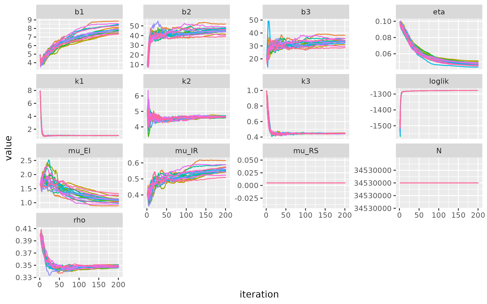
```

The locally optimal parameters and the simulation based on them are as
follows.

```{r, echo=FALSE, fig.align="center",out.width="70%"}
results_local = readRDS("./results/seirs_varying_k/lik_local.rds")
results_local_maxll = results_local |> arrange(desc(loglik)) |> slice(1)
best_params_local = results_local_maxll |> as.list() |> unlist()
print(best_params_local)
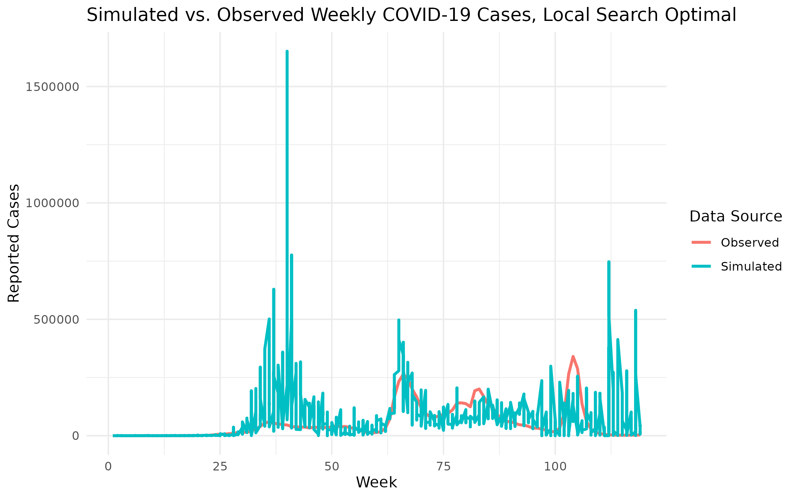
```

While most of the simulation aligns reasonably well with the timing and
scale of observed waves, the first spike shows a clear anomaly from one
of the simulations, in which more than 1.5 million cases are reported in
a single week, and that is far above the observed data. This outlier
suggests instability or overdispersion in that interval, likely driven
by parameter uncertainty or an extreme realization, while the rest of
the simulations remain within a plausible range.

### Global Search

#### Narrow Global Search

```{r echo=FALSE, message=FALSE, warning=FALSE}
global_result = read_csv("results/seirs_varying_k/Global_smaller.csv")
ordered_result = arrange(global_result, desc(loglik))
top10 = head(ordered_result, 10)
datatable(top10, options = list(pageLength = 10, scrollX = TRUE))
```

```{r echo=FALSE}
set.seed(021031)
global_best_params = ordered_result[2, ]
global_best_model = pomp(COVID_SEIR, params = global_best_params[1:13])
sim_df <- simulate(global_best_model, nsim = 5, format = "data.frame") |>
  dplyr::select(Week_Number, .id, reports) |>
  mutate(source = "Simulated")

real_df <- covid_data |>
  dplyr::select(Week_Number, Confirmed) |>
  rename(reports = Confirmed) |>
  mutate(source = "Observed")

(
  bind_rows(sim_df, real_df) |>
  ggplot(aes(x = Week_Number, y = reports, color = source)) +
  geom_line(linewidth = 1) +
  labs(
    title = "Simulated vs. Observed Weekly COVID-19 Cases, Global Best",
    x = "Week",
    y = "Reported Cases",
    color = "Data Source"
  ) +
  theme_minimal()
  )
```

#### Wider Global Search

```{r echo=FALSE, message=FALSE, warning=FALSE}
global_result = read_csv("results/seirs_varying_k/Global_800.csv")
ordered_result = arrange(global_result, desc(loglik))
top10 = head(ordered_result, 10)
datatable(top10, options = list(pageLength = 10, scrollX = TRUE))
```

```{r echo=FALSE}
set.seed(021031)
global_best_params = ordered_result[1, ]
global_best_model = pomp(COVID_SEIR, params = global_best_params[1:13])
sim_df <- simulate(global_best_model, nsim = 5, format = "data.frame") |>
  dplyr::select(Week_Number, .id, reports) |>
  mutate(source = "Simulated")

real_df <- covid_data |>
  dplyr::select(Week_Number, Confirmed) |>
  rename(reports = Confirmed) |>
  mutate(source = "Observed")

(
  bind_rows(sim_df, real_df) |>
  ggplot(aes(x = Week_Number, y = reports, color = source)) +
  geom_line(linewidth = 1) +
  labs(
    title = "Simulated vs. Observed Weekly COVID-19 Cases, Global Best",
    x = "Week",
    y = "Reported Cases",
    color = "Data Source"
  ) +
  theme_minimal()
  ) 
```

### Wider Global Search Profile Likelihood

```{r echo=FALSE}
eta_pro <- read.csv("results/seirs_varying_k/Eta_profile_800.csv")
eta_pro <- arrange(eta_pro, desc(loglik))[-1, ]  # NOTE: Fixed variable name from rho_pro
eta_pro |>
  filter(is.finite(loglik)) -> profile_eta

eta_plot <- profile_eta |>
  filter(loglik > max(loglik) - 10, loglik.se < 1) |>
  group_by(round(eta, 2)) |>
  filter(rank(-loglik) < 3) |>
  ungroup() |>
  ggplot(aes(x = eta, y = loglik)) +
  geom_point() +
  geom_hline(
    color = "red",
    yintercept = max(profile_eta$loglik) - 0.5 * qchisq(df = 1, p = 0.95)
  ) +
  ggtitle("Profile Likelihood for Eta")

# Confidence interval for eta
profile_eta |>
  filter(loglik > max(loglik) - 0.5 * qchisq(df = 1, p = 0.95)) |>
  summarize(min = min(eta), max = max(eta)) -> eta_ci

# --- mu_IR profile ---
rho_pro <- read.csv("results/seirs_varying_k/Rho_profile_800.csv")
rho_pro |>
  filter(is.finite(loglik)) -> profile_rho

rho_plot <- profile_rho |>
  filter(loglik > max(loglik) - 10, loglik.se < 1) |>
  group_by(round(rho, 2)) |>
  filter(rank(-loglik) < 3) |>
  ungroup() |>
  ggplot(aes(x = rho, y = loglik)) +
  geom_point() +
  geom_hline(
    color = "red",
    yintercept = max(profile_rho$loglik) - 0.5 * qchisq(df = 1, p = 0.95)
  ) +
  ggtitle("Profile Likelihood for Rho")

# Confidence interval for mu_IR
profile_rho |>
  filter(loglik > max(loglik) - 0.5 * qchisq(df = 1, p = 0.95)) |>
  summarize(min = min(rho), max = max(rho)) -> rho_ci

# --- Combine Plots ---
eta_plot + rho_plot + plot_layout(ncol = 2)
```

# Acknowledgement

[1] Government of Kerala. (2022). *COVID-19 Dashboard*. Retrieved from
<https://dashboard.kerala.gov.in/covid/index.php>

[2] Ionides, E. L. (2025). *Modeling and Analysis of time series data:
Chapter 5 - Parameter estimation and model identification for ARMA
models*. Retrieved from <https://ionides.github.io/531w25/05/slides.pdf>

[3] *Final Project Example: Project 12*. Retrieved from
<https://ionides.github.io/531w24/final_project/project12/blinded.html>

[4] Ionides, E. L. (2025). *Modeling and Analysis of Time Series Data
Chapter 6 - Extending the ARMA model: Seasonality, integration and
trend.* Retrieved from <https://ionides.github.io/531w25/06/slides.pdf>

[5] Khan, F., Saeed, A., & Ali, S. (2020). Modelling and forecasting of
new cases, deaths and recover cases of COVID-19 by using Vector
Autoregressive model in Pakistan. *Chaos, Solitons & Fractals, 140*,
110189. <https://doi.org/10.1016/j.chaos.2020.110189>

[6] Markovska-Simoska, S., Pop-Jordanov, J., & Kapushevska, B. (2018).
Meteorological multivariable approximation and prediction with classical
VAR-DCC approach. *ResearchGate*.
<https://www.researchgate.net/publication/324153796_Meteorological_multivariable_approximation_and_prediction_with_classical_VAR-DCC_approach>

[7] Ionides, E. L. (2025). *Modeling and Analysis of time series data:
Class notes 11:18.* <https://ionides.github.io/531w25/>.

[8] Kerala State Planning Board. (2020). *Economic Review 2020 – Volume
1*. Government of Kerala.
[https://spb.kerala.gov.in/sites/default/files/2021-01/English-Vol-1_0.pdfLinks
to an external
site.](https://spb.kerala.gov.in/sites/default/files/2021-01/English-Vol-1_0.pdf)

[9] Lauer, S. A., Grantz, K. H., Bi, Q., Jones, F. K., Zheng, Q.,
Meredith, H. R., Azman, A. S., Reich, N. G., & Lessler, J. (2020). The
Incubation Period of Coronavirus Disease 2019 (COVID-19) From Publicly
Reported Confirmed Cases: Estimation and Application. Annals of internal
medicine, 172(9), 577–582. <https://doi.org/10.7326/M20-0504>

[10] Centers for Disease Control and Prevention. (2024). *COVID-19*. In
*CDC Yellow Book: Health Information for International Travel 2024*.
<https://wwwnc.cdc.gov/travel/yellowbook/2024/infections-diseases/covid-19>

[11] World Health Organization (WHO) (2020).*Report of the WHO-China
Joint Mission on Coronavirus Disease 2019 (COVID-19).*
[https://www.who.int/publications/i/item/report-of-the-who-china-joint-mission-on-coronavirus-disease-2019-(covid-19)](https://www.who.int/publications/i/item/report-of-the-who-china-joint-mission-on-coronavirus-disease-2019-(covid-19)){.uri}

[12] Clarke, K. E. N., Jones, J. M., Deng, Y., Nycz, E., Lee, A.,
Iachan, R., ... & MacNeil, A. (2022). Seroprevalence of
Infection-Induced SARS-CoV-2 Antibodies — United States, September
2021–February 2022. *Morbidity and Mortality Weekly Report (MMWR)*,
*71*(17), 606–608. <https://doi.org/10.15585/mmwr.mm7117e3>

[13] Pulliam, J. R. C., van Schalkwyk, C., Govender, N., von Gottberg,
A., Cohen, C., Groome, M. J., ... & Moultrie, H. (2022). Increased risk
of SARS-CoV-2 reinfection associated with emergence of the Omicron
variant in South Africa. *Science*, *376*(6593), eabn4947.
<https://doi.org/10.1126/science.abn4947>

[14] Lauer, S. A., et al. (2020). *The Incubation Period of Coronavirus
Disease 2019 (COVID-19) From Publicly Reported Confirmed Cases:
Estimation and Application.* Annals of Internal Medicine, 172(9),
577–582. <https://www.acpjournals.org/doi/10.7326/M20-0504>

[15] World Health Organization. (2020). *Q&A on coronaviruses
(COVID-19)*. Retrieved from
<https://www.who.int/news-room/q-a-detail/coronavirus-disease-covid-19>

[16] Wu, S. L., Mertens, A. N., Crider, Y. S., et al. (2020).
Substantial underestimation of SARS-CoV-2 infection in the United
States. *Nature Communications*, 11, 4507.
<https://doi.org/10.1038/s41467-020-18272-4>

[17] Nishiura, H., Kobayashi, T., Miyama, T., et al. (2020). Estimation
of the asymptomatic ratio of novel coronavirus infections (COVID-19).
*International Journal of Infectious Diseases*, 94, 154–155.
<https://doi.org/10.1016/j.ijid.2020.03.020>

[18] Hellewell, J., Abbott, S., Gimma, A., et al. (2021). Estimating the
effectiveness of routine asymptomatic PCR testing at different
frequencies for the detection of SARS-CoV-2 infections. *BMC Medicine*,
19, 106. <https://doi.org/10.1186/s12916-021-01982-x>

[19] Liu, Y., Rocklöv, J. (2022). The reproductive number of the Omicron
variant is several times relative to Delta. *Journal of Travel
Medicine*, 29(3). <https://doi.org/10.1093/jtm/taac037>

[20] Chatgpt. Used for debugging and proof-reading.
