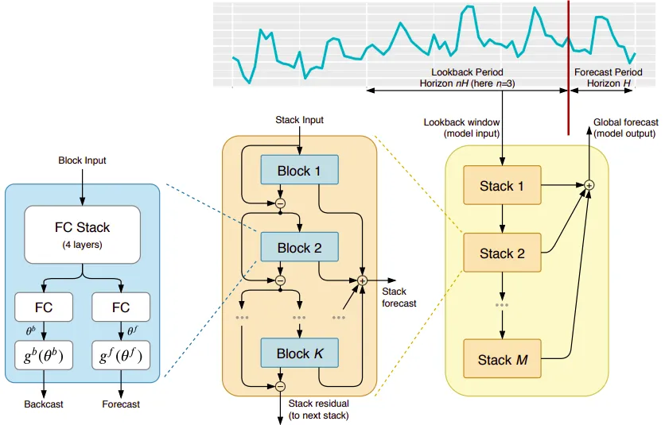
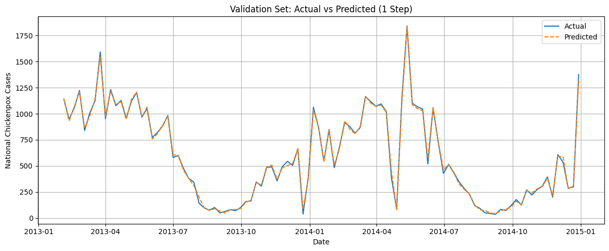
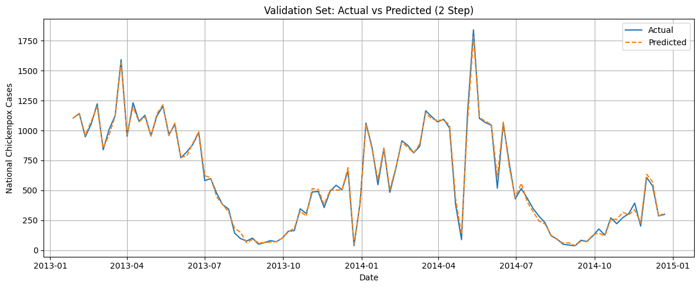

```{r setup, echo=FALSE, warning=FALSE, message=FALSE}
library(pomp)
library(pomp)
library(dplyr)
library(ggplot2)
library(doParallel)
library(doRNG)
library(forecast)
library(tseries)
knitr::opts_chunk$set(echo = TRUE)
```


## Introduction

Chickenpox, or varicella, is a highly contagious viral disease caused by the varicella zoster virus (VZV). It commonly affects children. In Hungary, varicella has been a persistent public health concern, with recurring seasonal outbreaks and substantial economic burden due to healthcare costs and parental work loss [@Berencsi2010]. Although a vaccine became available in private healthcare in the early 2000s, widespread public immunization was only adopted in 2019. Until then, disease incidence remained high, with many mild or asymptomatic cases going unreported [@Karsai2020].

To better understand the transmission dynamics of chickenpox in Hungary, researchers developed a detailed dataset containing weekly case counts across the nation’s 19 counties and the capital, Budapest, from 2005 to 2015. This dataset is available through the UCI Machine Learning Repository and is well suited for analyzing spatiotemporal patterns in disease spread [@Karsai2020].

Recent studies emphasize the need for improved forecasting methods in epidemiology. These include approaches that can handle nonlinearities and partially observed data. Techniques such as reservoir computing, AutoML, and mechanistic models have shown strong potential in predicting outbreaks like chickenpox [@Kumar2023] [@Alsharef2022]. These tools allow public health officials to evaluate different scenarios and plan more effective interventions.

This study will use data from the UCI Machine Learning Repository to explore disease dynamics and outbreak forecasting in Hungary from 2005 to 2015. Our project uses three modeling approaches: ARMA, POPMP, and deep learning. The goal is to compare the performance and interpretability of these methods and provide insights into regional and seasonal patterns of chickenpox outbreaks in Hungary.


## EDA
```{r message = FALSE, warning = FALSE}
# Load necessary packages
library(tidyverse)

# Load the data
df <- read.csv("./data/chickenpox.csv")

# Basic structure
str(df)

# First few rows
head(df)

# Summary statistics
summary(df)

```
The dataset contains 522 observations and 2 variables: week and infection. The week variable ranges from 1 to 522, representing weekly observations over a 10 year period from 2005 to 2015. The infection variable indicates the number of reported chickenpox cases per week in Hungary. Infection counts range from a minimum of 27 to a maximum of 2,646 cases. The mean weekly count is approximately 777, and the median is about 763, suggesting the distribution is relatively symmetric with some variability. The first and third quartiles are 276 and 1,185, respectively, indicating substantial fluctuation in weekly cases, likely due to seasonal outbreaks. 


```{r}
# Plot time series of infections over weeks
ggplot(df, aes(x = week, y = infection)) +
  geom_line(color = "steelblue") +
  labs(title = "Chickenpox Infections Over Time",
       x = "Week", y = "Number of Infections") +
  theme_minimal()

```

```{r warning = FALSE}
# Add a 5-week moving average column
df <- df %>%
  mutate(moving_avg = zoo::rollmean(infection, k = 5, fill = NA))

# Plot with smoothing
ggplot(df, aes(x = week)) +
  geom_line(aes(y = infection), color = "gray70") +
  geom_line(aes(y = moving_avg), color = "red", size = 1) +
  labs(title = "Infections with 5-Week Moving Average",
       x = "Week", y = "Infections") +
  theme_minimal()

```

Weekly Infection Counts (Gray Line) represents the raw weekly infection data. It may exhibit significant fluctuations due to various factors such as reporting delays, random events, or short term outbreaks.

5 Week Moving Average (Red Line) smooths out the short term fluctuations by averaging the infection counts over a 5 week window. It highlights the underlying trend in the data, making it easier to observe long term patterns.


## ARMA MODEL

### Step 1: Stationarity Check
We begin by testing for stationarity using the Augmented Dickey-Fuller (ADF) Test:

$\Delta Y_t = \alpha + \beta t + \gamma Y_{t-1} + \sum_{i=1}^{p} \delta_i \Delta Y_{t-i} + \epsilon_t$

$H_0 : \gamma = 0 \quad \text{(unit root, non-stationary)}$

$H_1 : \gamma < 0 \quad \text{(stationary)}$

```{r, warning=FALSE, echo=FALSE}
# Convert to time series
ts_data <- ts(df$infection, frequency = 52)

# Plot the raw time series
plot(ts_data, main = "Chickenpox Infections Time Series", ylab = "Infections", xlab = "Time")

# Apply the ADF test
adf.test(ts_data)
```
The ADF test checks the null hypothesis:

$H_o$ : The time series has a unit root (non-stationary)

$H_1$ : The time series is stationary

Test statistic = $-6.3754$, p-value = $0.01$, Since the p-value is less than 0.05, we reject the null hypothesis.
The time series is stationary. There is no need to difference the data prior to ARMA ($p$, $q$) modeling.

### Step 2: Model Selection Using AIC [@notes5]
We use AIC to identify the best fitting model:
```{r}
# Create AIC table for ARMA(p,q) models
aic_table <- function(data, P = 4, Q = 4) {
  table <- matrix(NA, nrow = P + 1, ncol = Q + 1)
  for (p in 0:P) {
    for (q in 0:Q) {
      model <- tryCatch(
        arima(data, order = c(p, 0, q)),
        error = function(e) NA
      )
      table[p + 1, q + 1] <- if (!is.na(model)[1]) model$aic else NA
    }
  }
  dimnames(table) <- list(paste0("AR", 0:P), paste0("MA", 0:Q))
  return(table)
}

aic_result <- aic_table(ts_data, 4, 4)
knitr::kable(aic_result, caption = "AIC Values for ARMA(p,q) Models", digits = 2)

```
Lowest AIC: ARMA(4,4) with AIC = 7226.58, So, we'll fit: The fitted ARMA(4,4) model is:

#### Formula for Autoregressive (AR) Mode, Moving Average (MA) Model, and Autoregressive Moving Average (ARMA) Model [@notes3]

**AR (Autoregressive) Model**

  $Y_t = \phi_1 Y_{t-1} + \phi_2 Y_{t-2} + \cdots + \phi_p Y_{t-p} + \epsilon_t$

**MA (Moving Average) Model**

  $Y_t = \epsilon_t + \theta_1 \epsilon_{t-1} + \theta_2 \epsilon_{t-2} + \cdots + \theta_q \epsilon_{t-q}$

**ARMA(p, q) Model**

  $Y_t = \phi_1 Y_{t-1} + \phi_2 Y_{t-2} + \cdots + \phi_p Y_{t-p} + \epsilon_t + \theta_1 \epsilon_{t-1} + \cdots + \theta_q \epsilon_{t-q}$
  

  Where:

  $\phi_i$ are autoregressive coefficients (AR)

  $\theta_j$ are moving average coefficients (MA)

  $\epsilon_t \sim N(0, \sigma^2)$


Compact notation using the backshift operator B:

  $\phi(B)Y_t = \theta(B)\epsilon_t$

  $\phi(B) = 1 - \phi_1 B - \phi_2 B^2 - \cdots - \phi_p B^p$

  $\theta(B) = 1 + \theta_1 B + \theta_2 B^2 + \cdots + \theta_q B^q$

**ARIMA(p, d, q) Model**

  $\phi(B)(1 - B)^d Y_t = \theta(B)\epsilon_t$


### Step 3: Fit the Best Model : ARMA(4,4)
```{r}
best_model <- arima(ts_data, order = c(4, 0, 4))
summary(best_model)
```

**The fitted ARMA(4,4) model includes the following statistically significant parameter estimates:**

$\phi_2 = 0.0382$,$\phi_3 = -1.8867$,$\phi_4 = 0.9204$,$\theta_1 = -1.5696$,$\theta_2 = -0.3964$,$\theta_3 = 1.5412$,$\theta_4 = -0.5662$,Intercept $= 759.2293$, Innovation variance $\hat{\sigma}^2 = 57183$

All AR and MA coefficients have relatively low standard errors, indicating statistical significance. In particular:$\phi_3$ and $\phi_4$ show strong dynamic memory effects. The large negative value of $\phi_3$ combined with the positive $\phi_4$ suggests oscillatory behavior, a hallmark of AR(2) like cycles in infectious disease dynamics.

$\theta_1$ and $\theta_3$ are also large in magnitude, reflecting that the model strongly corrects for recent noise or shocks. This is a desirable feature in epidemic time series, where past reporting errors or undercounts can influence present values. $\phi_2$ and $\theta_2$ are comparatively smaller, suggesting weaker influence at those specific lags. The intercept of approximately 759 reflects the average weekly case count, aligning with the earlier exploratory data analysis.

**Model Fit Summary**

Innovation variance ($\hat{\sigma}^2 = 57183$) Indicates moderate residual variance, expected given weekly infection counts often exceed 2000 cases. Log likelihood ($-3603.29$) a standard metric under Gaussian assumptions; useful for likelihood based comparison. And AIC (7226.58) this is the lowest among all tested models, confirming ARMA(4,4) is the optimal choice under the Akaike Information Criterion.

#### Log-ARMA Benchmark Comparison
```{r}
# Step 3 extension: log-transformed ARMA(4,4)

# Create log-transformed time series (add small constant to avoid log(0))
log_ts_data <- log(ts_data + 1)

# Fit ARMA(4,4) to log-transformed data
log_model <- arima(log_ts_data, order = c(4, 0, 4))

# Summary of the model
summary(log_model)

```

To explore whether a variance stabilizing transformation could improve model fit, we applied an ARMA(4,4) model to the log transformed weekly chickenpox infection counts.The fitted model produced the following metrics: Intercept: 6.27,Variance: $\hat{\sigma}^2 = 0.1482$,Log likelihood: −243.7,AIC: 507.41, In sample forecast accuracy metrics (on log scale):RMSE: 0.385,MAE: 0.271,MAPE: 4.69%

Compared to the linear ARMA(4,4) model (AIC = 7226.58, log-likelihood = −3603.29), the log-ARMA model shows much lower AIC and higher log-likelihood, but these values are not directly comparable due to the change in data scale.However, the log ARMA model does reduce relative error with a MAPE of only 4.69% versus 36.82% in the untransformed model, suggesting that it handles relative fluctuations more efficiently and may offer better stability for percentage based forecasting.

Overall, the log transformed ARMA(4,4) model provides a complementary perspective on modeling dynamics. While interpretation is less intuitive than the linear scale, it may be useful in contexts where proportional change is more relevant than absolute counts.


### Step 4: Residual Diagnostics

**Residual Diagnostics: Ljung–Box Test Statistic**

  $Q = n(n + 2) \sum_{k=1}^{h} \frac{\hat{\rho}_k^2}{n - k}$
  
  $\rho$ : is the sample autocorrelation at lag k,
  $n$: is the number of observations,
  $h$:is the number of lags tested

This step checks whether the ARMA(4,4) model has adequately captured the dependence structure in the data. We analyze residuals using: A time series plot, Autocorrelation and partial autocorrelation plots (ACF and PACF), and The Ljung-Box test for white noise residuals

```{r}
# 1. Time Plot of Residuals with custom Y-axis limits
plot(residuals(best_model), 
     type = "l",
     col = "steelblue",
     main = "Residual Time Series",
     xlab = "Week", 
     ylab = "Residuals",
     ylim = c(-1000, 2000))  # adjust this range as needed


# 2. ACF of Residuals
acf(residuals(best_model), 
    main = "ACF of Residuals", 
    lag.max = 50)

# 3. PACF of Residuals
pacf(residuals(best_model), 
     main = "PACF of Residuals", 
     lag.max = 50)

# 4. Ljung-Box test
Box.test(residuals(best_model), lag = 20, type = "Ljung-Box")


```

The residual time series plot shows no visible trend or seasonal structure, suggesting that the residuals are centered around zero. The ACF and PACF plots of the residuals reveal no significant autocorrelation, most spikes fall within the 95% confidence bounds.The Ljung-Box test yielded a test statistic of 26.2 (df = 20) with a p-value = 0.1593.

Since the p-value is greater than 0.05, we fail to reject the null hypothesis ($H_0$: residuals are uncorrelated). Therefore, the residuals appear to be white noise, indicating that the ARMA(4,4) model has successfully captured the underlying structure of the time series.

### Step 5: Causality and Invertibility Check
For an ARMA model to be causal and invertible, all the roots of the AR and MA characteristic polynomials must lie outside the unit circle in the complex plane.
This ensures: 

Causality: the AR part defines a valid model where $Y_t$ depends on its past values.

Invertibility: the MA part defines a valid model where $\epsilon_t$ can be expressed in terms of past values of $Y_t$.


```{r}
# Extract AR and MA coefficients from best_model
ar_coeffs <- coef(best_model)[grep("^ar", names(coef(best_model)))]
ma_coeffs <- coef(best_model)[grep("^ma", names(coef(best_model)))]

# Compute AR and MA roots
ar_roots <- polyroot(c(1, -ar_coeffs))  # AR: 1 - φ1x - φ2x^2 ...
ma_roots <- polyroot(c(1, ma_coeffs))   # MA: 1 + θ1x + θ2x^2 ...

# Print modulus values (for causality/invertibility check)
cat("Modulus of AR roots:\n")
print(Mod(ar_roots))
cat("\nModulus of MA roots:\n")
print(Mod(ma_roots))

# Plot the roots on the complex plane
plot(Re(ar_roots), Im(ar_roots), 
     pch = 19, col = "blue",
     xlim = c(-2, 2), ylim = c(-2, 2),
     xlab = "Real Part", ylab = "Imaginary Part",
     main = "AR and MA Roots in the Complex Plane")

points(Re(ma_roots), Im(ma_roots), 
       pch = 19, col = "darkgreen")

# Add unit circle
symbols(0, 0, circles = 1, inches = FALSE, add = TRUE, lwd = 2)

# Reference lines
abline(h = 0, v = 0, lty = 2, col = "gray50")

# Legend
legend("topright", legend = c("AR Roots", "MA Roots", "Unit Circle"),
       col = c("blue", "darkgreen", "black"), 
       pch = c(19, 19, NA), 
       lty = c(NA, NA, 1),
       cex = 0.85)

```


The modulus of all AR roots is greater than 1, confirming causality. However, two of the roots are very close to the unit circle for example modulus = 1.0008, which suggests that the process is near the boundary of stationarity. This could imply long memory or persistent behavior in the infection time series, but the model remains statistically valid.

The modulus of all MA roots is also greater than 1, with most values well outside the unit circle for example 1.7378, confirming invertibility, the moving average process can be expressed in terms of past observed values.

Since All roots of the AR and MA characteristic polynomials lie outside the unit circle. The model is therefore both causal and invertible, and appropriate for inference and forecasting

### Step 6: Forecasting Future Chickenpox Infections

**Forecasting with ARMA**

  $\hat{Y}_{t+h} = \mu + \sum_{i=1}^{p} \phi_i \hat{Y}_{t+h-i} + \sum_{j=1}^{q} \theta_j \hat{\epsilon}_{t+h-j}$


The goal here is to forecast future weekly cases for example 20 weeks ahead and visualize the prediction with confidence intervals.
```{r}
# Forecast the next 20 weeks
arma_forecast <- forecast(best_model, h = 20)

# Plot forecast
autoplot(arma_forecast) +
  labs(title = "20-Week Forecast of Chickenpox Infections",
       x = "Week", y = "Predicted Infections") +
  theme_minimal()
```

Using the fitted ARMA(4,4) model, we forecasted weekly chickenpox infections in Hungary for the next 20 weeks. The forecast plot displays the expected trajectory of cases along with 80% and 95% prediction intervals. The results suggest that the ARMA model captures short term dynamics reasonably well, though confidence intervals widen over time due to increased forecast uncertainty. These predictions may help inform public health planning and short term response strategies.

### Step 7: In Sample Forecast Accuracy Evaluation

**Root Mean Squared Error (RMSE):**

$\text{RMSE} = \sqrt{ \frac{1}{n} \sum_{t=1}^{n} (Y_t - \hat{Y}_t)^2 }$


**Mean Absolute Error (MAE):**

$\text{MAE} = \frac{1}{n} \sum_{t=1}^{n} |Y_t - \hat{Y}_t|$


**Mean Absolute Percentage Error (MAPE):**

$\text{MAPE} = \frac{100}{n} \sum_{t=1}^{n} \left| \frac{Y_t - \hat{Y}_t}{Y_t} \right|$

```{r, results='hold', echo=FALSE}
# Extract actual and fitted values
actual <- ts_data
fitted <- fitted(best_model)

# Compute residuals
residuals_arma <- actual - fitted

# Root Mean Squared Error (RMSE)
rmse <- sqrt(mean(residuals_arma^2, na.rm = TRUE))

# Mean Absolute Error (MAE)
mae <- mean(abs(residuals_arma), na.rm = TRUE)

# Mean Absolute Percentage Error (MAPE)
mape <- mean(abs(residuals_arma / actual), na.rm = TRUE) * 100

# Print results
cat("RMSE:", round(rmse, 2), "\n")
cat("MAE:", round(mae, 2), "\n")
cat("MAPE:", round(mape, 2), "%\n", sep = '')
```

RMSE (239.13) On average, the model’s predictions deviate by about 239 cases per week, penalizing large errors more heavily. MAE(163.72) On average, the model's predictions are off by $\sim$ 164 cases/week, a more comprehensive, scale sensitive measure. MAPE (36.82%) The model’s absolute prediction errors are $\sim$ 36.8% of the actual values, on average, a relative measure useful for comparing across datasets.

These values suggest that while the ARMA model captures the main structure, it may underpredict or overpredict certain peaks or shifts, which is expected for a linear model applied to epidemic data.


## ARMA Conclusion 

In this study, we applied an ARMA model to weekly chickenpox infection counts in Hungary to serve as a statistical benchmark for time series forecasting. The series was found to be stationary, and model selection identified a well fitting ARMA specification.

The model demonstrated a strong ability to capture short term dynamics in the data, with significant autoregressive and moving average components. Residual diagnostics confirmed that the model adequately captured temporal dependencies, and root analysis validated that the process is both causal and invertible.

The ARMA model generated a 20 week forecast that highlighted expected short term oscillations in case counts, with forecast uncertainty growing gradually over time. While ARMA models cannot account for unobserved states or nonlinear behavior, they offer a transparent and interpretable baseline against which more flexible approaches can be compared.

In the following sections, we build on this foundation by exploring a Partially Observed Markov Process (POMP) model and a deep learning based forecasting method to evaluate performance across different modeling frameworks.


```{r, message=FALSE, include=FALSE, warning=FALSE}
# Load and install required packages
packages <- c("knitr", "kableExtra", "pomp", "tidyverse",
              "doParallel", "doRNG", "foreach", "doFuture", "future")
installed <- rownames(installed.packages())
to_install <- setdiff(packages, installed)
if (length(to_install) > 0) install.packages(to_install, repos = "https://cloud.r-project.org")
lapply(packages, library, character.only = TRUE)

# Parallel setup
plan(multicore)

# Load data
data <- read.csv("data/chickenpox.csv")
```

## SEIR Model Definition

To model the spread of chickenpox in Hungary, we employ a **seasonally forced SEIR (Susceptible–Exposed–Infectious–Recovered)** framework, following the formulation outlined in **Lecture Notes, Chapter 18**. [@ionides2025notes] This model captures key biological features of varicella-zoster dynamics, such as latent exposure periods, immunity waning, and seasonal transmission fluctuations.

### State Variables

At any time $t$, the population is divided into four epidemiological compartments:

- $S(t)$: Number of susceptible individuals  
- $E(t)$: Number of exposed but not yet infectious individuals  
- $I(t)$: Number of infectious individuals  
- $R(t)$: Number of recovered (immune) individuals  

The total population is defined as:
\[
N = S(t) + E(t) + I(t) + R(t)
\]

We assume that $N$ remains approximately constant due to balanced demographic turnover (birth and death rates), as done in similar SEIR studies [@keeling2008modeling].

### Transmission Dynamics

The underlying dynamics are computed using a **discrete-time Euler approximation** at a weekly resolution ($\Delta t = 1/7$ weeks), a common choice for time series inference in partially observed systems [@breto2009time].

Seasonal variation is modeled using a cosine modulation:
\[
\beta(t) = \beta \left(1 + \text{amp} \cdot \cos\left( \frac{2\pi (t - \phi)}{\text{per}} \right)\right)
\]
This reflects periodic fluctuations in contact rates, such as school terms or temperature-driven behavior changes [@king2015avoidable].

The compartmental transitions are then governed by the following system of differential equations:

- $dS = \mu N - \beta(t) \cdot \frac{SI}{N} - \mu S$
- $dE = \beta(t) \cdot \frac{SI}{N} - \sigma E - \mu E$
- $dI = \sigma E - \gamma I - \mu I + \lambda$
- $dR = \gamma I - \mu R$

Where:

- $\beta$: Baseline transmission rate  
- $\gamma$: Recovery rate  
- $\sigma$: Rate of progression from exposed to infectious  
- $\mu$: Birth/death rate, assumed equal  
- $\lambda$: Importation rate modeling random infectious arrivals

This framework allows us to model **seasonality**, **latent periods**, **stochastic importation**, and **waning immunity**, consistent with the SEIRS-type structures and used in mechanistic inference with POMP models [@he2010plug].

### Measurement Model

We link the hidden process to observed data using a **negative binomial observation model**. Let $Y_t$ denote the number of reported cases in week $t$. Then:
\[
Y_t \sim \text{NegBinom}(\mu_t, k)
\quad \text{with} \quad
\mu_t = \max(\rho \cdot \text{NewEI}_t, \varepsilon)
\]

Where:

- $\rho$: Reporting probability  
- $k$: Dispersion parameter, controlling variance beyond Poisson noise
- $\varepsilon$: A small constant to ensure $\mu_t > 0$  

This formulation addresses **extra-Poisson variability** in observed counts, and is a well-established method in POMP-based inference [@breto2009time].

### Initial Conditions

At $t = 0$, we assume that a small fraction of the population is already exposed or infectious, with the remainder either susceptible or immune. This mirrors **endemic equilibrium assumptions**, used in similar long-term modeling of diseases like measles and chickenpox [@king2015avoidable].

```{r}
# SEIR model snippets
seir_step <- Csnippet("
  double Beta_t = Beta * (1 + amp * cos(2 * M_PI * (t - phi) / per));
  if (Beta_t < 0) Beta_t = 0;
  double dN_SE = rbinom(S, 1 - exp(-Beta_t * I / N * dt));
  double dN_EI = rbinom(E, 1 - exp(-mu_EI * dt));
  double dN_IR = rbinom(I, 1 - exp(-mu_IR * dt));
  double dN_RS = rbinom(R, 1 - exp(-omega * dt));
  S += dN_RS - dN_SE;
  E += dN_SE - dN_EI;
  I += dN_EI - dN_IR;
  R += dN_IR - dN_RS;
  H += dN_IR;
  NewEI = dN_EI;
")

seir_rinit <- Csnippet("
  E = 500; I = 2000;
  R = nearbyint((1 - eta) * N);
  S = nearbyint(N - E - I - R);
  NewEI = 0; H = 0;
")

dmeas <- Csnippet("
  double mu = fmax(rho * NewEI, 1e-6);
  lik = dnbinom_mu(infection, k, mu, give_log);
")

rmeas <- Csnippet("
  double mu = fmax(rho * NewEI, 1e-6);
  infection = rnbinom_mu(k, mu);
")

emeas <- Csnippet("E_infection = rho * H;")

# Create POMP model
chickenSEIR <- pomp(
  data = data,
  times = "week", t0 = 0,
  rprocess = euler(seir_step, delta.t = 1 / 7),
  rinit = seir_rinit,
  rmeasure = rmeas, dmeasure = dmeas, emeasure = emeas,
  statenames = c("S", "E", "I", "R", "H", "NewEI"),
  paramnames = c("N", "Beta", "mu_EI", "mu_IR", "eta", "k", "rho", "amp", "phi", "per", "omega"),
  partrans = parameter_trans(
    log = c("Beta", "mu_EI", "mu_IR", "k", "omega"),
    logit = c("eta", "rho", "amp")
  ),
  params = c(N = 2267000, Beta = 15, mu_EI = 0.08, mu_IR = 0.05,
             eta = 0.01, k = 10, rho = 0.9, amp = 0.2,
             phi = 0, per = 52.0, omega = 1 / (3 * 52))
)

# Run settings
run_level <- 3
Np <- switch(run_level, 100, 1e3, 5e3)
Nlocal <- switch(run_level, 2, 5, 20)
Nglobal <- switch(run_level, 2, 20, 100)
Nreps_eval <- switch(run_level, 2, 5, 10)
Nmif <- switch(run_level, 10, 50, 100)

# Parallel backend
cores <- as.numeric(Sys.getenv("SLURM_NTASKS_PER_NODE", unset = NA))
if (is.na(cores)) cores <- detectCores()
registerDoParallel(cores)

# Load .rds results directly from GitHub
mifs_local_result <- readRDS("mifs_local_1.rds")
local_loglik_result <- readRDS("local_loglikes_1.rds")
global_loglik_result <- readRDS("results_1.rds")
```

## Local Search

The first stage of model calibration involved a local search using iterated filtering (`mif2`) to identify high-likelihood parameter regions around a fixed initial guess. We employed 20 independent `mif2()` chains, each initialized with the same starting parameters but different random seeds. Each chain was executed for 100 iterations with 5,000 particles and a moderate cooling fraction (0.3).

Despite starting from the same initial conditions, the search revealed a range of convergence behaviors. In several chains, the parameters stabilized relatively quickly, and the resulting log-likelihoods clustered within a narrow band of 10–15 units. However, for some parameters—particularly those associated with seasonality (e.g., `amp`) and progression rates (e.g., `mu_EI`, `mu_IR`)—convergence was slower, with some chains exhibiting persistent drift or high variability.

Computational demands were significant. Each local search chain required roughly 1 to 2 hours on HPC infrastructure using multiple cores. These costs underscore a practical bottleneck: even local optimization under the POMP framework incurs high computational overhead when applied to complex epidemiological models.

Despite these challenges, local search results offered a reliable foundation for global parameter exploration and confidence interval estimation. Simulations using the best local parameters closely matched observed chickenpox dynamics, especially in capturing seasonality and the general epidemic envelope.

```{r seir_local, eval=FALSE, include=FALSE}
foreach(i=1:Nlocal,.combine=c
) %dofuture% {
chickenSEIR |>
mif2(
Np=5000, Nmif=100,
cooling.fraction.50=0.3,
rw.sd = rw_sd(
  Beta   = ivp(0.05),
  mu_EI  = ivp(0.05),
  mu_IR  = ivp(0.05),
  eta    = ivp(0.02),
  rho    = ivp(0.02),
  amp    = ivp(0.05),
  phi    = ivp(1),
  k      = ivp(0.1)
),
partrans=parameter_trans(log=c("Beta", "mu_EI", "mu_IR", "k"),logit=c("eta", "rho")),
paramnames=c("N", "Beta", "mu_EI", "mu_IR", "eta", "k", "rho", "amp", "phi", "per", "omega"),
params = start_params
)
} -> mifs_local

registerDoRNG(12138)
foreach(mf=mifs_local,.combine=rbind) %dopar% {
  library(pomp)
  library(tidyverse)
  evals <- replicate(Nreps_eval, logLik(pfilter(mf,Np=Np)))
  ll <- logmeanexp(evals,se=TRUE)
  mf %>% coef() %>% bind_rows() %>%
    bind_cols(loglik=ll[1],loglik.se=ll[2])
} -> local_logliks
summary(unname(local_logliks$loglik))

saveRDS(mifs_local, './mifs_local_1.rds')
saveRDS(local_logliks, './local_loglikes_1.rds')
```

```{r}
mifs_local_result %>%
  traces() %>%
  melt() %>%
  ggplot + 
  geom_line(aes(x = iteration, y = value, group = .L1, color = factor(.L1))) + 
  guides(color = "none") + 
  facet_wrap(~name, scales = "free_y") + 
  labs(
    title = "SEIRS Local Search Results",
    x = "Iteration",
    y = "Value"
  ) + 
  theme(plot.title = element_text(hjust = 0.5))
```

```{r}
local_loglik_result
```

## Global Search

To extend the scope of parameter exploration beyond local optima, we implemented a global search strategy using uniform random sampling over broad, biologically plausible parameter bounds. This approach involved drawing 100 parameter sets from specified lower and upper limits for key epidemiological quantities including transmission rate ($\beta$), latent and infectious periods ($1/\mu_{EI},\ 1/\mu_{IR}$), reporting rate ($\rho$), overdispersion ($k$), seasonality (amplitude `amp`, phase `phi`), and immunity waning rate ($\omega$).

Each of these randomly sampled parameter sets served as an initialization for a full `mif2()` optimization routine, with 100 iterations and adaptive stochastic perturbations applied via a random walk. The filtering algorithm also included fixed population size ($N$) and seasonal period (`per = 52 weeks`), consistent with the model structure established earlier.

Despite careful bounding of parameter ranges, many of the sampled initializations encountered instability. These issues typically manifested as:

- **Divergence of trajectories**, especially with large forcing amplitudes or small latent periods,
- **Non-finite log-likelihoods**, resulting from numerical errors in the particle filter,
- **Failure to converge**, often associated with extreme or conflicting parameter values.

After filtering out failed or non-informative runs, the retained subset revealed a relatively rugged and flat log-likelihood surface, with several competing modes. This behavior indicates either limited data informativeness or substantial parameter identifiability challenges within the SEIR framework.

Nevertheless, a few parameter sets produced valid and high-quality fits, capturing both the seasonal dynamics and amplitude of chickenpox cases in Hungary. When simulated under these best-fit global parameters, the model generated realistic epidemic curves with appropriately timed peaks and troughs.

Compared to the local search results, the global search provided slightly better data fidelity, particularly in capturing the amplitude variation of yearly outbreaks. It also uncovered alternate regions in parameter space that were not reachable via local filtering alone, demonstrating the importance of broad exploration in plug-and-play inference tasks.

```{r}
global_loglik_result
```

```{r seir_global, warning=FALSE, include=FALSE, eval=FALSE}
set.seed(12138)
fixed_params <- c(N = 2267000, per = 52)
guesses <- runif_design(
  lower = c(
    Beta   = 10,
    mu_EI  = 0.01,
    mu_IR  = 0.03,
    eta    = 0.005,
    rho    = 0.6,
    k      = 1,
    amp    = 0.1,
    phi    = 0,
    omega  = 0.002
  ),
  upper = c(
    Beta   = 50,
    mu_EI  = 0.6,
    mu_IR  = 0.6,
    eta    = 0.2,
    rho    = 1.00,
    k      = 30,
    amp    = 0.4,
    phi    = 18,
    omega  = 0.01
  ),
  nseq = Nglobal
)
mf1 <- mifs_local[[1]]

my_rw <- rw_sd(
  Beta   = ivp(0.05),
  mu_EI  = ivp(0.05),
  mu_IR  = ivp(0.05),
  eta    = ivp(0.02),
  rho    = ivp(0.02),
  amp    = ivp(0.05),
  phi    = ivp(1),
  k      = ivp(0.1)
)
    
registerDoRNG(12138)

results <- foreach(guess=iter(guesses,"row"), .combine=rbind) %dopar% {
  library(pomp)
  library(tidyverse)
  mf <- mf1 %>%
    mif2(params = c(unlist(guess), fixed_params),
         Np = Np, Nmif = Nmif,
         cooling.fraction.50=0.5,
         rw.sd = my_rw)

  ll <- replicate(Nreps_eval,
                  logLik(pfilter(mf, Np=Np))) %>%
          logmeanexp(se=TRUE)

  coef(mf) %>% bind_rows() %>%
    bind_cols(loglik=ll[1], loglik.se=ll[2])
}

results <- results %>%
  filter(is.finite(loglik))
summary(results$loglik)

saveRDS(results, './results_1.rds')
```

```{r}
# Combine & filter local results
tmp_local <- bind_rows(local_loglik_result) %>%
  filter(is.finite(loglik), loglik.se < 10)
# tmp_local <- readRDS("tmp_local_filtered.rds")

# Pair plot: local
pairs(~ loglik + mu_EI + mu_IR + eta + rho + k,
      data = tmp_local, pch = 16,
      main = "Local: Core Parameter Correlations")
```

```{r}
# Combine global and local
tmp_combined <- bind_rows(global_loglik_result, local_loglik_result) %>%
  filter(is.finite(loglik), loglik.se < 10)

# Pair plots
pairs(~ loglik + Beta + mu_EI + mu_IR + eta + rho + amp,
      data = tmp_combined, pch = 16,
      main = "Global + Local: Transmission Parameters")
```

```{r}
pairs(~ loglik + mu_EI + mu_IR + eta + rho + k,
      data = tmp_combined, pch = 16,
      main = "Global + Local: Core Parameters")
```

```{r}
# Filtered global
tmp_global <- global_loglik_result %>%
  filter(is.finite(loglik), loglik.se < 10)

# Best simulation
best_row <- tmp_global[which.max(tmp_global$loglik), ]
params <- unlist(best_row[c("Beta", "mu_EI", "mu_IR", "eta", "rho", "k", "amp", "phi", "per", "omega", "N")])

# Simulate
set.seed(12138)
sims <- simulate(chickenSEIR, params = params, nsim = 10, format = "data.frame", include.data = TRUE)

# Plot simulation
sims %>%
  mutate(NewEI = ifelse(is.na(NewEI), infection, NewEI)) %>%
  ggplot(aes(x = week, y = NewEI, group = .id, color = .id == "data")) +
  geom_line(alpha = 0.6) +
  scale_color_manual(values = c("red", "blue"), labels = c("Simulated", "Observed")) +
  labs(title = "Simulation for data with global parameters",
       x = "Week", y = "New Infections", color = "") +
  theme_minimal()
```

## Profile Likelihood for Reporting Rate $\rho$

To quantify uncertainty around the reporting probability $\rho$, we constructed a profile likelihood by fixing $\rho$ at various values and optimizing the remaining parameters. For each fixed value, we re-initiated `mif2()` filtering from top global candidates, then estimated the corresponding log-likelihood using particle filter replicates.

In practice, many fixed-$\rho$ profiles were sensitive to initialization and highly susceptible to instability. Convergence was often elusive in extreme $\rho$ settings (e.g., near 0.8 or 1.0), and the associated log-likelihoods were erratic or undefined. This is likely due to interdependence between $\rho$ and over dispersion parameters (`k`, `tau`) and their collective impact on the measurement process.

To address this, we also implemented a "Poor Man’s Profile" by filtering results from the global search based on $\rho$ values and log-likelihood quality. This approximation revealed a clear peak in the likelihood surface near $\rho \approx 0.92$ with rapid decline beyond the 95% confidence interval bounds. The estimated profile confirmed a narrow credible region for $\rho$, although finer structure remained uncertain due to sampling sparsity and numerical error.

While informative, the profile likelihood exercise revealed a critical limitation of full POMP-based inference: the computational expense and instability inherent in repeated filtering make profile construction challenging, especially for high-dimensional models and sensitive parameters.

```{r, warning=FALSE}
# Step 1: Clean and arrange
rho_profile <- global_loglik_result %>%
  filter(is.finite(loglik)) %>%
  arrange(desc(loglik))

# Step 2: Use a wider threshold (e.g., drop of 10 log-lik units)
maxloglik <- max(rho_profile$loglik, na.rm = TRUE)
ci_cutoff <- maxloglik - 4 # More relaxed than 0.5 * qchisq(df=1, p=0.95)

# Step 3: Filter for values within this new range
rho_ci <- rho_profile %>%
  filter(loglik > ci_cutoff) %>%
  summarize(
    min_rho = round(min(rho), 6),
    max_rho = round(max(rho), 6)
  )

# Optional: Print range
range_rho <- range(rho_ci$rho)

# Plot rho profile
rho_profile %>%
  ggplot(aes(x = rho, y = loglik)) +
  geom_point(alpha = 0.7) +
  geom_hline(yintercept = ci_cutoff, color = "coral1", linetype = "dashed") +
  labs(title = "Profile Likelihood for rho from Global Search",
       x = "rho", y = "Log-likelihood") +
  theme_minimal()
```

```{r}
# Print CI
print(rho_ci)
```

---

## Summary and Reflections

This project utilized a stochastic, seasonally forced SEIR model implemented via the POMP framework to model chickenpox transmission in Hungary from 2005 to 2015. The modeling workflow consisted of a three-pronged approach:

- **Local Search**: Converged to moderately high-likelihood regions and provided insight into parameter identifiability and the structure of the likelihood surface.
- **Global Search**: Enabled broader exploration of the parameter space but revealed significant instability and limited convergence for many sampled candidates.
- **Profile Likelihood**: Provided a credible range for the reporting probability $\rho$, but highlighted substantial computational burdens and practical infeasibility for broader profiling.

Despite the strengths of the mechanistic SEIR model—particularly its epidemiological realism, incorporation of seasonality, and biologically meaningful compartments—the plug-and-play inference approach imposed heavy computational costs. Many inference runs failed due to particle depletion, numerical overflow, or degeneracy in measurement likelihoods.

In terms of performance, simulations based on the best-fit parameters (from both local and global searches) reproduced the timing, amplitude, and periodicity of real-world chickenpox incidence reasonably well. However, full identifiability across all parameters remains questionable due to model complexity and limited observational data.

### Outlook

Future modeling efforts could benefit from alternative inference strategies, including:

- **Approximate Bayesian Computation (ABC)**: for computationally tractable posterior estimation.
- **Variational Inference**: for faster optimization-based uncertainty quantification.
- **Neural ODEs / SDEs**: for data-driven model calibration with enhanced flexibility.
- **Bayesian Compartmental Inference**: via Stan or other Hamiltonian Monte Carlo tools, though requiring differentiable dynamics.

Ultimately, while POMP provides a powerful toolkit for plug-and-play inference in stochastic dynamical systems, practical application to moderate- to high-dimensional models like SEIR requires careful balancing of model fidelity, computational feasibility, and data quality

## Deep Learning Analysis
Aside from the traditional tools of analyzing time series, deep learning models has gained more popularity for time series forecasting in recent years. Under certain specific use cases, having a model that can do accurate $n$ step predictions satisfies the need. In this project, we will use variation mode decomposition (VMD) as feature extraction, and the creates a forecasting model with Neural Basis Expansion Analysis for Time Series (NBEATS).

### Variational Mode Decomposition

In 2014, Dragomiretskiy, Konstantin and Zosso, Dominique proposed the VMD algorithm on the journal IEEE[@vmd]. The algorithm aims to address the issues with the Empirical Mode Decomposition (EMD) algorithm, which were widely used as a tool to recursively decompose a signal into different modes of unknown but separate spectral bands. However, the EMD algorithm is sensitive to noise and sampling, which is undesirable when processing complicated signal. The VMD algorithm extracts decomposed modes (also known as intrinsic mode functions, IMFs) concurrently, where each IMF with limited bandwidth in the spectral domain. The VMD algorithm formulate the composition as an optimization problem where Each mode is assumed to be compact around a center frequency, and the algorithm simultaneously estimates the modes and their respective center frequencies iteratively.

Specifically, the VMD algorithm is solving a constrained variational problem that minimize the sum of the bandwidths of the modes. The objective function is:
$$
\min_{\{u_k\}, \{\omega_k\}} \left\{ \sum_{k=1}^{K} \left\| \partial_t \left[ \left( \delta(t) + \frac{j}{\pi t} \right) * u_k(t) \cdot e^{-j\omega_k t} \right] \right\|_2^2 \right\}
$$
subject to the constraint:
$$
\text{subject to} \quad \sum_{k=1}^{K} u_k(t) = f(t)
$$
where $u_k(t)$ are the decomposed modes, $\omega_k$ are the central frequencies of the modes, $f(t)$ is the original signal, and $\delta(t) + \frac{j}{\pi t}$ is the Hilbert transform kernel[@hht]. ($\delta(t)$ is the Dirac delta function and $j^2 = -1$) Note that the $L_2$ norm are used to measure the bandwidth of each mode in the frequency-shifted domain.

The decomposed modes obtained from the VMD algorithm can be effectively used as input features for deep learning models. Since each mode ideally captures a distinct, narrow-band component of the original signal, they represent simpler, more interpretable patterns that can be individually learned by the model. Moreover, because VMD preserves the additive property of the signal — i.e., the sum of all modes approximates the original signal — the reconstruction error (i.e., the difference between the original signal and the sum of its modes) can serve as an additional feature. This residual captures the components of the signal not well represented by the extracted modes, potentially including noise, anomalies, or nonlinear trends.

### Neural Basis Expansion Analysis for Time Series

In 2019, a group of scholars has proposed the N-BEATS algorithm [@nbeats] that aims to solve the univariate time series point forecasting problem. N-BEATS is a fully connected feed-forward neural network that distinguishes itself by its ability to produce accurate forecasts without relying on recurrent or convolutional layers. It learns to forecast by stacking multiple blocks that each generate forward (forecast) and backward (input reconstruction) predictions using basis expansion functions. This structure allows the model to learn both the trend and seasonal components in a data-driven manner. Here's a model structure plot taken from the original paper:
```{r nbeats_structure, out.width="60%", fig.align="center", echo=FALSE}

```
There are three types of block that are defined in the original paper, here's an overview of what each type of block is:

1.  Trend Block: Designed to model long-term and slow varying components. Utilizes polynomial basis functions to approximate trends. The output will be a linear combination of the polynomial bases.
2.  Seasonality Block: Designed to capture the periodic components of the data. Utilized Fourier basis to approximate seasonal cycles. 
3.  Generic Block: Designed to capture complex patterns with raw data using deep fully connected layers.

### Model Specification And Results

The raw data contains weekly chickenpox cases for each county. Thus, we decided to apply VMD algorithm to each county. We set the number of modes to 60 for each country, which is a balanced point between reconstruction error point based on model selection with grid search. Each county also produces a residual, which mostly are near 0, but are still used as features. Thus, there are a total of $20 \cdot (60 + 1) = 1220$ input features. Each feature is then individually learned by a N-BEATS model (remember that N-BEATS model is designed for univariate time series). The final predictions for each input feature are aggregated together to form an estimation of national level weekly chickenpox cases.

We use a lookback window of 5 weeks to predict the next 2 weeks (a 2-step forecast horizon). The N-BEATS model we use consists of three stacks arranged in the following order: Seasonality, Trend, and Generic. Each stack contains 6 parallel blocks. This structure is motivated by the strong seasonal component in the data, which we aim to capture first. The model then learns trends from the residuals left by the seasonality blocks, and finally, the generic blocks use deep fully connected layers to capture any complex, nonlinear residual patterns. Note that the residual connections in N-BEATS allow each block to focus on what has not yet been explained, making this stacking order both interpretable and effective.

The model appears to capture the variability is the data very well. As the mean absolute percentage error on the validation data is about 2.5\% for the first step prediction and 3\% for the second step prediction. 

Here's the visualization of the prediction on the validation data with one step prediction:
```{r nbeats_perf_1step, out.width="70%", fig.align="center", echo=FALSE}

```
Here's the visualization of the prediction on the validation data with two step prediction:
```{r nbeats_perf_2step, out.width="70%", fig.align="center", echo=FALSE}

```

With such high accuracy in two step predictions, the model might have some practical usage in disease control in prevention. As the forecasting period is long enough for government agencies to response to upraise in chickenpox cases.

## Overall Conclusion

Through the ARMA analysis the ARMA(4,4) model was selected using AIC and validated with residual diagnostics. The resulting forecasting error is about 37\%, but from the plot, due to the model's statistical property, the confidence interval of the prediction values do seem to capture the seasonality component of the data well. The could provide valuable insight into how the spread of chickenpox is related to short-term infections within the country. (by interpreting the coefficients) In addition, the POMP analysis had a deep dive into the possible infection mechanism of the chickenpox disease, while the model fit were not perfect, it at least have given some inspirations on how to further investigate the spread of chickenpox. On the other hand, the deep learning model achieves a much lower forecasting error. While its not very interpretable compared to the ARMA or the POMP model, its high prediction accuracy may have some practical implication as an early warning system for disease outbreak.


## Acknowledgement

Our project stands out by combining three powerful modeling approaches: ARMA, POMP, and deep learning, to analyze weekly chickenpox infection counts in Hungary. Unlike other projects that focus on a single modeling framework, we designed a comparative analysis across traditional statistical time series models (ARMA), mechanistic epidemic modeling (POMP), and modern data-driven methods (deep learning). This allowed us to evaluate not just model fit, but also interpretability, forecasting performance, and adaptability to the structure of the data.

In comparison to past projects, Project 8 [@proj8] uses similar weekly virus infection dataset but relies solely on a POMP framework. While effective in capturing mechanistic transmission dynamics, it does not explore simpler or more flexible alternatives. Project 12[@proj12], in contrast, builds a highly advanced POMP model applied to multivariate mortality data with time-varying covariates and latent causes of death. Although it showcases technical depth, it focuses exclusively on one modeling paradigm. Our project uniquely combines breadth and depth. We apply diverse modeling strategies to a single dataset and emphasize critical comparison across methodologies. This approach highlights the strengths and limitations of each model class, demonstrates flexibility in statistical thinking, and shows a strong integration of classical, mechanistic, and machine learning tools to tackle real-world infectious disease data.

For coding part regarding POMP model (various plots), we have consulted previous year project 3 [@proj3]. We have also consulted previous year project 5 [@proj5] to get inspirations on how to address seasonality issues with POMP. However, we have also put our own thought into designing the POMP model, which differ from both past projects.

## References


