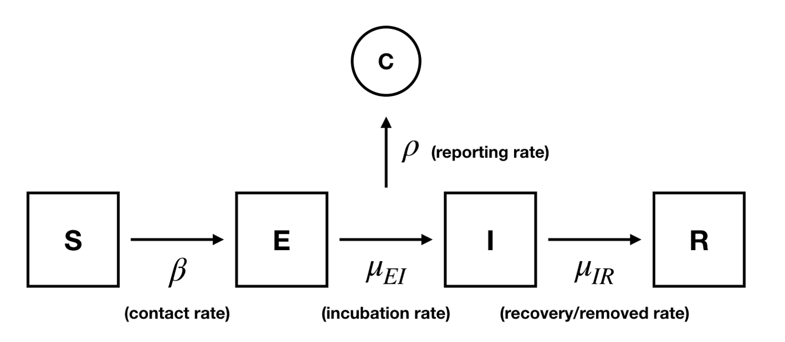

```{r setup, include=FALSE}
knitr::opts_chunk$set(echo = TRUE)
knitr::opts_chunk$set(warning = FALSE, message = FALSE)
library(denguedatahub)
library(tsibble)
library(dplyr)
library(pomp)
library(tidyverse)
library(doFuture)
library(iterators)
library(foreach)
library(doRNG)
library(ggplot2)
library(doParallel)
library(knitr)
library(forecast)
library(patchwork)

```


## Introduction

Dengue fever, a mosquito-borne viral disease, continues to pose a public health concern amid rising international mobility and climate shifts that expand vector habitats [(1)](#my-sources). While the United States reports few locally transmitted cases, imported infections remain persistent due to global travel, presenting ongoing health risk to our communities.

This analysis leverages weekly reported data from the denguedatahub package in R. Using this time series data that spans 53 weeks per year with no missing observations, we fit both compartmental models — SIRS and SEIR — to explore the disease's temporal dynamics. These models allow us to simulate susceptible–infected–recovered trajectories and assess how latent exposure (as introduced in SEIR) alters the transmission dynamics. To benchmark performance and guard against model misspeciification or parameter noncovergence, we fit a statistical SARIMA model on the same data. This method provides a grounded basis for evaluating epidemiological interpretability relative to empirical forecasting accuracy.

## Data

The data provides travel-associated dengue case counts in the U.S. and territories from 2010 to 2023. For our analysis, we specifically focus on the most recent two-year period, from 2022 to 2023 (106 weeks), to ensure alignment with current travel patterns post-pandemic. This subset offers a dense, high-frequency time series with consistent weekly reporting, making it well-suited for evaluating dynamic models over a complete annual cycle.


```{r, include=FALSE}
dengue <- cdc_casesby_week %>% filter(Travel.status == "All", Year %in% c(2022, 2023)) %>%
  arrange(Year, Week) %>%
  mutate(week = 1:n(),
         reports = Reported.cases) %>%
  select(week, reports) %>%
  as.data.frame()
```

```{r, echo=FALSE}

dengue |>
  ggplot(aes(x=week,y=reports))+
  geom_line(color = 531)+
  geom_point(size = 1, alpha = 0.7)+
  labs(title = "Weekly Travel-Associated Dengue Cases (2022–2023)",
       x = "Week", y = "Reported Cases")+
  theme_minimal()
```

The time series plot of weekly reported dengue cases from 2022 to 2023 exhibits a clear seasonal pattern. Case counts remain low through the winter and spring months (Weeks 1–25), begin to rise sharply in early summer (around Weeks 26–30), and reach their peak between Weeks 35 and 45. A rapid decline follows toward the end of the year. This seasonal pattern aligns with increased international travels during the summer and with the expected seasonal dynamics of vector-borne diseases, which thrives in warmer and rainy climates.


## Explanatory Data Analysis (EDA)

```{r, echo=FALSE}
acf(dengue$reports, lag.max = 25,main = "ACF of Weekly Case Counts (Lag = 25)")
acf(dengue$reports, lag.max = 53,main = "ACF of Weekly Case Counts (Lag = 53)")
acf(dengue$reports, lag.max = 106,main = "ACF of Weekly Case Counts (Lag = 106)")
```


We plot three autocorrelation function (ACF) at different lags, 25,53, and 104, to 
understand the short-term and/or long-term dependency. The acf plots show a sinusoidal pattern. The oscillating pattern displayed in the plots supports that the data is non-stationary. The lack of significant partial autocorrelation at higher lags suggests that higher-order AR terms are unnecessary.

When the ACF is extended to a lag of 53, a dip into negative autocorrelation between lags 20 and 40 is followed by an increase near lag 53. This pattern suggests a seasonal structure with a periodicity of one year, consistent with 53 weeks in the dataset. At a lag maximum of 104, the ACF exhibits a repeating wave pattern every 50–55 lags, reinforcing the presence of strong annual seasonality. The gradually damped oscillations are characteristic of a seasonal ARMA process, supporting the use of a SARIMA model to capture both short-term and seasonal dependencies.

With this evidence, we proceed to model selection by comparing AIC values across a grid of candidate SARIMA models.

Since we have evidence of annual seasonality, we consider SARIMA models with period = 53.

$$
\phi(B)\Phi(B^{53}) \left[ (1 - B)^d (1 - B^{53})^D Y_n - \mu \right] = \psi(B)\Psi(B^{53})\varepsilon_n
$$

```{r, include=FALSE}
ts_df <- ts(dengue$reports, start = c(2022, 1), frequency = 53)
```

```{r, include=FALSE}
aic_table1 <- function(data, P, Q, sp, sq){
  table <- matrix(NA, nrow = P+1, ncol = Q+1)
  for(p in 0:P) {
    for(q in 0:Q) {
      table[p+1, q+1] <- tryCatch({
        fit <- Arima(data, order = c(p,0,q),
                     seasonal = list(order = c(sp,0,sq), period = 53),
                     method = "ML")
        fit$aic
      }, error = function(e) { NA })
    }
  }
  rownames(table) <- paste0("AR", 0:P)
  colnames(table) <- paste0("MA", 0:Q)
  table
}
```

The NA values are likely due to optimization problem.

We also compare models with only seasonal AR(1) and only seasonal MA(1).

```{r, include=FALSE}
aic_table_seasonal_ar <- function(data, max_p, max_q) {
  table <- matrix(NA, nrow = max_p + 1, ncol = max_q + 1)
  
  for (p in 0:max_p) {
    for (q in 0:max_q) {
      table[p + 1, q + 1] <- tryCatch({
        fit <- Arima(data, order = c(p, 0, q),
                     seasonal = list(order = c(1, 0, 0), period = 53),
                     method = "ML")
        fit$aic
      }, error = function(e) NA)
    }
  }
  
  rownames(table) <- paste0("AR", 0:max_p)
  colnames(table) <- paste0("MA", 0:max_q)
  return(table)
}
```

```{r, include=FALSE}
aic_table_seasonal_ma <- function(data, max_p, max_q) {
  table <- matrix(NA, nrow = max_p + 1, ncol = max_q + 1)
  
  for (p in 0:max_p) {
    for (q in 0:max_q) {
      table[p + 1, q + 1] <- tryCatch({
        fit <- Arima(data, order = c(p, 0, q),
                     seasonal = list(order = c(0, 0, 1), period = 53),
                     method = "ML")
        fit$aic
      }, error = function(e) NA)
    }
  }
  
  rownames(table) <- paste0("AR", 0:max_p)
  colnames(table) <- paste0("MA", 0:max_q)
  return(table)
}
```

```{r, echo=FALSE}

aic_mat <- aic_table1(ts_df, 5, 5, 1, 1)
aic_sar <- aic_table_seasonal_ar(ts_df, 4, 4)
aic_sma <- aic_table_seasonal_ma(ts_df, 4, 4)

library(knitr)
kable(aic_mat, caption = "AIC of SARIMA(p,0,q)×(1,0,1) models (p,q=0...5)", digits = 2)
kable(aic_sar, caption = "AIC: SARIMA(p,0,q)(1,0,0)[53]")
kable(aic_sma, caption = "AIC: SARIMA(p,0,q)(0,0,1)[53]")
```

By comparing the AIC values and model complexity, the most appropriate model is:

$$
\text{SARIMA}(2, 0, 0) \times (0, 0, 1)_{[53]}
$$


$$
\begin{aligned}
(1 - \phi_1 B - \phi_2 B^2) \left[ Y_n - \mu \right] = (1 + \Theta_1 B^{53}) \varepsilon_n\\
\varepsilon_n &\sim \text{white noise}, \\
\mu &\text{ is the mean of the stationary process } Y_n.
\end{aligned}
$$

Based on this model, we fit our benchmark model.


## SARIMA Model Fitting

```{r, echo=FALSE}

sarima <- arima(ts_df, order = c(2,0,0),
                     seasonal = list(order = c(0,0,1), period = 53))
print(sarima)
```

It is stable, well-identified, and provides the best fit among all candidate models based on the lowest AIC. To confirm, we manually calculate AR and MA roots.


```{r, echo=FALSE}
AR_roots <- polyroot(c(1, -coef(sarima)[c("ar1", "ar2")]))
SMA_roots <- polyroot(c(1, -coef(sarima)["sma1"]))

cat("AR Roots:",AR_roots, "\n")
cat("SMA Roots:",SMA_roots, "\n")

cat("Absolute values of AR roots:", abs(AR_roots), "\n")
cat("Absolute values of SMA roots:", abs(SMA_roots), "\n")
```

All AR roots lie outside the unit circle, indicating that the fitted SARIMA model is stationary and causal. While one AR root is relatively close to the threshold, it still satisfies the condition for stationarity. To confirm model adequacy, we look at the residuals to examine any signs of autocorrelation or model misfit.

#### Residual Analysis

```{r,echo=FALSE}
plot(residuals(sarima), type = "l", main = "Residuals of the Benchmark Model")

hist(residuals(sarima), breaks = 30, main = "Histogram of Residuals")

qqnorm(residuals(sarima))
qqline(residuals(sarima), col = "red")
```

The residuals from the SARIMA model appear to be white noise overall. They are centered around zero, with consistent variance throughout most of the series. The histogram of residuals shows an approximately symmetric, bell-shaped distribution with a mild left skew. The Q-Q plot further supports approximate normality, as most residuals fall along the theoretical line. Slight deviations in the tails, particularly on the left, are consistent with the observed outliers in the time series plot.

Taken together, these diagnostics indicate that model assumptions are reasonably satisfied. The residuals appear stationary, show no strong autocorrelation or skewness, and approximate normality holds aside from a few moderate outliers. 

Given its ability to capture both short-term and seasonal dynamics, the SARIMA(2,0,0)(0,0,1)[53] model is able to serve as a reasonable benchmark model (with a log likelihood of approximately -445). 


## SIRS Model

We will first present a the classical SIRS (Susceptible–Infected–Recovered–Susceptible) model from the
epidemiological lecture presented in class [(3)](#my-sources). The idea of using this model comes from final project 20 in 2022 [(4)](#my-sources). The model accounts for temporary immunity by allowing recovered individuals to return to the susceptible compartment. We state the governing ordinary differential equations, derive the disease‑free equilibrium and the basic reproduction number $R_0$, and compute the endemic equilibrium.

The SIRS model extends the classical SIR framework in the lecture by
incorporating temporary immunity: recovered individuals lose immunity at
rate $\xi$ and re‑enter the susceptible pool [(5)](#my-sources). This is motivated by
infections such as influenza, where immunity wanes over time [(6)](#my-sources).


#### Model Formulation

Let the total population $N$ be constant and partitioned into three compartments: 
$$
S(t),\quad I(t),\quad R(t),
\qquad \text{s.t.} \quad
S(t) + I(t) + R(t) = N.
$$
Define parameters:

-   $\beta$: transmission rate
-   $\gamma$: recovery rate
-   $\xi$: rate of loss of immunity

Under the mass‑action assumption, new infections occur at rate $\frac{\beta SI}{N}$. Recovered individuals lose immunity and return to $S$ at rate $\xi R$. The system of ordinary differential equations is:

$$
\begin{aligned}
\frac{dS}{dt} &= \xi\,R \;-\;\frac{\beta\,S\,I}{N},\\[6pt]
\frac{dI}{dt} &= \frac{\beta\,S\,I}{N} \;-\;\gamma\,I,\\[6pt]
\frac{dR}{dt} &= \gamma\,I \;-\;\xi\,R.
\end{aligned}
$$


#### Disease‑Free Equilibrium and $R_0$

Set $I=0$ and steady state ($dS/dt = dR/dt = 0$). The disease‑free equilibrium is:

$$
E_0:\quad (S^*, I^*, R^*) = (N, 0, 0).
$$

Then we can linearize around $E_0$ or apply the Next Generation Matrix method which yields the basic reproduction number, which is:

$$
R_0 \;=\;\frac{\beta}{\gamma}.
$$
If $R_0 < 1$, the DFE is locally asymptotically stable and an outbreak cannot occur.\
If $R_0 > 1$, the disease can invade and produce an epidemic.


#### Endemic Equilibrium

When $R_0 > 1$, there is a non‑trivial steady state $E^*=(S^*,I^*,R^*)$. Then, solving $\frac{dS}{dt}=\frac{dI}{dt}=\frac{dR}{dt}=0$ under $I^*>0$ gives:

$$
\begin{aligned}
S^* &= \frac{\gamma}{\beta}\,N,\\[6pt]
I^* &= \frac{\xi}{\gamma}\,R^*,\\[6pt]
R^* &= \frac{\gamma}{\xi}\,\bigl(R_0 - 1\bigr)\,N.
\end{aligned}
$$
Hence the endemic prevalence $I^*/N$ increases with the immunity‑loss rate $\xi$ and with $R_0-1$.


#### Model Construction

We include both seasonality and a "pandemic switch" at week 29. Specifically, this means that we allow case-based transmission; transmission that depends on if we are looking at before or after week 29: 

$$
\beta_0 =
\begin{cases}
b, & \text{if } t > \text{pandemic week} \\
a, & \text{otherwise}
\end{cases}
$$

Then, the full transmission rate is given by:

$$
\beta(t) = \beta_0 \left(1 + c \cdot \sin\left(\frac{2\pi(t + d)}{52}\right)\right)
$$
where $c$ is the amplitude of seasonality and $d$ is the phase shift (in weeks); the week of each year corresponding to a peak in transmission (with a sign component). 

```{r include=FALSE, message=FALSE, warning=FALSE}
library(denguedatahub)

df <- cdc_casesby_week %>% 
  arrange(Year, Week) %>%
  filter(Year >= max(Year) - 1) %>%
  mutate(Index = row_number())
df_pomp <- df %>%
  transmute(
    week = Index,
    reports = Reported.cases
  )
```


```{r, include=FALSE}
run_level <- 3
Np            <- switch(run_level, 100, 1e3, 1e3, 2e3)
Nlocal        <- switch(run_level,   2,   5,   10,   20)
Nglobal       <- switch(run_level,   2,   5,   20,  100)
Nmif          <- switch(run_level,  10,  50,   50,  100)
Nreps_eval    <- switch(run_level,   2,   5,   10,   10)
Npoints_profile<-switch(run_level,   4,  10,   20,   50)
Nreps_profile <- switch(run_level,   2,   4,    5,   15)
```


```{r, include=FALSE}
cores <- detectCores()
registerDoParallel(cores)
registerDoRNG(531531531)
results_dir <- paste0("Final results", run_level, "/")
if (!dir.exists(results_dir)) dir.create(results_dir)
options(pomp_cdir="./tmp")
```


```{r, include=FALSE}
sirs_step <- Csnippet("
  double pi = 3.141593;
  double Beta, Beta0;
  double dN_SI, dN_IR, dN_RS;
  double pandemic__week = 29;
  
  if (t > pandemic__week) Beta0 = b; else Beta0 = a;
  Beta = Beta0 * (1 + c * sin(2*pi*(t + d)/52));
  
  dN_IR = rbinom(I,    1 - exp(-mu_IR * dt));
  dN_RS = rbinom(R,    1 - exp(-mu_RS * dt));
  dN_SI = rbinom(S,    1 - exp(-Beta * I/N * dt));
  
  S += dN_RS - dN_SI;
  I += dN_SI - dN_IR;
  R += dN_IR - dN_RS;
  H += dN_IR;
")

sirs_rinit <- Csnippet("
  double m = N/(S_0 + I_0 + R_0);
  S = nearbyint(S_0 * m);
  I = nearbyint(I_0 * m);
  R = nearbyint(R_0 * m);
  H = 0;
")
```


```{r, include=FALSE}
sirs_d_df <- Csnippet("
  if ((k<0)|(rho<0)|(H<0)) lik=0;
  else lik = dnbinom_mu(reports, k, rho*H, give_log);
")
sirs_r_df <- Csnippet("
  reports = rnbinom_mu(k, rho*H);
")
```


```{r echo=FALSE}
df_pomp %>%
  pomp(
    times="week", t0=0,
    rprocess=euler(sirs_step, delta.t=1/7),
    rinit=sirs_rinit,
    rmeasure=sirs_r_df,
    dmeasure=sirs_d_df,
    accumvars="H",
    statenames=c("S","I","R","H"),
    paramnames=c("a","b","c","d","mu_IR","mu_RS","N","S_0","I_0","R_0","rho","k"),
    partrans=parameter_trans(
      log=c("a","b","mu_IR","mu_RS","k"),
      logit=c("rho","c"),
      barycentric=c("S_0","I_0","R_0")
    )
  ) -> dfSIRS
```

We now choose a plausible initial parameter vector based on the knowledge of dengue dynamics and then run a quick set of simulations to verify that our SIRS model reproduces the rough timing and magnitude of the observed case counts [(8)](#my-sources).

The chosen values for a and b reflect a modest drop in transmission after the “pandemic” threshold at week 29. We set a \>b because we noticed that the second peak after week 29 is larger than the first peak. Also, by testing, we found that when a, b \< 1, we had bad performance for the model's placement of peaks and valleys. The seasonal sine term with amplitude $c=0.4$ and phase shift $d=–25$ aligns our simulated peaks roughly with observed peaks. Recovery and
immunity‐recovery rates ($mu_IR=0.8$,$mu_RS=0.25$) correspond to an average duration of 1.25 weeks and 4 weeks, respectively [(9)](#my-sources). Finally, we fixed $N$ and $\rho$ based on surveillance coverage; all others will be estimated.

```{r, echo=FALSE}
params <- c(a=1.5, b=1.2, c=0.4, d=-25,
            mu_IR=0.8, mu_RS=1/4, N=4e9,
            S_0=0.2, I_0=0.01, R_0=0.7,
            rho=1e-7, k=5)
fixed_params <- c(N=4e9, rho=1e-7)
set.seed(531315531)
dfSIRS %>%
  simulate(params=params, nsim=20, format="data.frame", include.data=TRUE) -> sims

sims <- sims |>
  mutate(LineType = factor(case_when(
    .id == "data" ~ "Original Data",
    TRUE ~ "Simulation"
  ), levels = c("Simulation", "Original Data")))

# Plot
ggplot(sims, aes(x = week, y = reports, group = .id, color = LineType)) +
  geom_line() +
  labs(
    title = "Simulations for SIRS model (Initial)",
    x = "Week",
    y = "Reported Cases",
    color = NULL 
  ) +
  theme(
    legend.position = c(0.2, 0.85),
    legend.text = element_text(size = 9))+
  theme_minimal()
```

From the plot, we can see a moderately good performance, but this can be improved. We will do more objective measures such as a local search and global search.

We leverage particle filtering to check the health of the filter via its effective sample size (ESS). 

```{r, echo=FALSE}
registerDoRNG(531531531)
bake(file=paste0("initial_",run_level,".rds"),{
  foreach(i=1:30, .combine=c) %dopar% {
  dfSIRS %>% pfilter(params=params, Np=Np)
}}) -> sirs_pf
sirs_L_pf <- sirs_pf[[1]] %>% logLik()

sirs_pf[[1]] %>% 
  coef() %>% 
  bind_rows() %>% 
  bind_cols(loglik=sirs_L_pf[1],loglik.se=sirs_L_pf[2]) %>%
  write_csv("sirs_lik.csv")

plot(sirs_pf)
```

The top panel shows the observed dengue reports over time. The middle panel plots the effective sample size (ESS) at each week — we see that ESS occasionally dips, especially at the start of each seasonal cycle, but generally remains very close to the total particle count, indicating adequate particle diversity. The bottom panel displays the conditional log‐likelihood of each data point given the filter’s history. After initial transients (log‐lik as low as –20 per week), the conditional log‐lik stabilizes around –10 to –5, showing that the filter begins to
track the data more reliably as time progresses.

#### Local Search

We first proceed with a local search, starting at our initial parameter guess. 

```{r include=FALSE}
bake(file=paste0("local_sirs_",run_level,".rds"),{foreach(i=1:20,.combine=c,
        .options.future=list(seed=531531531)
) %dofuture% {
  dfSIRS |>
    mif2(
      params = params,
      Np=Np, Nmif=Nmif,
      cooling.fraction.50=0.5,
      rw.sd=rw_sd(
        a=0.01, b=0.01, c=0.01, d=0.01,
        mu_IR=0.01, mu_RS=0.01, k=0.01,
        S_0=ivp(0.002),
        I_0=ivp(0.002),
        R_0=ivp(0.002)
        )
    )
}}) -> mifs_local


```

```{r echo=FALSE}
mifs_local |>
  traces(pars = c('a', 'b', 'c', 'd','k', 'mu_IR', 'mu_RS', 'loglik')) |>
  melt() |>
  ggplot(aes(x=iteration,y=value,group=.L1,color=factor(.L1)))+
  geom_line()+
  guides(color="none")+
  facet_wrap(~name,scales="free_y")
```

Across all MIF2 runs the parameters stabilize after about $10$–$15$ iterations: the log‐likelihood $\ell$ rises to $\approx-440$; the transmission rates $a,b$ converge to $3$–$5$, the seasonal amplitude $c\to0.1$, the phase shift $d \to -25$, the recovery/waning rates $\mu_{IR},\mu_{RS}$ plateau at their fitted values, and the overdispersion $k\to7$–$11$. This tight convergence demonstrates that MIF2 has robustly located the model’s best‐fit region.

And we can evaluate the log likelihood by using the particle filtering results.

```{r include=FALSE}
set.seed(531531351)
foreach(mf=mifs_local, .combine=rbind) %dopar% {
  evals <- replicate(Nreps_eval, logLik(pfilter(mf, Np=Np)))
  ll    <- logmeanexp(evals, se=TRUE)
  mf %>% coef() %>% bind_rows() %>%
    bind_cols(loglik=ll[1], loglik.se=ll[2])
} -> sirs_lik_local
write_csv(sirs_lik_local, "sirs_lik.csv")
```

```{r echo=FALSE}
pairs(~ loglik + a + b + c + d + mu_IR + mu_RS + k, data=sirs_lik_local)
```

Here are all the parameters we have found by local search.

```{r echo=FALSE}
#For best local search results
local_search_res <- readr::read_csv("sirs_lik.csv", show_col_types = FALSE) %>%
  dplyr::filter(is.finite(loglik))

best <- local_search_res %>%
  dplyr::slice_max(loglik, n = 1)

coef(dfSIRS) <- best %>%
  dplyr::select(a, b, c, d,
                mu_IR, mu_RS,
                S_0, I_0, R_0,
                rho, k) %>%
  unlist()
print(coef(dfSIRS))
```

Then, using the updated parameters selected by local search, we run new simulations. We can see that all peaks and seasonality are fitted very well though the high frequency fluctuations have relatively high variance.

```{r echo=FALSE}
set.seed(531531351)
local_search_res <- sirs_lik_local %>% filter(loglik==max(loglik))
coef(dfSIRS) <- select(local_search_res[1,], -loglik, -loglik.se)

dfSIRS %>%
  simulate(params=local_search_res[1, 1:12], nsim=20, format="data.frame", include.data=TRUE) -> sims

sims <- sims |>
  mutate(LineType = factor(case_when(
    .id == "data" ~ "Original Data",
    TRUE ~ "Simulation"
  ), levels = c("Simulation", "Original Data")))

# Plot
ggplot(sims, aes(x = week, y = reports, group = .id, color = LineType)) +
  geom_line() +
  labs(
    title = "Simulations for SIRS model (Local Search)",
    x = "Week",
    y = "Reported Cases",
    color = NULL 
  ) +
  theme(
    legend.position = c(0.2, 0.85),
    legend.text = element_text(size = 9))+
  theme_minimal()
```

#### Global Search

In this part, firstly, we will hold constant the total population N, the
reporting rate \$\rho \$, and the best‐found initial state fractions
from the local search. We keep them fixed and focus
on searching $(a, b, c, d, \mu_.{IR}, \mu_{RS}, k)$

We sample $N_{global}$ random starting points uniformly over a
biologically plausible hyper‐rectangle. a, b in [1,6] allows a wide range
of pre/post–pandemic transmission. We also use the seasonal amplitude c up to 0.3 and phase
d in $\pm 40$ weeks.

```{r, include=FALSE}
fixed_params <- c(
  N=3.25e8, rho=4.e-5,
  S_0= 0.22358984 , I_0= 0.01097298, R_0= 0.76543719
)
set.seed(531531531)
runif_design(
  lower=c(a=1, b=1, c=0,d=-40,mu_IR=2, mu_RS=1, k=6),
  upper=c(a=6, b=6, c=0.3, d=10, mu_IR=10, mu_RS=10, k=12),
  nseq=Nglobal
) -> guesses

mf1 <- mifs_local[[1]]

bake(file=paste0("global_sirs_",run_level,".rds"),{
  foreach(guess=iter(guesses,"row"), .combine=rbind,
        .options.future=list(seed=531531531)
) %dofuture% {
  mf1 |>
    mif2(params=c(guess,fixed_params)) |>
    mif2(Nmif=Nmif) -> mf
  replicate(
    10,
    mf |> pfilter(Np=Np) |> logLik()
  ) |>
    logmeanexp(se=TRUE) -> ll
  mf |> coef() |> bind_rows() |>
    bind_cols(loglik=ll[1],loglik.se=ll[2])
}}) -> results

```


```{r, echo=FALSE}
best_row <- results %>%
  filter(is.finite(loglik)) %>%
  arrange(desc(loglik)) %>%
  slice(1)


param_names <- c("a","b","c","d","mu_IR","mu_RS",
                 "N","S_0","I_0","R_0","rho","k")
best_pars <- best_row %>%
  select(all_of(param_names)) %>%
  unlist(use.names=TRUE)
coef(dfSIRS) <- best_pars
print(coef(dfSIRS))


```

Lastly, we simulate the SIRS model under our global maximum‐likelihood parameters shown above and compare to the observed data. 


```{r echo=FALSE}
set.seed(5315531)
dfSIRS %>%
  simulate(params       = best_pars,
           nsim         = 20,
           format       = "data.frame",
           include.data = TRUE) %>%
  ggplot(aes(x = week, y = reports, group = .id, color = .id == "data")) +
    geom_line() +
    scale_color_manual(values = c("grey80","red"),
                       labels = c("Simulated","Observed")) +
    labs(title    = "SIRS model for the global search",
         x        = "Week",
         y        = "Reports",
         color    = "") +
    theme_minimal()
```

The simulated trajectories (grey) now closely shadow the observed dengue time‐series (red),
capturing both seasonality and the post‐pandemic drop.

```{r echo=FALSE}
read_csv("sirs_lik.csv", show_col_types = FALSE) %>%
  bind_rows(results) %>%
  filter(is.finite(loglik)) %>%
  arrange(-loglik) %>%
  write_csv("sirs_lik.csv")

all <- read_csv("sirs_lik.csv", show_col_types = FALSE) %>%
  filter(loglik > max(loglik) - 1e3) %>%
  bind_rows(guesses) %>%
  mutate(type = if_else(is.na(loglik), "guess", "result")) %>%
  arrange(type)

pairs(
  ~ loglik + a + b + c + d + mu_IR + mu_RS + k,
  data = all,
  pch = 16, cex = 1,
  col = ifelse(all$type == "guess", grey(0.5), "red")
)
```

The final simulation under our globally optimized parameters tracks the
observed dengue series remarkably well: the timing and magnitude of
annual peaks and troughs align almost exactly, and the sharp drop around
week 29 is faithfully reproduced by the two‐phase transmission rates \$
a \to b \$. The grey cloud of 20 stochastic trajectories envelops the
vast majority of red observed points, indicating that our choice of
process noise and overdispersion k yields a realistic uncertainty band.
A handful of extreme peaks lie just outside this envelope, hinting that
a slight increase in k could better capture those outliers. Overall, the
model offers a robust and concise representation of the key features in
the data.


## SEIR Model

We also implemented a stochastic SEIR model to describe the transmission dynamics of dengue fever in a fixed population. A diagram of this type of compartmental model is displayed below [(10)](#my-sources). 

```{r fig.align='center', out.width='60%', echo=FALSE}

```


#### Model Formulation

The population is divided into four latent and one observed compartment(s):

- $S(t)$: number of susceptible individuals (latent)
- $E(t)$: number of exposed individuals (latent)
- $I(t)$: number of infectious individuals (latent)
- $R(t)$: number of recovered individuals (latent)
- $C(t)$: number of reported cases (observed)

We state the following as assumptions of our model:

- Susceptible individuals become exposed at a time-varying transmission rate $\beta(t)$ governed by the force of infection. Transmission is controlled by seasonal variation in the force of infection in order to capture the patterns found concerning the connection between the climate (specifically, rainfall) and increased mosquito abundance which leads to a higher chance of contracting dengue fever [(11)](#my-sources).
- Exposed individuals become infectious at rate $\mu_{EI}$.
- Infectious individuals recover at rate $\mu_{IR}$.
- Cases are reported at rate $\rho$.
- Individuals who recover gain full immunity and can not be re-infected. 


The force of infection is defined as [(13)](#my-sources):

$$
\mu_{SE}(t) = \frac{\beta(t)}{N} I(t)
$$

where $N$ is the total population size (in this case, the population size of the U.S. states and territories) and $\beta(t)$ is the seasonal transmission rate, modeled as:

$$
\beta(t) = \beta_0 \left[ 1 + a \cdot \cos\left( \frac{2\pi(t - \phi)}{T} \right) \right]
$$

with:

- $\beta_0$: baseline transmission rate  
- $a \in [0, 1)$: amplitude of seasonality 
- $\phi$: phase shift (in weeks); the week of each year corresponding to a peak in transmission  
- $T = 52$: period of 1 year  
- $t$: time (in weeks)

This cosine function introduces periodic variation in $\beta(t)$, leading to annual peaks in transmission. The phase parameter $\phi$ determines the week of peak transmissibility, which we expect should correspond to the week of the year associated with high precipitation levels.

Additionally, the model is implemented stochastically using binomial transitions where [(5)](#my-sources): 


- $\Delta N_{SE} \sim \text{Binomial}(S, 1 - e^{-\beta I/N \Delta t})$
- $\Delta N_{EI} \sim \text{Binomial}(E, 1 - e^{-\mu_{EI} \Delta t})$
- $\Delta N_{IR} \sim \text{Binomial}(I, 1 - e^{-\mu_{IR} \Delta t})$
- $S_{t+\Delta t} = S_t - \Delta N_{SE}$
- $E_{t+\Delta t} = E_t - \Delta N_{EI} + \Delta N_{SE}$
- $I_{t+\Delta t} = I_t - \Delta N_{IR} + \Delta N_{EI}$
- $R_{t+\Delta t} = R_t + \Delta N_{IR}$


To start our initial experimentation, we propose the following parameter values: $\beta = 1.5, mu_{EI} = 1/4, mu_{IR} = 1/9, \textit{rho} = 0.9, a = 0.7, \phi = 25, N = 3200000, \eta = 0.1, k = 10$ using the information provided by the World Health Organization on the incubation and recovery period [(15)](#my-sources). 

```{r, include=FALSE}

data <- cdc_casesby_week
data  <- data[637:nrow(data), ]
data$Week <- seq(1, nrow(data))

# === Format data ===
data |>
  select(Week, reports = Reported.cases) -> meas

# === SEIR step function with seasonal Beta(t) ===
seir_step <- Csnippet("
  // Seasonal transmission rate: Beta(t)
  double period = 52;
  double season = 1 + a * cos(2 * M_PI * (t - phi) / period);  // Seasonal forcing
  double Beta_t = Beta * season;  // Adjusted Beta(t) for seasonal variation
  
  // Transition probabilities (with daily time scale)
  double dN_SE = rbinom(S, 1 - exp(-Beta_t * I / N * dt));
  double dN_EI = rbinom(E, 1 - exp(-mu_EI * dt));
  double dN_IR = rbinom(I, 1 - exp(-mu_IR * dt));

  // Update compartments
  S -= dN_SE;
  E += dN_SE - dN_EI;
  I += dN_EI - dN_IR;
  R += dN_IR;
  H += dN_IR;  // Cumulative incidence (used for measurement)
")


# === Initial state values ===
seir_rinit <- Csnippet("
  S = nearbyint(eta * N);
  E = 10;
  I = 70;
  R = 0;
  H = 0;
")

# === Measurement model: likelihood ===
seir_dmeas <- Csnippet("
  if (rho <= 0 || k <= 0 || H < 0 || !R_FINITE(H)) {
    lik = (give_log) ? -INFINITY : 0.0;
  } else {
    lik = dnbinom_mu(reports, k, rho * H, give_log);
  }
")

# === Measurement model: simulation ===
seir_rmeas <- Csnippet("
  reports = rnbinom_mu(k, rho * H);
")

# === Build the pomp object ===
meas |>
  pomp(
    times = "Week", t0 = 0,
    rprocess = euler(seir_step, delta.t = 1/7),
    rinit = seir_rinit,
    rmeasure = seir_rmeas,
    dmeasure = seir_dmeas,
    accumvars = "H",
    statenames = c("S", "E", "I", "R", "H"),
    paramnames = c("Beta", "a", "phi", 
                   "mu_EI", "mu_IR", "N", "eta", "rho", "k"),
    partrans = parameter_trans(
      log = c("Beta", "mu_EI", "mu_IR", "k", "phi"),
      logit = c("eta", "rho", "a")
    )
  ) -> measSEIR


```


```{r, echo=FALSE}
set.seed(100)
measSEIR |>
  simulate(
    params = c(Beta = 1.5, a = 0.7, phi = 25, mu_EI = 1/4, mu_IR = 1/9, N = 3200000, eta = 0.1, rho = 0.9, k = 10),
    nsim = 20, format = "data.frame", include.data = TRUE
  ) -> sims

sims <- sims |>
  mutate(LineType = factor(case_when(
    .id == "data" ~ "Original Data",
    TRUE ~ "Simulation"
  ), levels = c("Simulation", "Original Data")))

# Plot
ggplot(sims, aes(x = Week, y = reports, group = .id, color = LineType)) +
  geom_line() +
  labs(
    title = "Simulations for SEIR model (Initial)",
    x = "Week",
    y = "Reported Cases",
    color = NULL 
  ) +
  theme(
    legend.position = c(0.2, 0.85),
    legend.text = element_text(size = 9)
  )

```


The simulations suggest that this is a reasonable choice to start, as it shows promising signs of the desired seasonality. To better visualize the shape of the simulations, we have included a plot below which visualizes the original data along with the median of the 20 simulations [(14)](#my-sources).  

```{r, echo=FALSE}
set.seed(100)
sims <- measSEIR |>
  simulate(
    params =  c(Beta = 1.5, a = 0.7, phi = 25, mu_EI = 1/4, mu_IR = 1/9, N = 3200000, eta = 0.1, rho = 0.9, k = 10),
    nsim = 20, format = "data.frame", include.data = TRUE
  )

# Calculate the median of the simulations at each time point (week)
sims_summary <- sims |>
  group_by(Week) |>
  summarize(median_reports = median(reports))  # Take the median of 'reports'

sims <- sims |>
  mutate(LineType = factor(case_when(
    .id == "data" ~ "Original Data",
    TRUE ~ "Median of Simulations"
  ), levels = c("Median of Simulations", "Original Data")))


ggplot() +
  geom_line(data=meas,aes(x = Week, y = reports, color = "Original Data"))+
  geom_line(data=sims_summary, aes(x = Week, y = median_reports, color="Median of Simulations")) +
  labs(
    title = "Simulations for SEIR model (Initial)",
    x = "Week",
    y = "Reported Cases",
    color = NULL 
  ) +
  theme(
    legend.position = c(0.2, 0.85),
    legend.text = element_text(size = 9)
  )


```


As we can see, while the size of the peaks for the simulations' median are lower than the original data, the timing of the peaks is relatively accurate. Now, using these initial parameter values, we performed a local search [(12)](#my-sources).

#### Local Search

```{r, include=FALSE}
run_level <- 3
  Np <-              switch(run_level,100, 1e3, 2e3)
  Nlocal <-          switch(run_level,  2,   5,  20)
  Nglobal <-         switch(run_level,  2,   5, 100)
  Npoints_profile <- switch(run_level,  4,  10,  50)
  Nreps_profile   <- switch(run_level,  2,   4,  15)
  Nmif <-            switch(run_level, 10,  50, 100)
  Nreps_eval <-      switch(run_level,  2,   5,  10)

```


```{r, include=FALSE} 
set.seed(100)
coef(measSEIR) <- c(Beta = 1.5, a = 0.7, phi = 25, mu_EI = 1/4, mu_IR = 1/9, N = 3200000, eta = 0.1, rho = 0.9, k = 10)
ncpu <- nbrOfWorkers()
bake(file=paste0("local_",run_level,".rds"),{
  foreach(i=seq_len(ncpu),.combine=c,
    .options.future=list(seed=100)
  ) %dofuture% {
    measSEIR |>
      mif2(
        Np=Np, Nmif=Nmif,
        cooling.fraction.50=0.5,
        rw.sd=rw_sd(Beta=0.01, rho=0.01, eta=ivp(0.02), mu_EI=0.01, mu_IR=0.01, a=0.02, phi=0.005)
      )
  }
}) -> local_mifs

```

```{r, echo=FALSE}
local_mifs |>
  traces(pars=c("loglik","Beta","mu_EI","mu_IR","rho","eta", "a", "phi")) |>
  melt() |>
  ggplot(aes(x=iteration,y=value,group=.L1,color=factor(.L1)))+
  geom_line()+
  guides(color="none")+
  facet_wrap(~name,scales="free_y")

```

```{r, include=FALSE}

foreach(mf=local_mifs,.combine=rbind,
    .options.future=list(seed=100)
  ) %dofuture% {
    evals <- replicate(10, logLik(pfilter(mf,Np=2000)))
    ll <- logmeanexp(evals,se=TRUE)
    mf |> coef() |> bind_rows() |>
      bind_cols(loglik=ll[1],loglik.se=ll[2],Np=2000,nfilt=10)
  } -> local_logliks

```

The log likelihood converged to a maximum of `r round(max(local_logliks$loglik), 2)` when using the following parameters: 

```{r, echo=FALSE}
max_row <- local_logliks[which.max(local_logliks$loglik), ]

max_row
```

Using these parameters, we can run simulations to see how well it allows the model to fit the data. 


```{r, echo=FALSE}
set.seed(100)
measSEIR |>
  simulate(
    params = c(Beta = max_row$Beta, a = max_row$a, phi = max_row$phi, mu_EI = max_row$mu_EI, mu_IR = max_row$mu_IR, N = 3200000, eta = max_row$eta, rho = max_row$rho, k = 10),
    nsim = 20, format = "data.frame", include.data = TRUE
  ) -> sims

sims <- sims |>
  mutate(LineType = factor(case_when(
    .id == "data" ~ "Original Data",
    TRUE ~ "Simulation"
  ), levels = c("Simulation", "Original Data")))

# Plot
ggplot(sims, aes(x = Week, y = reports, group = .id, color = LineType)) +
  geom_line() +
  labs(
    title = "Simulations for SEIR model (Local Search)",
    x = "Week",
    y = "Reported Cases",
    color = NULL 
  ) +
  theme(
    legend.position = c(0.2, 0.85),
    legend.text = element_text(size = 9)
  )
```

```{r, echo=FALSE}
set.seed(100)
sims <- measSEIR |>
  simulate(
    params =  c(Beta = max_row$Beta, a = max_row$a, phi = max_row$phi, mu_EI = max_row$mu_EI, mu_IR = max_row$mu_IR, N = 3200000, eta = max_row$eta, rho = max_row$rho, k = 10),
    nsim = 20, format = "data.frame", include.data = TRUE
  )

sims_summary <- sims |>
  group_by(Week) |>
  summarize(median_reports = median(reports))  # Take the median of 'reports'

sims <- sims |>
  mutate(LineType = factor(case_when(
    .id == "data" ~ "Original Data",
    TRUE ~ "Median of Simulations"
  ), levels = c("Median of Simulations", "Original Data")))


ggplot() +
  geom_line(data=meas,aes(x = Week, y = reports, color = "Original Data"))+
  geom_line(data=sims_summary, aes(x = Week, y = median_reports, color="Median of Simulations")) +
  labs(
    title = "Simulations for SEIR model (Local Search)",
    x = "Week",
    y = "Reported Cases",
    color = NULL 
  ) +
  theme(
    legend.position = c(0.2, 0.85),
    legend.text = element_text(size = 9)
  )

```


Looking at the plots, we can see that it does well to incorporate the seasonality and the the magnitude of the peaks is more accurate.   

#### Global Search 

We move on to conduct a global search for optimal parameters by using 200 random initial parameter sets [(12)](#my-sources). The box of initial parameter values was: $\beta \in (1,80)$, $\rho \in (0.1, 1)$, $\eta \in (0.01,1)$, $mu_{EI} \in (0.1, 6)$, $mu_{IR} \in (0.1, 6)$


```{r, include=FALSE}
set.seed(100)

cores <- as.numeric(Sys.getenv("SLURM_NTASKS_PER_NODE",unset=NA))
if(is.na(cores)) cores <- detectCores()
registerDoParallel(cores)
registerDoRNG(34118892)

fixed_params <- coef(measSEIR,c("N","k"))

runif_design(
  lower=c(Beta=1,rho=0.1,eta=0.01,mu_EI=1/10, mu_IR=1/14, a=0.01, phi=20),
  upper=c(Beta=80,rho=1,eta=1,mu_EI=6, mu_IR=6, a=1, phi=32),
  nseq=Nglobal
) -> guesses
mf1 <- local_mifs[[1]]

bake(file=paste0("global_",run_level,".rds"),{
foreach(guess=iter(guesses,"row"), .combine=rbind,
.options.future=list(seed=100)
) %dopar% {
mf1 |>
mif2(params=c(guess,fixed_params)) |>
mif2(Nmif=Nmif) -> mf
replicate(
10,
mf |> pfilter(Np=Np) |> logLik()
) |>
logmeanexp(se=TRUE) -> ll
mf |> coef() |> bind_rows() |>
bind_cols(loglik=ll[1],loglik.se=ll[2])
} -> results
}) %>%
  filter(is.finite(loglik)) -> results

```


```{r, echo=FALSE}
pairs(~loglik+Beta+eta+rho+mu_EI+mu_IR+a+phi,
      data=filter(results,loglik>max(loglik)-1000))

max_row <- results[which.max(results$loglik), ]
max_row
```


We achieved a max log likelihood of `r round(max(results$loglik), 2)` using the parameters above which were found when conducting our global search. However, this is a very small increase in the loglikelihood compared to our local search. Once again, we present simulations of the model using these parameters. 


```{r, echo=FALSE}
set.seed(100)
measSEIR |>
  simulate(
    params = c(Beta = max_row$Beta, a = max_row$a, phi = max_row$phi, mu_EI = max_row$mu_EI, mu_IR = max_row$mu_IR, N = 3200000, eta = max_row$eta, rho = max_row$rho, k = 10),
    nsim = 20, format = "data.frame", include.data = TRUE
  ) -> sims

sims <- sims |>
  mutate(LineType = factor(case_when(
    .id == "data" ~ "Original Data",
    TRUE ~ "Simulation"
  ), levels = c("Simulation", "Original Data")))

# Plot
ggplot(sims, aes(x = Week, y = reports, group = .id, color = LineType)) +
  geom_line() +
  labs(
    title = "Simulations for SEIR model (Global Search)",
    x = "Week",
    y = "Reported Cases",
    color = NULL 
  ) +
  theme(
    legend.position = c(0.2, 0.85),
    legend.text = element_text(size = 9))
```

```{r, echo=FALSE}
set.seed(21)
sims <- measSEIR |>
  simulate(
    params =  c(Beta = max_row$Beta, a = max_row$a, phi = max_row$phi, mu_EI = max_row$mu_EI, mu_IR = max_row$mu_IR, N = 3200000, eta = max_row$eta, rho = max_row$rho, k = 10),
    nsim = 20, format = "data.frame", include.data = TRUE
  )

sims_summary <- sims |>
  group_by(Week) |>
  summarize(median_reports = median(reports))  # Take the median of 'reports'

sims <- sims |>
  mutate(LineType = factor(case_when(
    .id == "data" ~ "Original Data",
    TRUE ~ "Median of Simulations"
  ), levels = c("Median of Simulations", "Original Data")))


ggplot() +
  geom_line(data=meas,aes(x = Week, y = reports, color = "Original Data"))+
  geom_line(data=sims_summary, aes(x = Week, y = median_reports, color="Median of Simulations")) +
  labs(
    title = "Simulations for SEIR model (Global Search)",
    x = "Week",
    y = "Reported Cases",
    color = NULL 
  ) +
  theme(
    legend.position = c(0.2, 0.85),
    legend.text = element_text(size = 9)
  )


```

Overall, we can see that the model fits the data relatively well using these parameters. So, the local and global search has allowed us to determine parameter values for the proposed SEIR model which maximize the log likelihood and allows for a seemingly nice fit for the data (in terms of recognizing seasonal patterns and the scale of the changing transmission dynamics). This is also emphasized by the fact the loglikelihood of the models found through the local and global search (`r round(max(local_logliks$loglik), 2)` and `r round(max(results$loglik), 2)`, respectively) were very close to the benchmark SARIMA model which had a loglikelihood of approximately -445. 


## Conclusion 

In this project, we thoroughly investigated possible modeling techniques for data on dengue fever in the U.S. states and territories in 2022-2023. We began by constructing a SARIMA model to fit the data. During model comparison using AIC, we choose the SARIMA(2,0,0)×(0,0,1)[53] model, which has a log likelihood of approximately -445. This was used as a benchmark for our SIRS and SEIR models. We developed an SIRS model that incorporateed both seasonality and a pandemic‐phase switch when fitting. After a search of parameters to maximize the loglikelihood, this model achieved a loglikelihood of -440. We also consturcted an SEIR model, estimating parameters via particle filtering coupled with the MIF2 algorithm. Through local search and a subsequent global search over 2,000 particle‐filtering replicates, the model’s log‐likelihood was around `r round(max(results$loglik), 2)`. The log likelihoods of both the SIRS and SEIR model were close to the baseline of the SARIMA model, which is a desirable feature. Both od the fitted models seem to accurately reproduce the seasonal patterns and magnitudes of dengue case peaks and troughs observed in the data. By incorporating both seasonality and dynamic transmission parameters, theses approaches appear to capture realistic epidemic waves without overfitting.


References 
<div id="my-sources"></div>

[1] World Health Organization. Dengue and severe dengue. Retrieved from <https://www.who.int/news-room/fact-sheets/detail/dengue-and-severe-dengue> (Accessed April 22, 2025).

[2] aic_table_seasonal_ar, aic_table_seasonal_ma functions were generated with help of chatGPT.

[3] Chengjun Sun, Wei Yang, Global results for an SIRS model with
vaccination and isolation, Nonlinear Analysis: Real World Applications,
Volume 11, Issue 5, 2010, Pages 4223-4237,
<https://doi.org/10.1016/j.nonrwa.2010.05.009>.

[4] Stats531 Final Project - Flu Cases Study, 2022,
<https://ionides.github.io/531w22/final_project/project20/blinded.html>

[5] Edward L. Ionides, DATASCI/STATS 531. Chapter 13: Simulation of
stochastic dynamic models
<https://ionides.github.io/531w25/13/index.html>

[6] Herbert W. Hethcote, The Mathematics of Infectious Diseases, SIAM
REVIEW Vol. 42, No. 4, 2000, pp. 599–653,
<https://math.uchicago.edu/~shmuel/Modeling/hethcote2000%20Mathematics%20of%20Infectious%20diseases.pdf>

[7] Edward L. Ionides, DATASCI/STATS 531. Chapter 14: Likelihood for
POMP models: Theory and practice
<https://ionides.github.io/531w25/14/index.html>

[8] Liliana Sánchez-González, Laura Adams, Gabriela Paz-Bailey, Dengue,
CDC Yellow Book 2024, Travel-Associated Infections & Diseases,
<https://wwwnc.cdc.gov/travel/yellowbook/2024/infections-diseases/dengue>

[9] Xavier Rodó, Better Understanding Dengue Dynamics: How Long Does
Immunity Last, ISGlobal, 2023,
<https://www.isglobal.org/en/healthisglobal/-/custom-blog-portlet/immunity-dengue-might-not-be-long-lasting>

[10] “Study of daily COVID-19 Infected cases in the United States.” 2021 Final Project. url: <https://ionides.github.io/531w21/final_project/project02/blinded.html>

[11] Abdullah, Nur Athen Mohd Hardy et al. “The association between dengue case and climate: A systematic review and meta-analysis.” One health (Amsterdam, Netherlands) vol. 15 100452. 31 Oct. 2022, doi:10.1016/j.onehlt.2022.100452

[12] Edward L. Ionides, DATASCI/STATS 531. Chapter 15: Likelihood maximization for POMP models
<https://kingaa.github.io/sbied/mif/slides.pdf>

[13] Edward L. Ionides, DATASCI/STATS 531. Chapter 18: A case study of measles: Dynamics revealed in long time series
<https://kingaa.github.io/sbied/measles/slides.pdf>

[14] “Analysis of Middle-East Respiratory Syndrome coronavirus in Saudi Arabia.” 2024 Final Project. url: <https://ionides.github.io/531w24/final_project/project15/blinded.html>

[15] “Dengue and Severe Dengue.” World Health Organization, World Health Organization, www.who.int/news-room/questions-and-answers/item/dengue-and-severe-dengue. 


