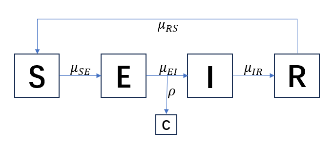

# Influenza Case Trends in Nova Scotia: Capturing the Seasonal Behavior


```{r setup, include=FALSE}
knitr::opts_chunk$set(echo = TRUE)
```

## Introduction 

Influenza, a contagious respiratory illness, imposes recurring seasonal health burdens on populations across the globe. In this study, we examine lab-confirmed influenza cases in Nova Scotia [@influenza] from 2014 to 2019, aiming to uncover the temporal dynamics and structural patterns underlying observed trends. By leveraging time series decomposition, autoregressive modeling, and partially observed Markov process (POMP) frameworks—including SIR, SIRS and SEIRS models—we seek to capture both the seasonal and stochastic behavior of influenza transmission in the region. This modeling effort helps quantify the seasonal peaks and infection dynamics and provides a basis for forecasting and evaluating public health interventions tailored to the Nova Scotia context.


## Data Preparation and EDA

```{r cars, include=FALSE}
library(ggplot2)
library(dplyr)
library(pomp)
library(tidyverse)
library(doFuture)
library(doParallel)
library(doRNG)
library(iterators)
```


```{r pressure, include=FALSE}
data <- read.csv("Lab-confirmed_Influenza_Cases.csv")
head(data)

```

```{r include=FALSE}
# Clean and format data
data$Date <- as.Date(data$Week.Ending, format= "%b %d, %Y")
#filtering the date variable
data <- data %>%
  filter(Date >= as.Date("2014-09-06") & Date <= as.Date("2019-09-07"))
```

```{r echo=FALSE}
# Time Series Plot
ggplot(data, aes(x = Date, y = Lab.Confirmed.Influenza.Cases)) +
  geom_line(color = "#003DA5") + 
  labs(title = "Confirmed  Influenza Cases Over Time in Nova Scotia",
       x = "Date ", y = "Confirmed Cases", caption = "Figure 1: Time Series of Influenza Cases") +
  theme_minimal() +
  theme(plot.title = element_text(size = 16, face = "bold"), 
        axis.title = element_text(size = 12), 
        axis.text = element_text(size = 10))


```

To begin our analysis, we obtained weekly lab-confirmed influenza case data for Nova Scotia from 2014 to 2019. The dataset was cleaned by converting date fields into standardized formats and filtering for the relevant timeframe. The dataset contains 262 observations. 
We then constructed a time series of weekly reported cases, revealing distinct seasonal peaks corresponding to annual influenza outbreaks.The time series plot shows clear seasonal peaks in confirmed influenza cases in Nova Scotia, with sharp outbreaks occurring annually between 2014 and 2019. Each season is followed by periods of low to near-zero case counts, indicating a strong seasonal trend in influenza activity. We have 261 observations in our dataset.

```{r echo=FALSE}

hist(data$Lab.Confirmed.Influenza.Cases, 
     col = "#003DA5", 
     border = "black", 
     main = "Histogram of Influenza Cases", 
     xlab = "Confirmed Cases", 
     ylab = "Frequency", 
     breaks = 20)


```
```{r echo=FALSE}
summary(data$Lab.Confirmed.Influenza.Cases)

```

We can notice that the distribution of Influenza cases in Nova Scotia is skewed to the right with a median being 1 cases per day and the range being from 0 to 87 cases per day. 

```{r echo=FALSE}

par(mfrow=c(1,2), mar=c(4, 4, 2, 1))
# ACF and PACF to assess temporal dependencies
acf(data$Lab.Confirmed.Influenza.Cases, main = "ACF of Influenza Cases")
pacf(data$Lab.Confirmed.Influenza.Cases, main = "PACF of Influenza Cases")

```

The ACF plot shows a strong autocorrelation at lag one that decays gradually across subsequent lags, indicating a non-stationary time series. The PACF plot displays a significant spike at lag one, followed by a sharp drop-off, which is characteristic of an autoregressive process. Together, these patterns suggest that the series requires first-order differencing to achieve stationarity, after which an ARIMA model may be appropriate for forecasting.

```{r echo=FALSE}
par(mfrow=c(1,2), mar=c(4, 4, 2, 1))
diff_series <- diff(data$Lab.Confirmed.Influenza.Cases)
acf(diff_series, main = "ACF of Influenza Cases" )
pacf(diff_series,  main = "ACF of Influenza Cases")


```

The ACF plot shows a sharp drop after lag 1, with all subsequent autocorrelations within the confidence bounds, indicating that the series is now stationary. The PACF shows significant spikes at early lags (especially lag 1–2), suggesting that an AR(1) or AR(2) component may be appropriate. This supports the use of an ARIMA(p,1,q) model with d = 1 due to first-order differencing.


```{r echo=FALSE}

ts_data <- ts(diff_series, frequency = 52 , start = c(2012, 36))
decomposed <- decompose(ts_data, type = "additive")
plot(decomposed)


```

The decomposition also confirms that the observed time series consists of a relatively stable trend component, a recurring seasonal pattern, and irregular random fluctuations. The seasonal component shows consistent cyclical behavior across years, while the random component captures short-term noise not explained by the trend or seasonality.  We are going to check our yearly cycle by spectral analysis

```{r echo=FALSE}
df <- read.csv("Lab-confirmed_Influenza_Cases.csv", stringsAsFactors = FALSE)
df$Week.Ending <- as.Date(df$Week.Ending, format = "%b %d, %Y")
start_date <- as.Date("2014-09-06")  # September 6, 2014
end_date <- as.Date("2019-09-07")    # September 7, 2019

# Filter the data
df_sub <- df[df$Week.Ending >= start_date & df$Week.Ending <= end_date, ]
df_sub$week <- 0:(nrow(df_sub) - 1)
ts_data_sa <- ts(df_sub$Lab.Confirmed.Influenza.Cases,
             frequency = 1,
             start = min(df_sub$week),
             end=max(df_sub$week))
spec_smooth <- spectrum(ts_data_sa,
         spans = c(4,4), 
         main  = "Smoothed Spectrum",
         xlab  = "Frequency", ylab = "Spectral Density")
abline(v=spec_smooth$freq[ which.max(spec_smooth$spec) ], lty=2, col="red")
text(spec_smooth$freq[ which.max(spec_smooth$spec) ], max(spec_smooth$spec), labels=paste("Dominant Frequency:", round(spec_smooth$freq[ which.max(spec_smooth$spec) ], 4)), pos=4, col="red")
cat("The peak frequency: ",spec_smooth$freq[ which.max(spec_smooth$spec) ],"\n")
dominant_period <-1/spec_smooth$freq[ which.max(spec_smooth$spec) ]
cat("The dominant period is:",dominant_period, "weeks. \n")
```

There is a clear seasonal trend in the influenza case data that recurs every ~54 weeks. Since the time period (54 weeks) is approximately one year (52 weeks), we will set the frequency to be 52 weeks for our following analysis.

```{r echo=TRUE, warning=FALSE}
aic_table <- function(data, P = 3, Q = 3, seasonal = FALSE, per = 52) {
  table <- matrix(NA, nrow = P + 1, ncol = Q + 1)
  
  for (p in 0:P) {
    for (q in 0:Q) {
      model <- tryCatch({
        if (seasonal) {
          arima(data, order = c(p, 0, q),
                seasonal = list(order = c(1, 0, 1), period = per))
        } else {
          arima(data, order = c(p, 0, q))
        }
      }, error = function(e) NULL)
      
      if (!is.null(model)) {
        table[p + 1, q + 1] <- model$aic
      }
    }
  }
  
  dimnames(table) <- list(paste0("AR", 0:P), paste0("MA", 0:Q))
  return(table)
}


aic_results <- aic_table(data = diff_series, P = 5, Q = 5, seasonal = FALSE)
# View as a table
print(aic_results)
```
```{r}
min_aic <- min(aic_results, na.rm = TRUE)
print(min_aic)

```

```{r echo=FALSE}
which_min <- which(aic_results == min_aic, arr.ind = TRUE)
# Because rows = AR0, AR1 so subtract 1
best_p <- which_min[1, 1] - 1 
#Same logic for MA
best_q <- which_min[1, 2] - 1 

cat("Best model: ARIMA(", best_p, ",0,", best_q, ")", sep = "")

```


The AIC table shows that ARIMA(5,0,5) has the lowest AIC (1821.56), indicating the best fit among tested models. However, ARIMA(2,0,2) has a similar AIC (1827.03) with far fewer parameters. Given the small AIC difference, ARIMA(2,0,2) may offer a better balance between accuracy and simplicity, helping to avoid overfitting.

## POMP Model analysis


### SIR Model 

The SIR model is one of the most fundamental compartmental models in infectious disease epidemiology. It segments the population into three compartments: Susceptible (S), Infected (I), and Recovered (R). Individuals progress from susceptible to infected upon exposure and from infected to recovered after resolving the illness. In this model, recovered individuals gain permanent immunity and do not return to the susceptible class.

The population dynamics of the SIR model are governed by the following system of difference equations:
$$
\begin{align*}
S(t) &= S(0) - N_{SI}(t) \\
I(t) &= I(0) + N_{SI}(t) - N_{IR}(t) \\
R(t) &= R(0) + N_{IR}(t)
\end{align*}
$$
Here, $N_{SI}(t)$ denotes the number of individuals who transition from susceptible to infected by time t, and $N_{IR}(t)$ represents those moving from infected to recovered.

The flow between compartments is governed by the following rate equations:

$$
\begin{aligned}
\frac{dN_{SI}}{dt} &= \beta(t) \cdot \frac{S(t) I(t)}{N} \\
\frac{dN_{IR}}{dt} &= \mu_{IR} \cdot I(t)
\end{aligned}
$$
To account for seasonality in influenza transmission, we modulate the transmission rate using a sinusoidal function:
$$
\beta(t) = \beta_0 \cdot \left(1 + \text{amp} \cdot \sin\left(\frac{2\pi(t + \text{phase})}{52}\right)\right)
$$

The model is simulated using Euler’s method. Transition counts are generated stochastically using binomial draws:
$$
\begin{aligned}
N_{SI}(t + \Delta t) &= N_{SI}(t) + \text{Binomial}\left(S(t), 1 - \exp\left(-\beta(t) \cdot \frac{I(t)}{N} \cdot \Delta t\right)\right) \\
N_{IR}(t + \Delta t) &= N_{IR}(t) + \text{Binomial}\left(I(t), 1 - \exp\left(-\mu_{IR} \cdot \Delta t\right)\right)
\end{aligned}
$$

The initial state is parameterized by setting a fraction $\eta$ of the population N as initially susceptible:
$$
\begin{aligned}
S(0) &= \eta \cdot N \\
I(0) &= 10 \\
R(0) &= (1 - \eta) \cdot N
\end{aligned}
$$

Reported cases are modeled as a noisy observation of the newly recovered individuals:
$$
\text{cases}_{\text{obs}} \sim \text{NegativeBinomial}(\mu = \rho \cdot \text{cases},\ k)
$$

This measurement model allows for underreporting ($\rho$) and overdispersion ($k$), helping the model accommodate real-world fluctuations in reported case counts.


```{r include=FALSE}

data <- read.csv("Lab-confirmed_Influenza_Cases.csv")
data$Date <- as.Date(data$Week.Ending, format = "%b %d, %Y")

# Filter and create the time variable (in weeks since first date)
data <- data %>%
  filter(Date >= as.Date("2014-09-06") & Date <= as.Date("2019-09-07")) %>%
  arrange(Date) %>%
  mutate(
    time = as.numeric(difftime(Date, min(Date), units = "weeks")),
    cases_obs = Lab.Confirmed.Influenza.Cases
  ) %>%
  select(time, cases_obs)

```


```{r SIR_init}

sir_step <- Csnippet("
  double pi = 3.141593;
  double beta_seasonal = Beta * (1 + amp * sin(2 * pi * (t + phase) / 52));
  double dN_SI = rbinom(S, 1 - exp(-beta_seasonal * I / N * dt));
  double dN_IR = rbinom(I, 1 - exp(-mu_IR * dt));
  S -= dN_SI;
  I += dN_SI - dN_IR;
  R += dN_IR;
  cases = dN_IR;
")

rinit_sir <- Csnippet("
  S = nearbyint(eta * N);
  I = 10;
  R = nearbyint((1 - eta) * N);
  cases = 0;
")

dmeas <- Csnippet("
  lik = dnbinom_mu(cases_obs, k, rho * cases + 1e-6, give_log);
")

rmeas <- Csnippet("
  cases_obs = rnbinom_mu(k, rho * cases + 1e-6);
")

sir_pomp <- pomp(
  data = data,
  times = "time",
  t0 = 0,
  rprocess = euler(sir_step, delta.t = 1/7),
  rinit = rinit_sir,
  rmeasure = rmeas,
  dmeasure = dmeas,
  statenames = c("S", "I", "R", "cases"),
  paramnames = c("Beta", "mu_IR", "eta", "amp", "phase", "rho", "k", "N"),
  accumvars = "cases",
  partrans = parameter_trans(
    log = c("Beta", "mu_IR", "k"),
    logit = c("eta", "amp", "rho")
  ),
  params = c(Beta = 2, mu_IR = 0.2, eta = 0.2, amp = 0.2,
             phase = 0, rho = 0.1, k = 10, N = 100000)
)


```


```{r}
registerDoParallel(cores = detectCores())
registerDoRNG(1234)

local_fits <- foreach(i = 1:5, .combine = c, .packages = "pomp") %dopar% {
  coef(sir_pomp) <- c(
    Beta = runif(1, 1, 3),
    mu_IR = runif(1, 0.1, 0.3),
    eta = runif(1, 0.1, 0.4),
    amp = runif(1, 0.1, 0.4),
    phase = runif(1, -13, 13),
    rho = runif(1, 0.01, 0.2),
    k = runif(1, 5, 50),
    N = 100000
  )

  mif2(
    sir_pomp,
    Nmif = 100,
    Np = 1000,
    cooling.fraction.50 = 0.5,
    rw.sd = rw_sd(
      Beta = 0.02, mu_IR = 0.02, eta = ivp(0.02),
      amp = 0.01, phase = 0.5,
      rho = 0.02, k = 0.02
    )
  )
}

```


```{r}

# Evaluate local search results
local_ll <- foreach(mf = local_fits, .combine = rbind) %dopar% {
  ll_vals <- replicate(20, logLik(pfilter(mf, Np = 2000)))
  pomp::logmeanexp(ll_vals, se = TRUE)
}

print(local_ll)


```
The local search yielded several comparable log-likelihood estimates, with the best result being -761.92 (result.4), indicating a slightly better fit than the others, which clustered around -765. The small standard errors (all < 0.02) suggest consistent and stable estimates across different initializations.


```{r echo=FALSE}

best_index <- which.max(sapply(local_fits, function(m) logLik(pfilter(m, Np = 2000))))
best_fit <- local_fits[[best_index]]
coef(best_fit)


sim_df <- simulate(best_fit, nsim = 3, include.data = TRUE, format = "data.frame")
ggplot(sim_df, aes(x = time, y = cases_obs, group = .id)) +
  geom_line(aes(color = .id == "data"), alpha = 0.6) +
  scale_color_manual(values = c("FALSE" = "#d21034", "TRUE" = "#003DA5"),
                     labels = c("Simulated", "Observed"), name = "") +
  labs(title = "Final Best Local Fit: SIR Model",
       x = "Week", y = "Cases") +
  theme_minimal() +
  theme(legend.position = "top")


```

The final best local fit of the SIR model, with a transmission rate (1.79) and a very low recovery rate (0.00366), suggests prolonged infectious periods that result in high amplitude and frequent epidemic spikes. The amplitude of seasonal forcing (0.10) and a moderate initial susceptibility level (0.40) allow for a reasonable reproduction of seasonal peaks, but the near-perfect reporting rate (0.99) may unrealistically overestimate case visibility. As seen in the Final Best Local Fit plot, the simulated cases overestimate the true peaks and exhibit excessive volatility, especially during non-epidemic periods—indicating poor calibration to real-world underreporting and noise.


```{r}

#global search space
sir_guesses <- data.frame(
  Beta = runif(20, 1, 3),
  mu_IR = runif(20, 0.1, 0.3),
  eta = runif(20, 0.1, 0.4),
  amp = runif(20, 0.1, 0.4),
  rho = runif(20, 0.01, 0.2),
  phase = runif(20, -13, 13),
  k = runif(20, 5, 50),
  N = 100000
)


#running a global search
global_results_sir <- foreach(i = 1:nrow(sir_guesses), .combine = rbind) %dopar% {
  start_params <- as.list(sir_guesses[i, ])
  mf <- sir_pomp
  coef(mf) <- unlist(start_params)

  mf <- mif2(
    mf,
    Nmif = 50,
    Np = 1000,
    cooling.fraction.50 = 0.5,
    rw.sd = rw_sd(
      Beta = 0.02,
      mu_IR = 0.02,
      eta = ivp(0.02),
      amp = 0.01,
      phase = 0.5,
      rho = 0.02,
      k = 0.02
    )
  )

  mf <- mif2(mf)

  ll_vals <- replicate(5, logLik(pfilter(mf, Np = 2000)))
  ll <- logmeanexp(ll_vals, se = TRUE)

  tibble(
    loglik = ll[1],
    se = ll[2],
    Beta = coef(mf)["Beta"],
    mu_IR = coef(mf)["mu_IR"],
    eta = coef(mf)["eta"],
    amp = coef(mf)["amp"],
    phase = coef(mf)["phase"],
    rho = coef(mf)["rho"],
    k = coef(mf)["k"],
    N = coef(mf)["N"]
  )
}


```


```{r}

global_results_df <- as.data.frame(global_results_sir)

#Best fit based on log-likelihood
best_global_fit <- global_results_df %>%
  arrange(desc(loglik)) %>%
  head(1)

print(best_global_fit)


```


```{r echo=FALSE}

#simulate with best the global parameters
best_params <- unlist(best_global_fit[ , !(names(best_global_fit) %in% c("loglik.est", "se.se"))])
sim_df <- simulate(sir_pomp, params = best_params, nsim = 3, include.data = TRUE, format = "data.frame")

ggplot(sim_df, aes(x = time, y = cases_obs, group = .id)) +
  geom_line(aes(color = .id == "data"), alpha = 0.6) +
  scale_color_manual(
    values = c("FALSE" = "#d21034", "TRUE" = "#003DA5"),
    labels = c("Simulated", "Observed"),
    name = ""
  ) +
  labs(
    title = "Best Global Fit: SIR with Seasonality & NB",
    x = "Week",
    y = "Cases"
  ) +
  theme_minimal() +
  theme(legend.position = "top")


```


In contrast, the best global fit achieves a slightly more conservative transmission estimate (1.61) and recovery rate (0.00329), with similar levels of seasonal modulation (0.074) and a slightly higher initial susceptibility (0.44). While the global simulation (shown in the Best Global Fit plot) captures the general timing of seasonal peaks more subtly than the local fit, it still fails to replicate the magnitude and width of actual outbreaks. Over time, excessive low-level simulated spikes reflect overdispersion and unrealistic epidemic cycling. These limitations in both local and global fits underscore that the basic SIR framework—even when enhanced with seasonal forcing and negative binomial observation noise—is insufficient to model Nova Scotia’s influenza dynamics. This motivates transitioning to more realistic models, such as SEIR or SIRS, incorporating latent exposure periods and immunity waning to better reflect the complex mechanisms driving flu transmission.

### SIRS model

This section generalizes the SIR model to the SIRS model, which includes Susceptible (S), Infected (I), Recovered (R), and Reported (H). In terms of this model, the conservation of individuals can be expressed as the following [@ionides2025chapter12]:

$$
S(t) = S(0) - N_{SI}(t) + N_{RS}(t)
$$
$$
I(t) = I(0) + N_{SI}(t) - N_{IR}(t)
$$
$$
R(t) = R(0) +N_{IR}(t) - N_{RS}(t)
$$

and its counting process can be described with the ordinary differential equations (ODE) [@ionides2025chapter12]:

$$
\frac{dN_{SI}}{dt} = \mu_{SI}(t)S(t)
$$
$$
\frac{dN_{IR}}{dt} = \mu_{IR}(t)I(t)
$$
$$
\frac{dN_{RS}}{dt} = \mu_{RS}(t)R(t)
$$
The ODEs can be solved by Euler's numerical method. Specifically, the RHS can be expressed as a binomial approximation with exponential transition probability [@ionides2025chapter12]:

$$
N_{SI}(t + \Delta t) \approx N_{SI}(t) + \text{Binomial}\left[S(t), 1 - \exp(-\mu_{SI}(t)\Delta t)\right]
$$

$$
N_{IR}(t + \Delta t) \approx N_{IR}(t) + \text{Binomial}\left[I(t), 1 - \exp(-\mu_{IR} \Delta t)\right]
$$

$$
N_{RS}(t + \Delta t) \approx N_{RS}(t) + \text{Binomial}\left[R(t), 1 - \exp(-\mu_{RS} \Delta t)\right]
$$

We consider $\mu_{IR}$ as the constant recovery rate and $\mu_{RS}$ as the reinfection rate. The rate at which individuals move from $S$ to $I$ is the force of infection. We consider the infection rate as a time-variable function with periodic $\beta$ to incorporate seasonality with a period of 52 weeks (a year), where $a$, $b$ are average transmission rates for pre-pandemic years and pandemic seasons, respectively:

$$
\mu_{SI}(t) = \beta(t) \frac{I(t)}{N},
$$

$$
\beta(t) = \beta_0(t)(1 + c \cos(2\pi(t + d)/52))
$$

$$
\beta_0(t) = a, \quad \text{in prepandemic years}
$$

$$
\beta_0(t) = b = a - \Delta a, \quad \text{during pandemic year}
$$


We first define a set of parameters and the SIRS model using the POMP package:

```{r message=FALSE, warning=FALSE}
data <- read.csv("Lab-confirmed_Influenza_Cases.csv")
data$Date <- as.Date(data$Week.Ending, format = "%b %d, %Y")


# Filter and create the time variable (in weeks since first date)
data <- data %>%
  filter(Date >= as.Date("2014-09-06") & Date <= as.Date("2019-09-07")) %>%
  arrange(Date) %>%
  mutate(
    time = as.numeric(difftime(Date, min(Date), units = "weeks")),
    cases = Lab.Confirmed.Influenza.Cases
  ) %>%
  select(time, cases)
# SIRS step function (Euler method)

# Step function
sirs_step <- Csnippet("
  double beta, dN_SI, dN_IR, dN_RS;

  if (t < 261) {
    beta = a;
  } else {
    beta = b;
  }

  beta *= (1 + c * cos(2.0 * 3.141592653589793 * (t + d) / 52.0));

  dN_SI = rbinom(S, 1 - exp(-beta * I / N * dt));
  dN_IR = rbinom(I, 1 - exp(-mu_IR * dt));
  dN_RS = rbinom(R, 1 - exp(-mu_RS * dt));

  S -= dN_SI;
  I += dN_SI - dN_IR;
  R += dN_IR - dN_RS;
  S += dN_RS;
  H += dN_IR;
")

# Initial state
sirs_init <- Csnippet("
  double m = N / (S_0 + I_0 + R_0);
  S = nearbyint(m * S_0);
  I = nearbyint(m * I_0);
  R = nearbyint(m * R_0);
  H = 0;
")

# Measurement model
sirs_rmeas <- Csnippet("cases = rpois(rho * H + 1e-6);")
sirs_dmeas <- Csnippet("lik = dpois(cases, rho * H + 1e-6, give_log);")

# Build pomp object using your actual `data`
sirs_pomp <- pomp(
  data = data,
  times = "time",
  t0 = 0,
  rprocess = euler(sirs_step, delta.t = 1/7),
  rinit = sirs_init,
  rmeasure = sirs_rmeas,
  dmeasure = sirs_dmeas,
  accumvars = "H",
  statenames = c("S", "I", "R", "H"),
  paramnames = c("a", "b", "c", "d", "mu_IR", "mu_RS", "N", "S_0", "I_0", "R_0", "rho")
)
```


The parameters were chosen based on epidemiological data and literature. The simulation was run 500 times to reflect stochasticity. While the model successfully captures the seasonal pattern and general magnitude of flu incidence, there is a noticeable phase offset, suggesting a possible timing mismatch between real-world data and simulated peaks. This comparison implies the need for further refinement on model parameters, such as adjusting transmission or reinfection rates to better align simulated flu cycles with observed data.

```{r echo=FALSE, message=FALSE, warning=FALSE}
# Parameters
params = c(
  a = 1, b = 0.5, c = 0.1, d = -1,
  mu_IR = 1, mu_RS = 1/21,
  N = 3.25e8, S_0 = 0.8, I_0 = 0.01, R_0 = 0.15,
  rho = 2.8e-5
)

# Run simulation
sim <- simulate(sirs_pomp, params = params, nsim = 500, format = "data.frame", include.data = TRUE)

# Plot
ggplot(sim, aes(x = time, y = cases, group = .id)) +
  geom_line(aes(color = .id == "data"), alpha = 0.6) +
  scale_color_manual(
    values = c("FALSE" = "#d21034", "TRUE" = "#003DA5"),
    labels = c("Simulated", "Observed"),
    name = ""
  ) +
  labs(
    title = "SIRS Simulation vs Observed Flu Reports",
    y = "Reported Cases",
    x = "Week"
  ) +
  theme_minimal() +
  theme(plot.title = element_text(hjust = 0.5)) +
  guides(color = FALSE)
```

#### Particle Filter and Likelihood for Initial Guess

To proceed with iterative simulations for local and global parameter searches, we apply particle filtering to the SIRS model. According to the resulting plot, it appears that the ESS tends to drop significantly at the start of each seasonal cycle, indicating difficulty in maintaining particle diversity during those periods, but remains reasonably stable otherwise. The initial likelihood estimate is relatively low, suggesting that there is room for improvement in parameter tuning in subsequent steps.

```{r echo=FALSE}
set.seed(531)

pf_result <- pfilter(
  data = sirs_pomp,
  params = c(a = 1, b = 0.5, c = 0.1, d = -1,
             mu_IR = 1, mu_RS = 1/21,
             N = 3.25e8, S_0 = 0.8, I_0 = 0.01, R_0 = 0.15,
             rho = 2.8e-5),
  Np = 2000
)

# Replicate the pfilter 10 times for stable likelihood and SE
loglik_reps <- replicate(10, logLik(pfilter(sirs_pomp, params = coef(pf_result), Np = 2000)))

# Estimate mean and SE using log-mean-exp trick
loglik_summary <- logmeanexp(loglik_reps, se = TRUE)

cat("Log-likelihood estimate:", loglik_summary[1], "\n")
cat("Standard error:", loglik_summary[2], "\n")

plot(pf_result)
```

#### Local Search

We then run the local search using the mif2 algorithm to optimize the SIRS model fit based on particle filtering. The random walk perturbation is chosen to be 0.01 or 0.02 for the parameters.

```{r echo=FALSE}
registerDoParallel(cores = 4)
registerDoRNG(12345)

# Parameter transformation
param_trans <- parameter_trans(
  log = c("a", "b", "mu_IR", "mu_RS", "rho"),
  logit = c("S_0", "I_0", "R_0"),
  identity = c("c", "d", "N") 
)

# Rebuild pomp object using your actual dataset
sirs_pomp <- pomp(
  data = data, times = "time", t0 = 0,
  rprocess = euler(sirs_step, delta.t = 1/7),
  rinit = sirs_init, rmeasure = sirs_rmeas, dmeasure = sirs_dmeas,
  accumvars = "H",
  statenames = c("S", "I", "R", "H"),
  paramnames = c("a", "b", "c", "d", "mu_IR", "mu_RS",
                 "N", "S_0", "I_0", "R_0", "rho"),
  partrans = param_trans
)

# Starting parameter guess
params <- c(
  a = 1, b = 0.5, c = 0.1, d = -1,
  mu_IR = 1, mu_RS = 1/21, N = 3.25e8,
  S_0 = 0.8, I_0 = 0.01, R_0 = 0.15,
  rho = 2.8e-5
)

# Local search settings
Np <- 1000
Nmif <- 50
Nlocal <- 10
Nreps_eval <- 10

# Random walk sd
rw.sd.local <- rw_sd(
  a = 0.02, b = 0.02, c = 0.01, d = 0.01,
  mu_IR = 0.01, mu_RS = 0.01, rho = 0.02,
  S_0 = ivp(0.01), I_0 = ivp(0.01), R_0 = ivp(0.01)
)

# Run mif2 search
local_mifs_sirs <- replicate(Nlocal,
  mif2(
    data = sirs_pomp, Np = Np, Nmif = Nmif,
    params = params, rw.sd = rw.sd.local,
    cooling.fraction.50 = 0.5
  ),
  simplify = FALSE
)

# Evaluate log-likelihoods
local_logliks <- foreach(mf = local_mifs_sirs, .combine = rbind) %dopar% {
  evals <- replicate(Nreps_eval, logLik(pfilter(mf, Np = Np)))
  ll <- logmeanexp(evals, se = TRUE)
  bind_cols(as_tibble(coef(mf)), loglik = ll[1], loglik.se = ll[2])
}

# local_logliks %>% arrange(desc(loglik)) %>% print(n = Inf)
```

```{r echo=FALSE}
coef(local_mifs_sirs[[1]])  
```

The trace plots from running 50 iterations show how each parameter adjusted over the iterations, with the log-likelihood values converging relatively quickly, indicating stable estimates.

```{r echo=FALSE}
# Extract traces manually from each mif2 result
trace_data <- bind_rows(
  lapply(seq_along(local_mifs_sirs), function(i) {
    as.data.frame(local_mifs_sirs[[i]]@traces) %>%
      mutate(iteration = seq_len(nrow(.)), chain = i)
  })
)

trace_data %>%
  pivot_longer(cols = -c(iteration, chain), names_to = "parameter", values_to = "value") %>%
  ggplot(aes(x = iteration, y = value, group = chain, color = factor(chain))) +
  geom_line() +
  facet_wrap(~parameter, scales = "free_y") +
  labs(title = "Parameter Trace Plots from mif2 Runs",
       x = "Iteration", y = "Parameter Value") +
  guides(color = FALSE)
```

The log-likelihood pair plot shows that most parameter combinations have little influence on improving model likelihood, indicating a relatively flat likelihood surface. Parameters such as S_0 and mu_RS seen to have minimal impact, while others show weak nonlinear patterns, which suggest the need for global search to further improve model fit.

```{r echo=FALSE}
# Likelihood estimation, pairplot and updated simulation
library(foreach)
library(pomp)
library(tibble)
library(tidyr)

sirs_lik_local <- foreach(mf = local_mifs_sirs, .combine = rbind) %dopar% {
  evals <- replicate(Nreps_eval, logLik(pfilter(mf, Np = Np)))
  ll <- logmeanexp(evals, se = TRUE)
  
  bind_cols(
    as_tibble_row(as.list(coef(mf))),
    tibble(loglik = ll[1], loglik.se = ll[2])
  )
}

sirs_lik_all_numeric <- sirs_lik_local %>%
  select(where(is.numeric)) %>%
  drop_na()

pairs(sirs_lik_all_numeric,
      pch = 16,
      main = "Parameter Pairs vs. Log-Likelihood")
```

The best-fit parameter set achieved a log-likelihood of -2470.286 with a standard error of approximately 7.37. The parameter set with the highest log-likelihood includes increased values for the transmission rate (a ≈ 4.81) and recovery rate (mu_IR ≈ 6.44), indicating faster disease spread and resolution than what we initially assumed. This observation is consistent with the plot, which displays significantly overly high amplitudes in the simulations despite of improved timing match. These findings also encourage to further explore the global parameter space to seek potential improvements beyond the local search.

```{r echo=FALSE}
# Find the best local search result
local_search_res <- sirs_lik_local %>%
  filter(loglik == max(loglik)) %>%
  filter(loglik < 0) %>%
  filter(is.finite(loglik))

local_search_res[1, ]
```

```{r echo=FALSE}
# Convert best-fit row to a named numeric vector of parameters
best_named <- local_search_res[1, ] %>%
  select(-loglik, -loglik.se) %>%
  unlist() %>%
  as.numeric()
names(best_named) <- colnames(local_search_res)[1:(ncol(local_search_res) - 2)]

# Simulate from the best-fit model
set.seed(531)
sim_best <- simulate(
  object = sirs_pomp,
  params = best_named,
  nsim = 20,
  format = "data.frame",
  include.data = TRUE
)

# Plot: Simulation vs Observed
ggplot(sim_best, aes(x = time, y = cases, group = .id)) +
  geom_line(aes(color = .id == "data"), alpha = 0.6) +
  scale_color_manual(
    values = c("FALSE" = "#d21034", "TRUE" = "#003DA5"),
    labels = c("Simulated", "Observed"),
    name = ""
  ) +
  labs(title = "SIRS Simulation vs Observed Flu Reports (Best Local Fit)",
       x = "Week", y = "Reported Cases") +
  guides(color = FALSE)
```

#### Global Search

Before running the global search, we first use the parameter guesses generated from the defined safe box to simulate the SIRS model to ensure numerical stability. The simulation outputs for the S, I, R, H, and reported cases summarized in the table below appear no negative or non-finite values, which is essential for a valid starting point in the following global search procedure.

```{r echo=FALSE, message=FALSE}
sirs_step <- Csnippet("
  double beta, dN_SI, dN_IR, dN_RS;

  if (t < 261) {
    beta = a;
  } else {
    beta = b;
  }

  beta *= (1 + c * cos(2.0 * M_PI * (t + d) / 52.0));

  // Safety check and cap
  if (!R_FINITE(beta) || beta < 0) {
    Rprintf(\"Invalid beta at time %f: beta=%f\\n\", t, beta);
    beta = 0.0;
  }

  double p_SI = 1 - exp(-fmin(10.0, fmax(0.0, beta * I / N * dt)));
  double p_IR = 1 - exp(-fmin(10.0, fmax(0.0, mu_IR * dt)));
  double p_RS = 1 - exp(-fmin(10.0, fmax(0.0, mu_RS * dt)));

  dN_SI = rbinom(S, fmin(1.0, fmax(0.0, p_SI)));
  dN_IR = rbinom(I, fmin(1.0, fmax(0.0, p_IR)));
  dN_RS = rbinom(R, fmin(1.0, fmax(0.0, p_RS)));

  S -= dN_SI;
  I += dN_SI - dN_IR;
  R += dN_IR - dN_RS;
  S += dN_RS;
  H += dN_IR;
")

sirs_pomp <- pomp(
  data = data, times = "time", t0 = 0,
  rprocess = euler(sirs_step, delta.t = 1/7),
  rinit = sirs_init, rmeasure = sirs_rmeas, dmeasure = sirs_dmeas,
  accumvars = "H",
  statenames = c("S", "I", "R", "H"),
  paramnames = c("a", "b", "c", "d", "mu_IR", "mu_RS",
                 "N", "S_0", "I_0", "R_0", "rho"),
  partrans = param_trans
)
```


Through running 50 mif2 chains, the output shows a wide range of log-likelihood values, indicating that some guesses led to much better model fits than others. The best chains achieved much higher log-likelihoods than in the local search phase, suggesting that the global search does help improve the model fit.

```{r include=FALSE}
param_box <- rbind(
  a = c(1.0, 2.5), b = c(0.5, 1.5), c = c(0.05, 0.2), d = c(-2, 2),
  mu_IR = c(1.2, 2), mu_RS = c(1/28, 1/14), rho = c(1e-4, 5e-4),
  S_0 = c(0.7, 0.9), I_0 = c(0.005, 0.015), R_0 = c(0.05, 0.25)
)
N_fixed <- 1e6

# Random Guesses
Ntest <- 50
set.seed(531)

test_guesses <- as.data.frame(t(
  replicate(Ntest, {
    sapply(1:nrow(param_box), function(i) runif(1, param_box[i, 1], param_box[i, 2]))
  })
))
colnames(test_guesses) <- rownames(param_box)
test_guesses$N <- N_fixed

# Define Output Names
param_names <- c("a", "b", "c", "d", "mu_IR", "mu_RS", "rho", "S_0", "I_0", "R_0", "N")
col_names <- c("loglik", "se", param_names)

# Run MIF2 Chains (Sequential)
library(pomp)
library(tibble)

global_results_sirs_test <- lapply(1:Ntest, function(i) {
  # cat("Running chain", i, "...\n")
  tryCatch({
    this_params <- unlist(test_guesses[i, ])
    coef(sirs_pomp) <- this_params

    # Pre-check: simulate to confirm stability
    sim_check <- simulate(sirs_pomp, params = this_params, nsim = 1, format = "data.frame")
    if (any(!is.finite(sim_check$S)) || any(sim_check$S < 0)) stop("Unstable simulation")

    # Fit with mif2
    mf <- mif2(
      sirs_pomp, params = this_params,
      Nmif = 50, Np = 1000,
      cooling.fraction.50 = 0.5,
      rw.sd = rw_sd(
        a = 0.02, b = 0.02, c = 0.01, d = 0.01,
        mu_IR = 0.01, mu_RS = 0.01, rho = 0.02,
        S_0 = ivp(0.01), I_0 = ivp(0.01), R_0 = ivp(0.01)
      )
    )

    # Evaluate likelihood
    ll_vals <- replicate(3, logLik(pfilter(mf, Np = 1000)))
    ll <- logmeanexp(ll_vals, se = TRUE)

    # Combine and return results
    result <- c(loglik = ll[1], se = ll[2], as.numeric(coef(mf)))
    names(result) <- col_names
    result
  }, error = function(e) {
    # cat("Chain", i, "failed:", e$message, "\n")
    result <- setNames(rep(NA_real_, length(col_names)), col_names)
    result
  })
})

global_results_sirs_test_df <- as_tibble(do.call(rbind, global_results_sirs_test))
# print(global_results_sirs_test_df)
```

This pair plot compares the initial random parameter guesses (grey) against the optimized results from mif2 (red). The concentration and shift of red points indicate how certain parameters, such as a and mu_IR, tend to increase during optimization. The clear separation between guesses and fitted values supports that mif2 successfully refined parameters toward a higher-likelihood.

```{r echo=FALSE}
library(readr)
library(dplyr)

read_csv("sirs_lik.csv", show_col_types = FALSE) %>%
  bind_rows(global_results_sirs_test_df) %>%
  filter(is.finite(loglik)) %>%
  arrange(desc(loglik)) %>%
  write_csv("sirs_lik.csv")

all_results <- read_csv("sirs_lik.csv", show_col_types = FALSE)

guesses <- test_guesses
guesses$loglik <- NA
guesses$se <- NA
guesses <- guesses %>% select(loglik, se, everything())

all <- all_results %>%
  filter(loglik > max(loglik, na.rm = TRUE) - 1e3) %>%  # keep top 1000-window
  bind_rows(guesses) %>%
  mutate(type = if_else(is.na(loglik), "guess", "result")) %>%
  arrange(type)
```


```{r echo=FALSE}
pairs(~loglik + a + b + c + d + mu_IR + mu_RS,
      data = all, pch = 16, cex = 1,
      col = ifelse(all$type == "guess", grey(0.5), "red"))
```

The plot below compares simulated flu reports to observed data using the best parameter set from the global search. While the simulation captures the first two peaks relatively well, it significantly underestimates later peaks. This failure to capture the true trend across the entire time frame indicates that the SIRS is not the optimal model for this flu data.

```{r echo=FALSE}
# Pick the Best Parameter Set
best_fit <- global_results_sirs_test_df %>%
  arrange(desc(loglik)) %>%
  slice(1)

params_best <- best_fit %>%
  select(-loglik, -se) %>%
  unlist() %>%
  as.numeric()

names(params_best) <- colnames(best_fit)[-(1:2)]
```

```{r echo=FALSE}
sim_best <- simulate(
  object = sirs_pomp,
  params = params_best,
  nsim = 20,
  format = "data.frame",
  include.data = TRUE
)

ggplot(sim_best, aes(x = time, y = cases, group = .id)) +
  geom_line(aes(color = .id == "data"), alpha = 0.6) +
  scale_color_manual(
    values = c("FALSE" = "#d21034", "TRUE" = "#003DA5"),
    labels = c("Simulated", "Observed"),
    name = ""
  ) +
  labs(
    title = "SIRS Simulation vs Observed Data (Best Global Fit)",
    x = "Time (weeks)",
    y = "Reported Cases"
  ) +
  guides(color = FALSE) +
  theme_minimal()
```

### SEIRS model 

We are also going to fit our SEIRS model. This model is a variation of the SIRS model that incorporates an unobserved latent period and modifies the dynamics so that recovered individuals return to the susceptible class. Such a modification is important because, in the context of influenza, individuals experience a latent period after becoming infected [anderson_may1991]. We now construct our SEIRS model.

```{r insert-image, echo=FALSE, out.width='60%', fig.cap="SEIRS diagram"}

```

Inspired by a previous project [@24project5], we use a different implementation and parameter set for this report.

The number of individuals in each compartment is described by the following system of equations.
$$
\begin{align*}
S(t) &= S_0 + N_{RS}(t) - N_{SE}(t) \\
E(t) &= E_0 + N_{SE}(t) - N_{EI}(t) \\
I(t) &= I_0 + N_{EI}(t) - N_{IR}(t) \\
R(t) &= R_0 + N_{IR}(t) - N_{RS}(t)
\end{align*}
$$

The system of ordinary differential equations below governs the dynamics of the counting process; these equations have been adapted from the ODEs shown in the lecture [@ionides2025chapter12]. In our formulation, we allow $\mu_{SE}$ to vary with time, whereas $\mu_{EI},\mu_{IR}$ and $\mu_{RS}$ are held fixed.
$$
\begin{align*}
\frac{dN_{SE}}{dt} &= \mu_{SE}(t) S(t) \\
\frac{dN_{EI}}{dt} &= \mu_{EI} E(t) \\
\frac{dN_{IR}}{dt} &= \mu_{IR} I(t) \\
\frac{dN_{RS}}{dt} &= \mu_{RS} R(t)
\end{align*}
$$
We can solve the differential equations by using Euler’s method [@ionides2025chapter12].
$$
\begin{align*}
N_{SE}(t + \Delta t) &= N_{SE}(t) +\text{Binomial}[S(t), 1 - \exp(-\mu_{SE}(t) \Delta t)] \\
N_{EI}(t + \Delta t) &= N_{EI}(t) + \text{Binomial}[E(t), 1 - \exp(-\mu_{EI} \Delta t)] \\
N_{IR}(t + \Delta t) &= N_{IR}(t) + \text{Binomial}[I(t), 1 - \exp(-\mu_{IR} \Delta t)] \\
N_{RS}(t + \Delta t) &= N_{RS}(t) + \text{Binomial}[R(t), 1 - \exp(-\mu_{RS} \Delta t)]
\end{align*}
$$

Because the actual population is distributed across different compartments, we introduced new parameters representing the fraction of the population in each compartment, which also require estimation. Our approach mirrors the formulation from the lecture notes [@ionides2025chapter18], as shown in the following equations.
$$
\begin{align*}
\text{Pop} &= N / (S_0 + E_0 + I_0 + R_0) \\
S &= S_0 \cdot \text{Pop} \\
E &= E_0 \cdot \text{Pop} \\
I &= I_0 \cdot \text{Pop} \\
R &= R_0 \cdot \text{Pop}
\end{align*}
$$

To keep the model straightforward, we omitted demographic turnover (births and deaths) and held the population fixed at 969400, corresponding to Nova Scotia’s estimated population in 2021 [@pop].

Reffering to the previous project [@24project5], in order to accurately capture the natural seasonal variations (the cycle of 52 weeks) in influenza cases, we adapted our transmission rate parameter.
$$
\beta = \beta_0 \cdot (1 + \text{amp} \cdot \sin(2  \pi \cdot (t + \text{phase}) / 52))
$$

In this formulation, $\beta_0$ denotes the baseline transmission rate, $\text{amp}$ specifies the amplitude of the seasonal forcing (the sine wave), and $\text{phase}$ is its phase offset. These three quantities are treated as additional parameters to be estimated from the data. We also updated the measurement component to use a negative binomial distribution, following the lecture notes [@ionides2025chapter12]. To confirm that this SEIRS structure is reasonable for influenza incidence, we conducted several trial simulations with hand-picked parameter values.

```{r, echo=FALSE}
data <- read.csv("Lab-confirmed_Influenza_Cases.csv")
data$Date <- as.Date(data$Week.Ending, format = "%b %d, %Y")


# Filter and create the time variable (in weeks since first date)
data <- data %>%
  filter(Date >= as.Date("2014-09-06") & Date <= as.Date("2019-09-07")) %>%
  arrange(Date) %>%
  mutate(
    week = as.numeric(difftime(Date, min(Date), units = "weeks")),
    cases = Lab.Confirmed.Influenza.Cases
  ) %>%
  select(week, cases)
# SEIRS model 
seirs_step <- Csnippet("
  double pi = 3.141593;
  double Beta = Beta0 * (1 + amp * sin(2 * pi * (t + phase) / 52));
  double dN_SE = rbinom(S, 1 - exp(-Beta * I / N * dt));
  double dN_EI = rbinom(E, 1 - exp(-mu_EI * dt));
  double dN_IR = rbinom(I, 1 - exp(-mu_IR * dt));
  double dN_RS = rbinom(R, 1 - exp(-mu_RS * dt));
  S += dN_RS - dN_SE;
  E += dN_SE - dN_EI;
  I += dN_EI - dN_IR;
  R += dN_IR - dN_RS;
  H += dN_IR;
  ")

seirs_rinit <- Csnippet("
 double pop = N / (S0 + E0 + I0 + R0);
  S = nearbyint(S0 * pop);
  E = nearbyint(E0 * pop);
  I = nearbyint(I0 * pop);
  R = nearbyint(R0 * pop);
  H = 0;
  ")

seirs_dmeas <- Csnippet("
  lik = dnbinom_mu(cases, k, rho * H, give_log);
  ")

seirs_rmeas <- Csnippet("
  cases = rnbinom_mu(k, rho * H);
  ")
```


```{r, echo=FALSE}
seirs_pomp <- pomp(
  data=data,
  times = "week",
    t0 = 0,
    rprocess = euler(seirs_step, delta.t = 1 / 7),
    rinit = seirs_rinit, 
    rmeasure = seirs_rmeas,
    dmeasure = seirs_dmeas,
    accumvars = "H",
    statenames = c("S", "E", "I", "R", "H"),
    paramnames = c("Beta0", "amp", "phase", "mu_EI", "mu_IR", "mu_RS", "N", "S0", "E0", "I0", "R0", "rho", "k"),
    partrans = parameter_trans(
      log = c("Beta0", "mu_EI", "mu_IR", "mu_RS", "k"),
      logit = c("amp", "rho"),
      barycentric = c("S0", "E0", "I0", "R0")
    )
  )
params <- c(
  Beta0 = 2, amp = 0.3, phase = -4.5,
  mu_EI = 0.8, mu_IR = 2, mu_RS = 1,
  N = 969400, S0 = 0.1, E0 = 0.01, I0 = 0.01, R0 = 0.3,
  rho = 0.0005, k = 10
)
sim <- function(sirs, params, model = "SEIRS", seed = 35) {
  set.seed(seed)
  sims <- sirs %>%
    simulate(
      params = params,
      nsim = 20,
      format = "data.frame",
      include.data = TRUE
    )
  ggplot() + 
    geom_line(data = sims %>% filter(.id == "data"), aes(x = week, y = cases), color = "#007ac1") + 
    geom_line(data = sims %>% filter(.id != "data"), aes(x = week, y = cases, group = .id), color = "#dc4151", alpha = 0.4) + 
    labs(
      x = "Week",
      y = "Cases",
      title = paste0("Influenza ", model, " Simulations")
    ) + 
    theme(plot.title = element_text(hjust = 0.5))
}

print(params)
# Run simulation and plot results
seirs_pomp %>% sim(params)


```

It seems that our modified SEIRS model succeeds to capture the seasonality in the influenza data. Although some peaks are not perfectly overlapped and the original data seem to decay more rapidly than the simulation, we will adopt this set of parameters to carry out our further analysis.

Let us first check that the basic particle filter is working.

```{r, echo=FALSE}
coef(seirs_pomp) <- params

# Run particle filter for log-likelihood estimation
plan(multisession)
 foreach(i=1:10,.combine=c,
 .options.future=list(seed=TRUE)
 ) %dofuture% {
 seirs_pomp |> pfilter(Np=2000)
 }-> pf
 pf |> logLik() |> logmeanexp(se=TRUE)-> L_pf
 print(L_pf)
 plot(pf)
```

Our simulation with hand-picked parameter values obtains log-likelihood of -1346.7. And in the particle-filter diagnostics, ESS collapses at every start of an influenza cycle, but even the lowest ESS is far above 0. 

Now we construct our local search based on the manually-determined parameters.

#### Local Search

In order to control the growth rates of $\mu_{EI}$ and $\mu_{IR}$ (to make $\mu_{EI}$ and $\mu_{IR}$ more sensible [@anderson_may1991]), we set `mu_EI = 0.002, mu_IR = 0.002` in our `rw.sd` specification [@rwsd]. And we also fix `cooling.fraction.50=0.5`, so that after 50 mif2 iterations, the perturbations are reduced to half their original magnitudes.

```{r, echo=FALSE}
# Local search for SEIRS (multiple fits to check for convergence)
local_mifs_seir <- readRDS("seirs_ls.RDS")
local_mifs_seir |>
 traces() |>
 melt() |>
 ggplot(aes(x=iteration,y=value,group=.L1,color=factor(.L1)))+
 geom_line()+
 guides(color="none")+
 facet_wrap(~name,scales="free_y")
```

From the trace plot, the “mu” rates (including the paramters that constructing $\mu_{SE}$) and to a lesser extent $\rho$ remain unstable, but that is not a main issue since most core parameters and loglik converge nicely. And we reach a log-likelihood of -587.5 in our local search, which is hundreds of log-units higher than the initial guess.

Moreover, we can view a pair-plot of the model parameters, omitting $S_0, E_0, I_0$ and $R_0$-- which all converged quickly--to make the plot easier to read.

```{r, echo=FALSE}
local_ll_seir <- readRDS("seirs_results.RDS")
pairs(~loglik + Beta0 + amp + phase + mu_EI + mu_IR + mu_RS + rho+k,data=local_ll_seir,pch=16)
``` 

#### Global Search

Referring to the previous project [@24project5], we adopted the parameter ranges from its last global search as our own--except that we narrowed the mu_IR range to $(0,5)$ to make it more sensible [@anderson_may1991] and also added $S_0, E_0, I_0, R_0$ and $k$ to the design matrix for a more thorough global search. We then reduced the sequence size to 100 so that the run can complete within the time limits on greatlakes. The following plots show a pair-plot, parameters with highest log-likelihood, and a simulation with best paramters. 

```{r echo=FALSE, message=FALSE, warning=FALSE}
#global search
guesses <- runif_design(
  lower = c(Beta0 = 0,  amp=0, phase = -5, mu_EI = 0, mu_IR = 0, mu_RS = 0, S0=0,E0=0,I0=0,R0=0,rho = 0,k=5),
  upper = c(Beta0 = 5, amp=1, phase = 0, mu_EI = 1, mu_IR = 5, mu_RS = 1, S0=0.1,E0=0.1,I0=0.1,R0=0.1,rho = 0.005,k=20),
  nseq = 100
)

fixed_params <- c(N=969400)
gs_results<- read_csv("influenza_params.csv")
read_csv("influenza_params.csv") |>
 filter(loglik>max(loglik)-50) |>
 bind_rows(guesses) |>
 mutate(type=if_else(is.na(loglik),"guess","result")) |>
 arrange(type)-> all
 pairs(~loglik + Beta0 + amp + phase + mu_EI + mu_IR + mu_RS + rho+k, data=all, pch=16, cex=0.3,
 col=ifelse(all$type=="guess",grey(0.5),"red"))
```

```{r, echo=FALSE}
params_new <- gs_results %>%
  filter(loglik == max(loglik)) %>%
  select(-loglik, -loglik.se)
gs_results %>%
  arrange(desc(loglik)) %>%           
  select(Beta0, amp, phase,
         mu_EI, mu_IR, mu_RS,
         rho, k,loglik) %>%
  slice_head(n = 1) %>%               
  knitr::kable()
seirs_pomp %>% sim(params_new)
```

We find that the highest log-likelihood (-586.6,which is also the highest among the models in this report) in our global search is a little bit higher than the local search (-587.5). And the simulation using the best parameters appears to fit the original data better than the initial simulation. Even though the magnitude of our simulation peak is too large, the peaks overlap, and once the original data has passed its peak and begun to decline, our simulation fits the data more closely.

Furthermore, we also want to check the effective sample size of our final simulation.

```{r, echo=FALSE}
coef(seirs_pomp) <- params_new

# Run particle filter for log-likelihood estimation
 foreach(i=1:10,.combine=c,
 .options.future=list(seed=TRUE)
 ) %dofuture% {
 seirs_pomp |> pfilter(Np=2000)
 }-> pf
 plot(pf)
```

Although the ESS still plunges at the start of each influenza cycle, its minimum value remains well above zero, indicating our best parameters fit the data well. 

#### Profile Likelihood over $\rho$

For each fixed value of $\rho$, we maximize the likelihood over all remaining parameters; plotting those maximized values against $\rho$ produces the profile-likelihood curve.

The following plots and table show a pair-plot, a scatter plot of profile likelihood over $\rho$ and its 95% confidence interval.

```{r, echo=FALSE}
pf_results<-readRDS("seirs_pf.RDS")
pf_results |>
 filter(is.finite(loglik))-> pf_results
 pairs(~loglik + Beta0 + amp + phase + mu_EI + mu_IR + mu_RS + rho+k,data=pf_results,pch=16)
 pf_results |>
 filter(loglik>max(loglik)-10,loglik.se<1) |>
 group_by(round(rho,5)) |>
 filter(rank(-loglik)<3) |>
 ungroup() |>
 ggplot(aes(x=rho,y=loglik))+
 geom_point()+
 geom_hline(
 color="red",
 yintercept=max(pf_results$loglik)-0.5*qchisq(df=1,p=0.95)
 )
pf_results |>
 filter(loglik>max(loglik)-0.5*qchisq(df=1,p=0.95)) |>
 summarize(min=min(rho),max=max(rho))-> rho_ci
print(rho_ci)
```

The reporting rate with the highest log-likelihood is pretty close to 0.0018, while its 95% confidence interval is quite narrow and around 0.001769433. It reveals that the only value of $\rho$ that keeps the log-likelihood within 1.92 log-units of its maximum is approximately 0.1769% and only about 0.1769% of true infections are actually reported in our data--roughly 1-2 reported cases for every 1,000 infections that occur.

And we also see that the reporting rate from our best-fit parameters (0.001132336) lies outside the 95% confidence interval, and that the peak log-likelihood reached in the $\rho$-profile is higher than the maximum log-likelihood (–586.6) we obtained in our earlier global search. If we want to take this project further, one option would be to fix $\rho$ at 0.001769433 and then-in the global search-either widen the parameter bounds or increase the number of starting points (i.e. the size of the random design) in order to get higher log-likelihood [@profile]. 

### Conclusion

```{r include=FALSE}

mif_sir <- local_fits[[best_index]]
mif_sirs <- local_mifs_sirs[[best_index]]
best_index <- which.max(unlist(local_ll_seir[, "loglik"]))
mif_seirs <- local_mifs_seir[[best_index]]

```

```{r echo=TRUE}
loglik_sir  <- logLik(pfilter(mif_sir, Np = 2000))
loglik_seir <- logLik(pfilter(mif_seirs, Np = 2000))
loglik_sirs <- logLik(pfilter(mif_sirs, Np = 2000))

print(c(SIR = loglik_sir,  SIRS = loglik_sirs,SEIRS = loglik_seir))
```
Based on the log-likelihood values, the SEIRS model performs best, with the lowest value of -590.46, followed by the SIR model at -761.97. The SIRS model has a much higher value of 19821.71.


Through applying POMP-based compartmental models, we explored the stochastic and seasonal dynamics of influenza transmission in Nova Scotia. While the basic SIR model captured general outbreak patterns, it overestimated peaks and lacked flexibility in representing immunity and exposure delays. The SEIRS model, incorporating a latent period and waning immunity, provided the best fit based on log‑likelihood and visual comparison with observed case data. It more accurately reflected the timing and shape of seasonal outbreaks, though it still faced challenges in reproducing case magnitude due to underreporting and overdispersion. Because the SIRS model lacks a latent period, it performed poorly relative to SEIRS. Overall, the SEIRS model emerged as the most effective framework for simulating influenza dynamics in this setting, demonstrating the utility of POMP modeling in capturing complex epidemic processes and informing disease surveillance strategies.


### Previous Project Comparisons

For the SEIRS model, we primarily built upon the framework of Project 5 (2024) [@24project5]. We adopted their seasonal modification of $\beta$ to capture influenza seasonality better and used the same parameter ranges from their final global search. However, in our `rw.sd` specification we set `mu_EI = 0.002` and `mu_IR = 0.002` to control the growth rates of $\mu_{EI}$ and $\mu_{IR}$ making these values more epidemiologically plausible [@anderson_may1991]. We also restricted the search range for $\mu_{IR}$ to $(0,5)$ for greater realism [@anderson_may1991], and we expanded the design matrix to include the initial state proportions ($S_0, E_0, I_0, R_0$) and the dispersion parameter $k$ for a more comprehensive global search. Finally, we conducted a profile-likelihood analysis over the reporting rate $\rho$, which was not performed in the prior project.

For the SIRS model, we refer to the structure of Project 20 (2022) [@ionides2022project20]. Since we also noticed significant seasonality in earlier analytical work, we retained the seasonality in transmission rate $\beta(t)$. Rather than using a fixed $\mu_{RS}$, we estimated it in our local search to better capture the true waning immunity. Additionally, we used full local optimization via particle filtering (mif2) with parameter sets with broader ranges, in contrast to the simple profile likelihood used in the earlier project. We also included the plot “SIRS Simulation vs Observed Data” with the best local and global fits, which provide visualizations of how well the model fits.


**<big>References</big>**.
 


