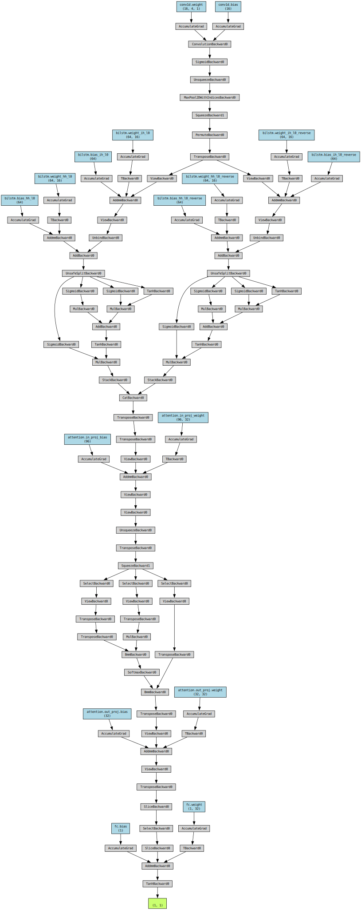
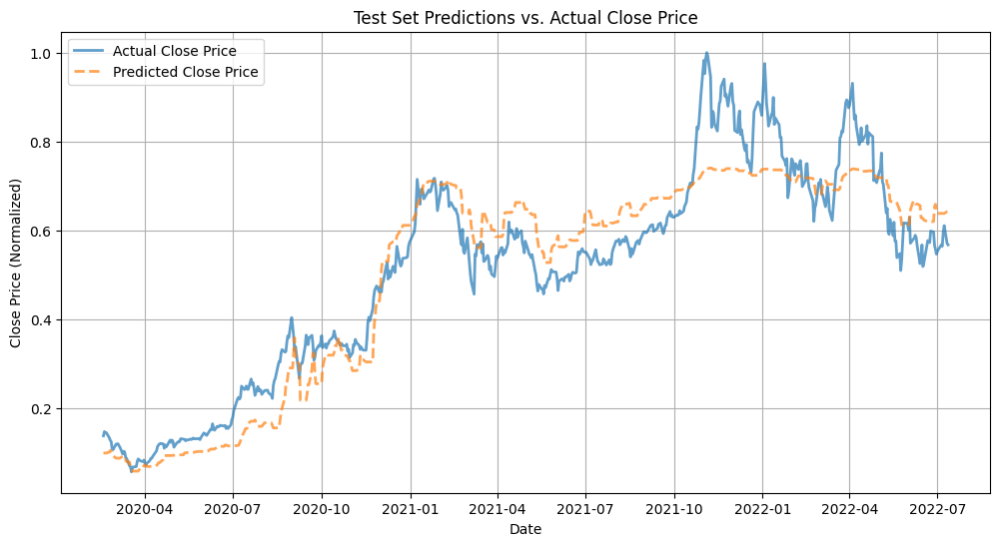

```{r setup, echo=FALSE, warning=FALSE, message=FALSE}
library(tseries)
library(forecast)
library(kableExtra)
library(arima2)
library(quantmod)
library(ggplot2)
library(gridExtra)
library(grid)
library(zoo)
library(dplyr)
```

## Introduction

In modern financial markets, the Efficient Market Hypothesis [@emh] suggests that stock prices incorporate all available information, making it difficult to systematically outperform a simple random walk model. However, as new technologies emerge and industries evolve, certain sectors experience long-term structural growth. This raises the possibility that time series analysis could uncover persistent trends in stock prices within such industries.

In this report, we focus on Tesla, the leading company in the electric vehicle industry, to analyze its stock price behavior over time. Specifically, we aim to investigate the following questions:

1.  Is there a statistically significant trend in Tesla's stock price?
2.  Does Tesla's stock price exhibit a cyclic pattern?
3.  Can exogenous variables enhance the model fit for Tesla's stock price? If so, what inference can be drawn about the relationship between these variables and Tesla’s stock performance?

The dataset used in this study originates from Yahoo Finance and is archived on Kaggle [@data_source]. For our analysis, we consider only closing prices before July 7, 2022. This exclusion is motivated by the significant market disruptions caused by the COVID-19 pandemic, which introduced volatility that is difficult to separate from natural stock price fluctuations. In the later part of the project, we also study the Ford Motors stock price to explore any unilateral effect of a trade variable like Volume. By focusing on pre-pandemic data, we aim to better isolate the underlying trends in Tesla’s stock price.


## Exploratory Data Analysis

As shown by plot below, the raw stock price seems have a stable trend until 2020, then the stock price increases exponentially until about November of 2021, then the stock price exhibits a decreasing trend. It is apparent that if we want to fit a ARMA like model to the data, we must transform the data.

```{r tsla_data, echo=FALSE, fig.align='center'}
tsla <- read.csv('./TSLA.csv')[c('Date', 'Close', 'Volume')]
tsla$Date <- as.Date(tsla$Date, format='%Y-%m-%d')
ford <- read.csv('./F.csv')[c('Date', 'Close', 'Volume')]
ford$Date <- as.Date(ford$Date, format='%Y-%m-%d')
ford <- ford[ford$Date >= '2010-06-29' & ford$Date <= '2022-07-12', ]
plot(Close~Date,data=tsla,type='l', main='Tesla Stock Price', xlab='', ylab='Close Price (USD)')
```

As suggested by previous year project [@nvidia_ref], an intuitive way to transform stock price data is to compute the log return, which helps in analyzing relative changes while removing the impact of absolute price levels. Let $\{P_t\}$ denote the daily closing price, the log return is defined as
\[
R_t = \log \left(\frac{P_t}{P_{t-1}}\right) = \log(P_t) - \log(P_{t-1}) \approx \frac{P_t - P_{t-1}}{P_{t-1}}
\]
In addition to the de-trending effect of the transformation, a desirable property for log return is that it is additive. Namely, let $R_{t_1,t_2}$ represent the log return between time $t_1$ and $t_2$ where $t_2 > t_1$, for $t_3 > t_2$ we have $R_{t_3,t_1} = R_{t_1,t_2} + R_{t_2,t_3}$. This additive property allows the application of linear models.

```{r detrend, echo=FALSE, fig.align='center'}
x <- diff(log(tsla$Close))
plot(tsla$Date[2:3030],x,type='l', xlab='', ylab='Log Return', main='Tesla Log Return')
```

As shown, the transformed data seems to have zero mean and can work better with a stationary model. However, it is important to note that when the true rate of return is large (positive or negative), the error of the log estimate increases. In the Tesla stock dataset, the extreme daily return rarely exceeds $\pm 20\%$. Thus, according to the error table below, the absolute estimation error for each data point should be mostly lower than $2\%$. This error is noticeable when requiring high precision forecasting, but it is good enough for the purpose of researching the general trend.

```{r log_return_error_table, echo=FALSE, results='asis'}
s_t <- seq(-0.2, 0.2, by=0.05)
r_t <- log(1 + s_t)
error <- abs(r_t - s_t)
error_table <- data.frame('Exact Return' = s_t, 'Log Return' = r_t, 'Error' = error)

kable(error_table, digits = 4, align = "c", format = "html") %>%
  kable_styling(full_width = FALSE, position = "center")
```

To start, we can try to investigate the autocorrelation function. The number of significant lags can be informative for choosing the $q$ parameter for the $MA(q)$ model. As shown, for any lag that's greater than 0, there are borderline significant at lag 6 and lag 24. This might suggest that having $q=0$ for the model might be the best.

```{r acf, echo=FALSE, fig.align='center'}
par(mar=c(4,4,1.5,1))
acf(x, main='')
```

To further investigate the autocorrelation, we can try to plot the partial autocorrelation function. As defined in Wikipedia [@pacf], the "partial autocorrelation function (PACF) gives the partial correlation of a stationary time series with its own lagged values, regressed the values of the time series at all shorter lags." Since it controls for shorter lags, it is help full for choosing the $p$ parameter in $AR(p)$ model. As shown by the plot, although not statistically significant, there is a cyclic structure.

```{r pacf, echo=FALSE, fig.align='center'}
par(mar=c(4,4,1.5,1))
pacf(x, main='')
```

To confirm whether the cyclic structure is significant we can try to estimate the spectral density of the series. Since the analysis if ACF and PACF did not indicate a strong auto regressive relationship in the series, we will use a series of modified Daniell smoothers (\texttt{pgram} method)[@pgram] with span of $(40,40)$ is used for smoothing.

```{r spectral_1, echo=FALSE, fig.align='center'}
par(mfrow = c(1, 1), mar=c(4.2,4.2,2,1))
res <- spectrum(x, span=c(40, 40), main='Estimated Spectral Density', xlab='Cycle Per Day', sub='')
max_freq <- res$freq[which.max(res$spec)]
abline(v=max_freq, lty='dotted', col='red')
```

As shown, the dominant frequency is around 0.4, which suggests that the period is about 2.5 days. However, there are several other peaks that are close to the chosen frequency, which may suggest that the seasonality is rather weak in this data.


## Model Selection
In this section, we will explore various models and test if they perform better than the baseline model. We will then draw inference from the best model.

### The $ARMA(p,q)$ Model
The basic model is used as baseline, which will be used later to compare with other models. The model takes the form
\[
Y_n = \mu + \epsilon_n + \sum_{i=1}^{p}\phi_i(Y_{n-i} - \mu) + \sum_{i=1}^{q}\psi_i\epsilon_{n-i}
\]
For computational efficiency reason, we only consider models where the $(p,q) \in [0,4] \times [0,4]$. Here's the AIC table using the code borrowed from lecture note [@aic_table].

```{r aic_table, echo=FALSE, warning=FALSE}
aic_table <- function(data,P,Q){
  table <- matrix(NA,(P+1),(Q+1))
  for(p in 0:P) {
    for(q in 0:Q) {
      set.seed(123)
      table[p+1,q+1] <- arima2::arima(data,order=c(p,0,q))$aic
    }
  }
  dimnames(table) <- list(paste("AR",0:P, sep=""), paste("MA",0:Q,sep=""))
  return(table)
}
aic_table <- aic_table(x,4,4)
knitr::kable(aic_table,digits=4)
```

As shown, model with low AIC are $ARMA(4,3)$ and $ARMA(0,0)$. However, after further investigation, the model overfit when either $p > 3$ or $q > 3$. (standard errors are null due to convergence issue) Thus, the AIC value shown above is not trust worthy for higher order models. As for investigating the potential structure of the Tesla returns, we prefer more complex model, thus we proceed with $ARMA(1,1)$. Here's the fitted model.
```{r arma43, echo=FALSE, warning=FALSE}
set.seed(123)
mod1 <- arima(x, order = c(1,0,1))
mod1
```

To test the validity of the $ARMA(1,1)$ model, we want to investigate whether the residual follows i.i.d. normal assumption. As shown by the residual plot, there's no apparent pattern, and the histogram approximately follows a bell curve. For the residual autocorrelation function, there is no significant lags; However, the ACF seems to have a sinusoidal pattern, which suggest that we might need to add fourier terms to capture the cyclic behavior. The plot is produced by the $\texttt{checkresiduals()}$ function in $\texttt{forecast}$ library [@forecast].

```{r mod1_residual_1, echo=FALSE, fig.align='center', results='hide',fig.keep='all'}
checkresiduals(mod1)
```

To formally test whether there is a serial correlation between lags of the residual, we can test autocorrelation of the residual with Ljung-Box test [@Ljun]. As defined in Wikipedia, the null hypothesis is that the data is not correlated and the alternative hypothesis is that the data exhibit serial correlation. As shown, p-value is greater than $\alpha=0.05$. Thus, there is no sufficient evidence to reject the null hypothesis. Combining the test result with residual plots, we can say that the $ARMA(1,1)$ model is appropriate for the given data.

```{r mod1_residual_2, echo=FALSE, fig.align='center', fig.keep='none'}
checkresiduals(mod1)
```

We can check the roots of the AR and MA polynomial to see if this model is causal and invertible. From the fitted coefficients, we have the AR polynomial as $\phi(x)=1 - \phi_1x$ and the MA polynomial is $\psi(x)=1+\psi_1x$, where $\phi_1=$ `r mod1$coef[1]` and $\psi_1 =$ `r mod1$coef[2]`. As shown, both root's absolute value are outside the unit circle. Thus, the model is both causal and invertible. However, note that the value of roots are rather close. They might just cancel out and fall back to ARMA(0,0). 

```{r mod1_roots, echo=FALSE, results='hold'}
cat('AR Root:', abs(polyroot(c(1,-mod1$coef[1]))), '\n')
cat('MA Root:', abs(polyroot(c(1,mod1$coef[2]))), '\n')
```


### The $SARMA(p,q) \times (P,Q)_{n}$ Model
To investigate further on the presence of seasonality in data, we specifically analyse combining seasonal components with our previous $ARMA(1,1)$[@sarima] as well as SARIMA model with the non-seasonal components removed, defined as:
\[
(1 - \phi_1B^5)Y_n = (1 - \psi_1B^5)\epsilon_n + constant
\]

The period (5) is selected based on the number of trading days of the week. Our analysis shows that the above model with the AR/MA parts removed is a more robust model(AIC = -11580.63) than the previous $ARMA(1,1)$ model. The integrated SARIMA model returns a higher AIC score describing a relatively weaker fit.
```{r sarima, echo=FALSE, warning=FALSE}
set.seed(125)
sarima11 <- arima(x, order = c(0,0,0), seasonal = list(order = c(1,0,1), period = 5))
sarima11
```
While these results point towards a more dominant weekly pattern in the stock price and prove to be more influential than day-to-day projections. We also experiment with different periods to investigate monthly and quarterly cycles, but trading days(period=5) define the cyclical pattern better. However, it is also to be noted that the coefficients weights do not make a significant difference to the trend. Thus, the relatively stronger seasonal patterns on weekly basis are too small to profitably trade after costs. We note that this inference would align with the weak form of Efficient Market Hypothesis[@cfi_emh] and suggests a deeper fundamental trade analysis is required to support the technical statistics.

### The CNN-BiLSTM-Attention Model
As indicate by above analysis, the traditional ARMA like models, in theory, cannot perform better than the white noise model for the log return. However, there exists modern methods that are claimed to have the ability to directly deal with raw stock price data. As suggested by Zhang et al., a CNN-BiLSTM-Attention-based model[@cnn_lstm_attn] can be used for accurate stock price prediction. The proposed model have three major parts, the first part is a Convolutional Neural Network [@cnn] that aims to capture the temporal structure of the input data. The second part is a Bidirectional Long Short Term Neural Network [@lstm] that aims to capture the inter-dependence between lags of the input data. Note that the the "Bidirectional" means that it is a modified version of the original LSTM that allows the model to learn patterns both ways. The last major part of the proposed model is an attention layer that aims to distinguish the more relevant inter-dependencies returned by the BiLSTM layer. This attention mechanism is the same one as used in modern large language models as suggested by the paper "Attention Is All You Need"[@attn] written by scientists at Google.

For the Tesla stock price data, we have used the daily open, close, high, and low price as predictors, and the target variable is the daily close price. The look back period is 5 days, and the model is set up to do one step prediction. (one day into future in this case) we have adopted a model structure we found on GitHub [@git_model]. The model from Github is implemented via Tensor Flow [@tf], we re-implemented the model with PyTorch [@torch] and we changed the single head attention layer into a multihead attention layer to allow the model to capture more dependencies between data and its lag values. The model also uses a min-max scalar [@minMax] to preprocess the data to improve numeric stability, which makes all data points fall in the range $[0,1]$.
Here's a visualization of the model structure:

```{=html}
<div style="height: 300px; width: 100%; overflow: auto; text-align: center; margin: 20px 0;">
  
</div>
```

Due to the high complexity of the model, our Tesla dataset (about 3000 observations) is not enough for the model to reach convergence. Thus, a transfer learning technique is applied, which leveraged knowledge learned from other dataset to improve the converged for predicting Tesla stock price. The other dataset used is the China and U.S. currency exchange rate data we gathered from GitHub[@git_model] (about 26000 observations), which contains the open, close, high, and low exchange rate in CNY per USD. The granularity of this dataset is not stable (ranges from 1 minute to 7 minutes) between observation, but it shouldn't matter as predicting currency exchange rate is not out primary task. After fitting the model on the currency exchange rate data, we fine-tuned the learned parameters with Tesla stock price dataset, and the model has reached convergence.

For the Tesla data, we only used 80% for training, and the rest for testing. The performance on the testing data has $R^2=0.8897$, and mean absolute percentage error of 0.1502. Here's a visualization of the prediction on testing data. Note that this is the best fitted model and re-run the code provided may result in different model fit.

So, does this model fit result indicate that the model might beat the efficient market hypothesis? After fitting the model multiple times, the resulting fit's performance does vary quite a bit. Some of the worst fits have mean absolute percentage error up to 0.3, which is about two times higher than the best fit. Additionally, across all the fits, there's a common theme that appears in the fitted value v.s. actual value: the predictive power falls apart after the spike around October 2021. Thus, we believe that the efficient market still holds. As it's likely that the early portion of the Tesla stock price testing data has exhibited a very similar trend either in the pre-train data or the training data. This could explain the sudden change in predictive power in the testing set after October 2021.

FYI: Tesla stock has increased so much in October 2021 due to announced large contract from rental companies as indicated by online news [@tesla202110].

## Volume and Volatility Index 
Understanding volume, the amount of stocks being traded daily, is key to realizing it's power on the stock price. Volume gives us an idea of market participation and generated/declining interest in the stocks. Whether a stock is being bought/sold in high volumes tells the trader of bullish and bearish trends in the stock[@zerodha_varsity_ta], making them more informed of conducting or setting up trades. We look at how the amount of daily trades have varied for Ford and Tesla over the years. A 10-day moving average line has been constructed as it is often beneficial to gauge the market interest through this[@zerodha_varsity_volumes].

```{r volumes, echo=FALSE, warning=FALSE, message=FALSE}
price_vol_chart <- function(data, plot_title) {
  data$volume_ma10 <- rollmean(data$Volume, k = 10, fill = NA, align = "right")
  
  price_plot <- ggplot(data, aes(x = Date)) +
    geom_line(aes(y = Close), color = "blue") +
    theme_minimal() +
    labs(title = plot_title,
         x = NULL,
         y = "Price") +
    theme(plot.margin = unit(c(0.5, 0.5, 0.5, 0.5), "cm"))

  volume_plot <- ggplot(data, aes(x = Date)) +
    geom_bar(aes(y = Volume), stat = "identity", fill = "darkblue", alpha = 0.7) +
    geom_line(aes(y = volume_ma10), color = "red", size = 1) +
    theme_minimal() +
    labs(x = "Date",
         y = "Volume") +
    theme(plot.margin = unit(c(0.5, 0.5, 0.5, 0.5), "cm"))

  return(list(price_plot, volume_plot)) # Return as a list
}
tsla_plots <- price_vol_chart(tsla, "Tesla Stocks")
ford_plots <- price_vol_chart(ford, "Ford Stocks")
grid.arrange(
  grobs = c(tsla_plots, ford_plots), 
  ncol = 2, 
  nrow = 2
)
```

Along with volume, the CBOE Volatility Index [@investopedia_vix] is used to determine the market's stress, fear and risk centering around the position of a stock. The index represents the market's expectation of volatility over the next 30 days. The trend stability can be interpreted by following the VIX along with the candlestick representation of the stock. To visualize how it has varied since 2010:

```{r vix_viz, echo=FALSE, fig.align='center', warning =FALSE}
set.seed(130)
getSymbols("^VIX", src = "yahoo", from = "2010-06-29", to = "2022-07-12")
vix_df <- data.frame(Date = index(VIX), VIX_Close = Cl(VIX))
vix_df$Date <- as.Date(vix_df$Date)
ggplot(vix_df, aes(x = Date, y = VIX.Close)) +
     geom_line(color = "blue") +
     labs(title = "VIX Index Over Time", x = "Date", y = "VIX Closing Price") +
     theme_minimal()
```

Thus, with sufficient proof to their influential aspect to the closing price, we investigate these two entities as exogenous variables and observe any difference they make to the model fit. We consider the base models $ARMA(1,1)$ and $MA(1)$ as well as adding their seasonal components with the exogenous variables. In our analysis, we look into the influence of the logarithm of the volume to scale it with our closing price. We model six different variations of our base models introducing different combinations fo exogenous variables as well as seasonality. It is inferred that the Volatility Index depicts a marked improvement in model utility through the AIC score dropping significantly.

```{r aic_xreg, echo=FALSE,warning=FALSE}
tsla_merged <- left_join(tsla, vix_df, by = "Date")
VIX <- tsla_merged$VIX.Close[-1]
log_vol <- log(tsla$Volume)
log_vol <- log_vol[-1]
arimax_m101<- arima(x, order = c(0,0,1), xreg = as.matrix(log_vol))
arimax_m201<- arima(x, order = c(0,0,1), xreg = as.matrix(VIX))
arimax_m301<- arima(x, order = c(0,0,1), xreg = as.matrix(log_vol,VIX))
arimax_m401<- arima(x, order = c(0,0,1), seasonal = list(order =c(1,0,1), period = 5), xreg = as.matrix(log_vol))
arimax_m501<- arima(x, order = c(0,0,1), seasonal = list(order =c(1,0,1), period = 5), xreg = as.matrix(VIX))
arimax_m601<- arima(x, order = c(0,0,1), seasonal = list(order =c(1,0,1), period = 5), xreg = as.matrix(log_vol,VIX))

create_model_comparison <- function(models_list) {
  table <- data.frame(
    Parameters = c("MA(1)", "ARMA(1,1)"),
    M1_LogVol = NA,
    M2_VIX = NA,
    M3_Both = NA,
    M4_LogVol_Seasonal = NA,
    M5_VIX_Seasonal = NA,
    M6_Both_Seasonal = NA
  )
  
  get_aic <- function(model) {
    return(AIC(model))
  }
  set.seed(135)
  table[1, "M1_LogVol"] <- get_aic(arimax_m101)
  table[1, "M2_VIX"] <- get_aic(arimax_m201)
  table[1, "M3_Both"] <- get_aic(arimax_m301)
  table[1, "M4_LogVol_Seasonal"] <- get_aic(arimax_m401)
  table[1, "M5_VIX_Seasonal"] <- get_aic(arimax_m501)
  table[1, "M6_Both_Seasonal"] <- get_aic(arimax_m601)
  
  table[2, "M1_LogVol"] <- get_aic(arima(x, order = c(1,0,1), xreg = as.matrix(log_vol)))
  table[2, "M2_VIX"] <- get_aic(arima(x, order = c(1,0,1), xreg = as.matrix(VIX)))
  table[2, "M3_Both"] <- get_aic(arima(x, order = c(1,0,1), xreg = as.matrix(cbind(log_vol, VIX))))
  table[2, "M4_LogVol_Seasonal"] <- get_aic(arima(x, order = c(1,0,1), 
                                                  seasonal = list(order = c(1,0,1), period = 5), 
                                                  xreg = as.matrix(log_vol)))
  table[2, "M5_VIX_Seasonal"] <- get_aic(arima(x, order = c(1,0,1), 
                                               seasonal = list(order = c(1,0,1), period = 5), 
                                               xreg = as.matrix(VIX)))
  table[2, "M6_Both_Seasonal"] <- get_aic(arima(x, order = c(1,0,1), 
                                               seasonal = list(order = c(1,0,1), period = 5), 
                                               xreg = as.matrix(cbind(log_vol, VIX))))
  
  return(table)
}

comparison_table <- create_model_comparison(list(arimax_m101, arimax_m201, arimax_m301, 
                                               arimax_m401, arimax_m501, arimax_m601))
knitr::kable(comparison_table,digits=4)
```

The question that arises now is how statistically significant is the exogenous term? A starkly lower AIC score(-11597.95) for the $MA(1)$ model definitely allows us to infer that moving averages can describe trends better by smoothing over short-term noise[@ma_trend]. Hence, on further looking at the coefficients and p-values, we observe that even though VIX exogenous weight does not have much of a practical impact, statistically it definitely proves to influence the model more than the Volume(logarithm) of trades. We have already concluded that it's presence definitely has a marked improvement of the robustness of the model and stability, hence it's usage largely depends on the context of the forecasting task.

```{r signf_ma1, echo=FALSE, warning=FALSE}
set.seed(140)
coefs <- coef(arimax_m201)
std_errors <- sqrt(diag(arimax_m201$var.coef))
variable_names <- c("MA1", "Intercept", "VIX")
t_values <- coefs / std_errors
p_values <- 2 * (1 - pnorm(abs(coefs/std_errors)))
results_df <- data.frame(
  Variable = variable_names,
  Coefficient = round(coefs, 4),
  `Std.Error` = format(std_errors, scientific = TRUE, digits = 3),  
  `t-value` = format(t_values, scientific = TRUE, digits = 3),      
  `p-value` = format(p_values, scientific = TRUE, digits = 3)
)

results_df$Significance <- ifelse(p_values < 0.001, "***",
                         ifelse(p_values < 0.01, "**",
                         ifelse(p_values < 0.05, "*",
                         ifelse(p_values < 0.1, ".", ""))))

plot_df <- data.frame(
  Variable = variable_names,
  Coefficient = coefs,
  `Std.Error` = std_errors
)

kable(results_df,
      caption = "ARIMA Model Results",
      format = "markdown",
      align = c('l', 'r', 'r', 'r', 'r', 'l')) %>%
  print()

ggplot(plot_df, aes(x = Variable, y = Coefficient)) +
  geom_point(size = 3) +
  geom_errorbar(aes(ymin = Coefficient - 1.96 * Std.Error,
                    ymax = Coefficient + 1.96 * Std.Error),
                width = 0.2) +
  theme_minimal() +
  labs(title = "MA(1) Model with Coefficients with 95% Confidence Intervals",
       x = "Variable",
       y = "Coefficient Estimate") +
  theme(axis.text.x = element_text(angle = 45, hjust = 1))

cat("\nSignificance codes: 0 '***' 0.001 '**' 0.01 '*' 0.05 '.' 0.1 ' ' 1")
```

## Conclusion
Being a capital-intensive industry, automobile stocks often require analysis with scrutiny. Through this project, we investigate our initial three research questions and gather significant momentum in answering these. Our analysis aligns with historical findings that moving average models provide the best fit for stock data. While standalone ARMA models are less effective in capturing trends in daily closing prices, incorporating influential variables like the Volatility Index or Volume improves their fit. This highlights that stock prices are influenced by other financial factors, emphasizing the need for both fundamental [@zerodha_varsity_ta] and technical analysis in forecasting. We extend our trend analysis by leveraging state-of-the-art CNN models with Bi-LSTM layers and transfer learning to capture the temporal structure of the data. While our model achieves a promising $R^2$ score, accuracy begins to diverge from actual stock performance starting in October 2021, reflecting the impact of external factors on stock prices[@cfi_emh]. Future research should focus on accurately modeling pandemic-driven stock fluctuations, particularly for essential products that experienced sudden disruptions. Additionally, this study can be expanded to analyze key financial ratios[@investopedia_auto_ratios], such as debt-to-equity and inventory turnover, which influence the performance of companies within the same industry. Such insights would be valuable for market analysts and investors alike.

## Acknowledgement
In addition to explicit sources cited above, we have also consulted the general structure of the apple stock [@apple_ref] and the nvidia [@nvidia_ref] stock project from last year. Although some of the method used are similar, we have developed our own insights into the results of those methods. (those methods are also taught as standard tools in lecture)

## References


